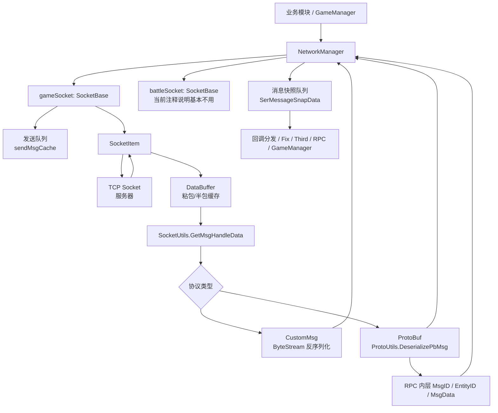
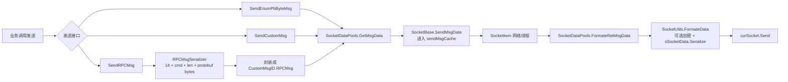
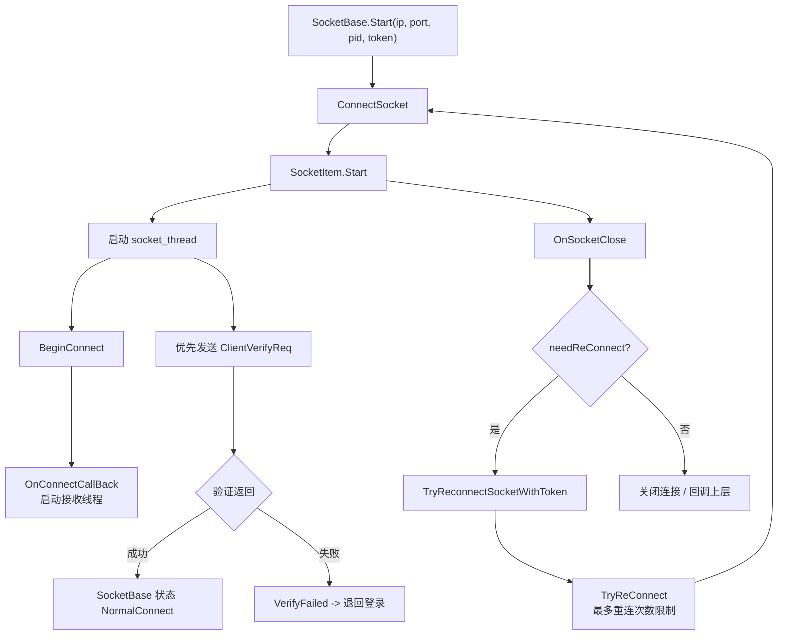

# 网络层设计流程图

本文档记录当前项目网络层的主要结构与消息流向。核心代码位于 `Assets/Scripts/StarFramework/Network`。

## 整体结构

## 发送流程

## 接收流程

```mermaid
flowchart LR
  RECV["SocketItem.OnReceiveThread"] --> RAW["curSocket.Receive"]
  RAW --> BUFFER["DataBuffer.AddData"]
  BUFFER --> HAS{"ContainData?"}
  HAS -->|是| MSG["SocketUtils.GetMsgHandleData"]
  MSG --> DECRYPT{"serializeType & 0x02"}
  DECRYPT -->|加密| DEC["MsgEncode.DecryptData"]
  DECRYPT -->|未加密| PARSE{"cmd 是否 CustomMsg"}
  DEC --> PARSE

  PARSE -->|是| CUSTOM["DeserializeCustomMsg"]
  PARSE -->|否| PB["ProtoUtils.DeserializePbMsg"]
  PB --> RPC{"cmd == RpcMsgID?"}
  RPC -->|是| INNER["解析 RPC 内层 messageCmd/entityId/data"]
  RPC -->|否| HANDLE["MessageHandleData"]

  CUSTOM --> HANDLE
  INNER --> HANDLE
  HANDLE --> SB["SocketBase.OnReceiveMessage"]
  SB --> SPECIAL{"验证 / 心跳 / 普通消息"}
  SPECIAL -->|验证| VERIFY["OnVerifyResult"]
  SPECIAL -->|心跳| PING["Ping.OnHeartBeatMsgID"]
  SPECIAL -->|普通| NM["NetworkManager.AddMessageHandleData"]
  NM --> QUEUE["messageHandleDataQueue"]
  QUEUE --> SNAP["CacheMessageSnapData"]
  SNAP --> DISPATCH["HandleMessageHandleData"]
```

## 连接与重连流程

## 关键代码位置

- `Assets/Scripts/StarFramework/Network/NetworkManager.cs`: 网络层总入口，创建 socket，注册消息回调，按帧处理消息队列。
- `Assets/Scripts/StarFramework/Network/Socket/SocketBase.cs`: Socket 中间层，负责连接状态、重连、发送队列、验证和心跳特殊消息。
- `Assets/Scripts/StarFramework/Network/Socket/SocketItem.cs`: 真实 Socket 实现，后台线程连接、发送、接收、超时关闭。
- `Assets/Scripts/StarFramework/Network/Socket/DataBuff.cs`: 包头、包体缓存、粘包和半包处理。
- `Assets/Scripts/StarFramework/Network/Socket/SocketUtils.cs`: 协议帧格式化、解密、CustomMsg/Protobuf 分流。
- `Assets/Scripts/StarFramework/Network/Socket/ProtoUtils.cs`: Protobuf 和 RPC 内层消息解析。
- `Assets/Scripts/StarFramework/Network/Socket/SocketDataPools.cs`: 发送消息对象池与组包入口。
