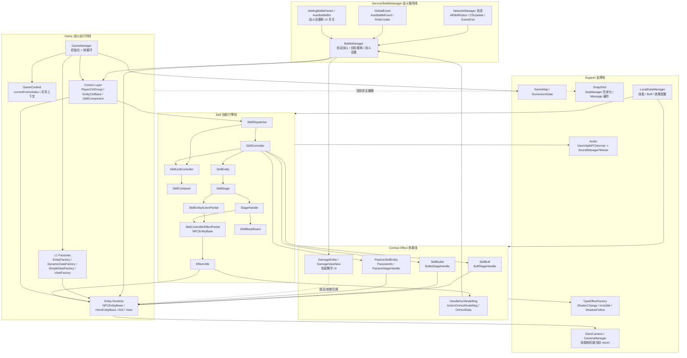
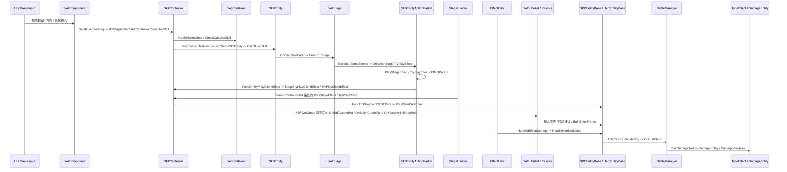
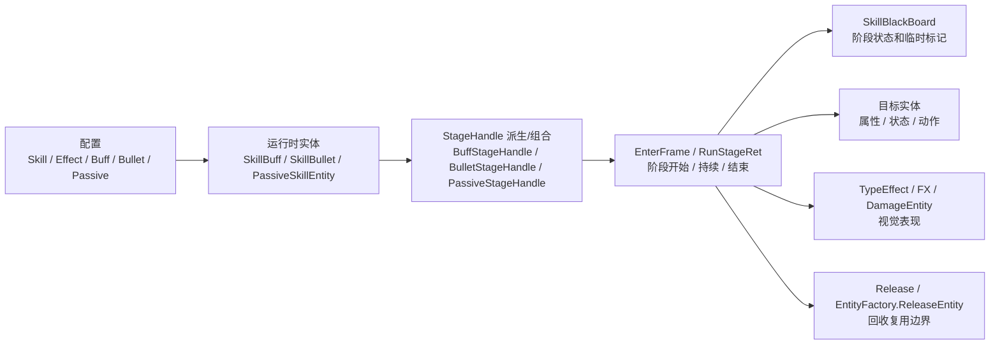

# Star 战斗框架架构图

> 生成日期：2026-07-10
> 范围：`Assets/Scripts/StarGame/Game/` + `Assets/Scripts/StarGame/Service/BattleManager/`
> 目的：把战斗运行时主轴、技能效果管线、战斗服务配置线放在一张可读图里。

历史 SVG 总图：[BATTLE_FRAMEWORK_ARCHITECTURE.svg](./BATTLE_FRAMEWORK_ARCHITECTURE.svg)。当前代码事实以本文 Mermaid 源为准；本轮未触网安装 Mermaid CLI 重渲 SVG。

## 结论

这个项目的战斗框架不是一个单独的 `BattleManager` 总控类，而是两条线协同：

- `GameManager` 是战斗世界运行时入口，`Init()` 初始化四类 L1 工厂，`CreateGame()` 保障 Entity/View 工厂的模式内初始化，并驱动实体控制组、本地实体、地图 `m_map.EnterFrame()` 和超时消息 `HandleOverTimeMsgRet()`。
- `BattleManager` 是服务层战斗管理器，负责自动战斗、目标搜索、战斗设置、战斗相关网络通知和 UI 状态。
- 技能主轴在 `Game/Skill` 下，`SkillDispatcher` 每帧推进 `SkillController` / `SkillUnitController`；`SkillController` 通过 `SkillContainer` 选择/校验 `SkillInfo` 并创建 `SkillEntity`，阶段效果再分叉到手动 `SkillEntityActionPartial` 或 ServerControl/Bullet 等 `StageHandle` 路径。
- 战斗效果层由 `SkillBuff`、`SkillBullet`、`PassiveSkillEntity` 等运行时实体承接；`PassiveInfo` 是被动配置承载，最终落到实体状态、受击表现、伤害飘字、特效、音效和相机等支撑系统。`SerSnapshotSeqManager` 当前只保留空 `Init()` 与历史注释逻辑，不作为现行战斗主链路描述；`SerMessageSnapData` 仍承担网络消息快照缓存，RPC 快照类保留结构但当前不在主帧驱动链。

## 总体分层图



## 运行时主循环

```mermaid
sequenceDiagram
    participant Loop as 外部帧驱动
    participant GM as GameManager
    participant Ctrl as EntityCtrlBase / PlayerCtrlGroup
    participant SkillComp as SkillComponent
    participant Ent as NPCEntityBase
    participant Local as EntityLocalDynamic
    participant SD as SkillDispatcher
    participant SC as SkillController
    participant SUC as SkillUnitController
    participant Bullet as SkillBullet
    participant Map as GameMap

    Loop->>GM: EnterFrame(frameIndex)
    GM->>GM: 更新 GameContext.currentFrameIndex
    loop 控制组列表
        GM->>Ctrl: EnterFrame(frameIndex)
        Ctrl->>SkillComp: 输入组件 EnterFrame / 按键保持
        Ctrl->>Ent: M_Curr.EnterFrame(frameIndex)
        Ent->>SD: skillDispatcher.EnterFrame()
        SD->>SC: skillController.EnterFrame()
        SD->>SUC: skillUnitController.EnterFrame()
        SC->>Bullet: EnterFrameBullet()
    end
    loop 本地实体列表
        GM->>Local: EnterFrame(frameIndex)
    end
    GM->>Map: EnterFrame(frameIndex)
    GM->>GM: HandleOverTimeMsgRet()
```

## 技能到效果链路



## Buff / Bullet / Passive 的共同模式



## 关键代码锚点

| 位置 | 作用 |
|------|------|
| `Assets/Scripts/StarGame/Game/GameManager.cs:235` | 初始化 `SimpleDataFactory`、`DynamicDataFactory`、`EntityFactory`、`ViewFactory`。 |
| `Assets/Scripts/StarGame/Game/GameManager.cs:2772` | 主帧循环：驱动控制组、本地实体、地图和超时消息处理。 |
| `Assets/Scripts/StarGame/Service/BattleManager/BattleManager.cs:55` | 服务层初始化：自动战斗数据、事件监听、战斗相关网络消息。 |
| `Assets/Scripts/StarGame/Game/Player/Component/SkillComponent.cs:24` | 技能输入和技能 UI 组件，持有网络技能消息和当前实体引用。 |
| `Assets/Scripts/StarGame/Game/Skill/SkillDispatcher.cs:86` | 技能调度每帧驱动 `SkillController` 和 `SkillUnitController`。 |
| `Assets/Scripts/StarGame/Game/Skill/StageHandle.cs:406` | Timeline 阶段效果包装为 `EffectParam` 并交给效果执行逻辑。 |
| `Assets/Scripts/StarGame/Game/Skill/SkillPartial/SkillEntityActionPartial.cs:800` | SkillEntity 侧阶段效果执行入口之一。 |
| `Assets/Scripts/StarGame/Game/Skill/EffectUtils.cs:1342` | 伤害效果落地：查目标实体、播放受击特效、调用实体伤害处理。 |
| `Assets/Scripts/StarGame/Game/Entity/RemoteDynamic/Base/AOIEntityObject.cs:574` | `HandleHurtNodeMsg` 只触发 `ActionOnHurtNodeMsg` delegate。 |
| `Assets/Scripts/StarGame/Game/Entity/RemoteDynamic/NPCEntityBase.cs:866` | `OnHurtNodeMsg` 调用 `BattleManager.OnHurtData`，并处理受击后的索敌/头顶血条等副作用。 |
| `Assets/Scripts/StarGame/Service/BattleManager/BattleManager.cs:299` | `OnHurtData(HurtData,...)` 按服务器 HurtData 组装飘字用 `DamageData`。 |
| `Assets/Scripts/StarGame/Game/Skill/DamageEntity.cs:59` | `DamageEntity.Create(DamageData,...)` 保存飘字数据并加载 `DamageViewNew`。 |
| `Assets/Scripts/StarGame/UI/DamageView/DamageViewNew.cs:371` | `BindDamageEntity` 绑定飘字 UI，不负责伤害计算或实体受击入口。 |
| `Assets/Scripts/StarGame/Game/Skill/Buff/SkillBuff.cs:213` | Buff 每帧驱动：基础阶段 tick、初始化、脏标记更新通知。 |

## 阅读顺序

1. 先看本文的总图，区分 `BattleManager` 服务线和 `GameManager` 运行时线。
2. 看 `diagrams/battle/BATTLE_OVERVIEW.md`，确认 L0-L5 分层。
3. 看 `diagrams/battle/FLOW_SKILL_RELEASE.md`，追技能释放。
4. 看 `diagrams/battle/FLOW_DAMAGE_PIPELINE.md`，追伤害落地。
5. 看 `diagrams/battle/FLOW_BUFF_LIFECYCLE.md`，追 Buff 生命周期。

## 风险点

- `SkillController`、`SkillEntity`、`NPCEntityBase`、`GameManager` 都是大文件，partial 和共享字段较多，接口边界不清。
- `EffectUtils` 是伤害表现和黑板效果注册的重要集中点；Buff/Bullet/Passive 协议入口在 `GameManager.HandleRPCMsg -> EntityCtrlMsgBase/CtrlGroup`，运行时创建再由 `SkillController*Partial` 处理，修改影响面大。
- Bullet 命名存在双重语义：`SkillBullet` 是技能运行时，`E_EntityType.BulletEntity` 当前实体创建链复用 `SummonCtrlGroup`，程序定义的 `BulletEntity/BulletEntityCtrl` 是另一条支线。
- 自动战斗不是直接调用 SkillController，`BattleManager` 决策后通过 `InputManager.DispatchVKey` 复用输入链；普通技能 Camera 效果支撑存在，但 `SkillController.OnActionPlayCamera` 当前开头直接 `return`；CameraShake 是另一条链，仍由 `OnActionPlayCameraShake -> GlobalEvent.OnVirtualCameraShakeEvent` 触发。
- `BattleManager` 名字容易误导：它不是完整战斗世界的唯一核心，更像服务层战斗状态和自动战斗管理器。
- 当前索引没有发现这些核心链路的测试覆盖，重构前应先围绕 `SkillDispatcher`、`StageHandle`、`EffectUtils` 建最小验证。
