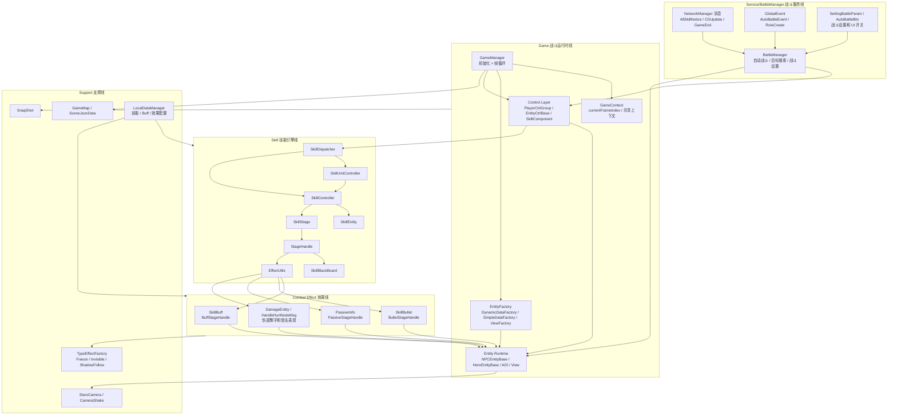
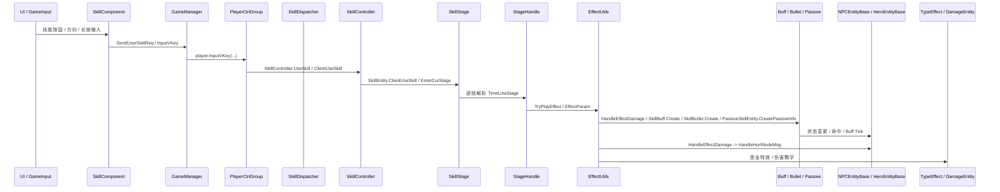
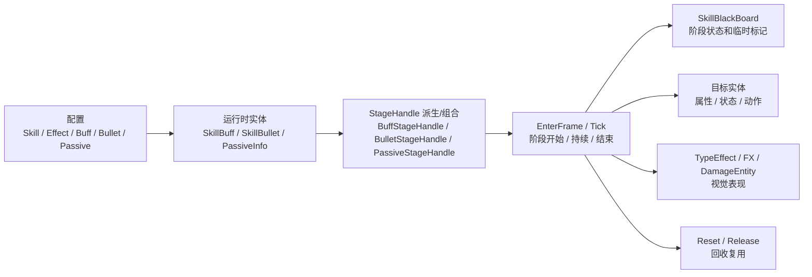

# Star 战斗框架架构图

> 生成日期：2026-07-10  
> 范围：`Assets/Scripts/StarGame/Game/` + `Assets/Scripts/StarGame/Service/BattleManager/`  
> 目的：把战斗运行时主轴、技能效果管线、战斗服务配置线放在一张可读图里。

可直接打开的 SVG 总图：[BATTLE_FRAMEWORK_ARCHITECTURE.svg](./BATTLE_FRAMEWORK_ARCHITECTURE.svg)

## 结论

这个项目的战斗框架不是一个单独的 `BattleManager` 总控类，而是两条线协同：

- `GameManager` 是战斗世界运行时入口，负责初始化工厂、驱动实体控制组和本地实体逐帧 `EnterFrame`。
- `BattleManager` 是服务层战斗管理器，负责自动战斗、目标搜索、战斗设置、战斗相关网络通知和 UI 状态。
- 技能主轴在 `Game/Skill` 下，核心链路是 `SkillDispatcher -> SkillController / SkillUnitController -> SkillStage -> StageHandle -> EffectUtils`。
- 战斗效果层由 `SkillBuff`、`SkillBullet`、`PassiveInfo` 等承接，最终落到实体状态、受击表现、伤害飘字、特效、相机和快照等支撑系统。

## 总体分层图



## 运行时主循环

```mermaid
sequenceDiagram
    participant Loop as 外部帧驱动
    participant GM as GameManager
    participant Ctrl as EntityCtrlBase / PlayerCtrlGroup
    participant Local as EntityLocalDynamic
    participant SD as SkillDispatcher
    participant SC as SkillController
    participant Bullet as SkillBullet
    participant Map as GameMap

    Loop->>GM: EnterFrame(frameIndex)
    GM->>GM: 更新 GameContext.currentFrameIndex
    loop 控制组列表
        GM->>Ctrl: EnterFrame(frameIndex)
        Ctrl->>SD: 技能输入 / 技能状态 tick
        SD->>SC: skillController.EnterFrame()
        SD->>SC: skillUnitController.EnterFrame()
        SC->>Bullet: EnterFrameBullet()
    end
    loop 本地实体列表
        GM->>Local: EnterFrame(frameIndex)
    end
    GM->>Map: EnterFrame(frameIndex)
    GM->>GM: HandleOverTimeMsgRet()
```

## 技能到效果链路



## Buff / Bullet / Passive 的共同模式



## 关键代码锚点

| 位置 | 作用 |
|------|------|
| `Assets/Scripts/StarGame/Game/GameManager.cs:235` | 初始化 `SimpleDataFactory`、`DynamicDataFactory`、`EntityFactory`、`ViewFactory`。 |
| `Assets/Scripts/StarGame/Game/GameManager.cs:2772` | 主帧循环：驱动控制组、本地实体、地图和超时消息处理。 |
| `Assets/Scripts/StarGame/Service/BattleManager/BattleManager.cs:55` | 服务层初始化：自动战斗数据、事件监听、战斗相关网络消息。 |
| `Assets/Scripts/StarGame/Game/Player/Component/SkillComponent.cs:24` | 技能输入和技能 UI 组件，持有网络技能消息和当前实体引用。 |
| `Assets/Scripts/StarGame/Game/Skill/SkillDispatcher.cs:86` | 技能调度每帧驱动 `SkillController` 和 `SkillUnitController`。 |
| `Assets/Scripts/StarGame/Game/Skill/StageHandle.cs:406` | Timeline 阶段效果包装为 `EffectParam` 并交给效果执行逻辑。 |
| `Assets/Scripts/StarGame/Game/Skill/EffectUtils.cs:1342` | 伤害效果落地：查目标实体、播放受击特效、调用实体伤害处理。 |
| `Assets/Scripts/StarGame/Game/Skill/Buff/SkillBuff.cs:213` | Buff 每帧驱动：基础阶段 tick、初始化、脏标记更新通知。 |

## 阅读顺序

1. 先看本文的总图，区分 `BattleManager` 服务线和 `GameManager` 运行时线。
2. 看 `diagrams/battle/BATTLE_OVERVIEW.md`，确认 L0-L5 分层。
3. 看 `diagrams/battle/FLOW_SKILL_RELEASE.md`，追技能释放。
4. 看 `diagrams/battle/FLOW_DAMAGE_PIPELINE.md`，追伤害落地。
5. 看 `diagrams/battle/FLOW_BUFF_LIFECYCLE.md`，追 Buff 生命周期。

## 风险点

- `SkillController`、`SkillEntity`、`NPCEntityBase`、`GameManager` 都是大文件，partial 和共享字段较多，接口边界不清。
- `EffectUtils` 是技能到 Buff/Bullet/Passive/伤害表现的集中出口，修改影响面大。
- `BattleManager` 名字容易误导：它不是完整战斗世界的唯一核心，更像服务层战斗状态和自动战斗管理器。
- 当前索引没有发现这些核心链路的测试覆盖，重构前应先围绕 `SkillDispatcher`、`StageHandle`、`EffectUtils` 建最小验证。
