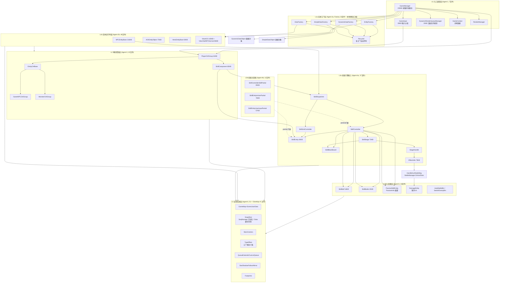

# Star 战斗层全景模块关系图 (BATTLE_OVERVIEW)

> 基于已复核的 L0-L5 根文档和 `VERIFY_BATTLE_MD_AGAINST_CODE.md` 汇总；原始 SubAgent 报告仅作历史输入。代码根：`Assets/Scripts/StarGame/Game/`，本轮分层已覆盖 220 个 CS 文件；ClientNpc/Data/Object/Partner 共 20 个补充文件已折入现有 L1/L2/L5 层级文档。

## 各层职责速览

| 层 | Agent | 文件数 | 核心职责 | 巨型文件 |
|----|-------|--------|---------|---------|
| L0 入口调度 | entry | 7 | 帧循环总驱动、输入分发、渲染队列规划 | GameManager 239KB |
| L1a 工厂 | entity-factory | 13+ | EntityFactory / DynamicDataFactory / SimpleDataFactory / ViewFactory 各自入口 + Recycler 对象池 | ViewFactory 29KB |
| L1b 运行时 | entity-runtime | 48 + Data 8 | 远程实体/AOI/View 渲染表现 + 实体数据底座 | NPCEntityBase 216KB, EntityBaseData 76KB |
| L2 控制 | player | 15 + Object 2 + PartnerManager 1 | 控制组家族 + 组件模式 + 交互物/伙伴管理支撑 | SkillComponent 65KB, PlayerCtrlGroup 62KB |
| L3a 引擎 | skill-core | 37 | Timeline 驱动技能管线 | SkillEntity 83KB, EffectUtils 79KB |
| L3b 分部 | skill-partial | 12 | partial 类功能扩展 | SkillControllerSkillPartial 85KB |
| L4 效果 | effect | 10 | Buff/Bullet/Passive/AutoBattle | SkillBullet 25KB |
| L5 支撑 | support | 51 + ClientNpc 9 | 地图/ClientNpc/快照现状/相机/特效/音效/数据结构 | SceneJsonData 36KB |

## 补充定位目录

| 目录 | 文件数 | 归属判断 | 关键证据 |
|---|---:|---|---|
| `Game/ClientNpc` | 9 | 已折入 L5 Map 支撑：地图配置驱动的客户端 NPC / Trigger 状态机 | `ClientNpcManager.OnSceneMapLoadComplete -> ClientNpc.Create`，`StarWorldGame.OnEnterFrame -> ClientNpcManager.EnterFrame -> ClientNpc.EnterFrame` 驱动 trigger 与 state |
| `Game/Data` | 8 | 已折入 L1 运行时：实体/AOI/战斗状态数据底座，被 L1/L2/L3/L4 共享 | `GameManager.HandlePropSync/CreateEntityData -> UpdateEntityData -> EntityBaseData.UpdateWithAttr`；`HandleClientBattleStates` 被 GameManager 与 Skill 层调用 |
| `Game/Object` | 2 | 已折入 L2 控制：非生物交互物控制分支 | `GameManager.CreateEntity(E_EntityType.Interact) -> CreateInterActionObject -> ObjectCtrlGroup.Create`，内部创建 `ObstacleBase` 和 `ObjectUnitPendant` |
| `Game/Partner` | 1 | 已折入 L2 控制：伙伴列表/具象化消息管理，邻接 `PartnerCtrlGroup` | `AppMain.InitServices -> PartnerManager.Init -> AddEventListener`；`BattleManager.GetCanUsePartner -> GetInPlayedPartners` |

## 关键架构洞察

1. **Timeline 驱动主轴**：`SkillStage / SkillEntityActionPartial → StageHandle/阶段效果逻辑 → EffectResultUtils/EffectExecuteResult → EffectUtils` 是技能 pipeline 的核心链路；当前代码已验证 `StageHandle.TryPlayEffect()` 与 `SkillEntityActionPartial.TryPlayEffect()` 都会更新执行结果并调用效果逻辑，`EffectUtils.HandleEffectDamage()` 是伤害消息落地入口之一，伤害飘字实体由 `BattleManager.OnHurtData/PlayDamageText` 创建。
2. **工厂+对象池模式**：当前代码不是 `EntityFactory` 单口按 m_nType 分派；`EntityFactory.InstanceEntity<T>()`、`DynamicDataFactory.InstanceData<T>()`、`SimpleDataFactory.InstanceData<T>()`、`ViewFactory.CreateViewAsync(...)` 分别管理实体/动态数据/简单数据/表现对象，`Recycler` 通过 `Pop`/`Push` 复用，`DynamicDataFactory` 不创建本地实体。
3. **AOI/表现链**：逻辑实体链为 `NPCEntityBase → AOIEntityObject → EntityRemoteDynamic`，表现链为 `ViewVitalNPCNormal → ViewAOI → ViewModel`，ViewAOI 持有 AOIEntityObject 引用后由事件/属性回调驱动表现。
4. **StageHandle 范式复用**：L3 技能阶段和 L4 Buff/Bullet/Passive 都围绕 Stage/StageHandle 运行，但具体类分别是 `StageHandle`、`BuffStageHandle`、`BulletStageHandle`、`PassiveStageHandle`，不能简化成完全同一套实现。
5. **partial 物理拆分**：SkillController/SkillEntity 按功能域（输入/特效/动作/Buff等）拆分为 12 个 partial 文件，共享私有字段无接口隔离。
6. **自动战斗入口边界**：当前代码没有同名 `AutoBattle` 类，`Skill/AutoBattle/` 下是 `AutoBattleBtn` / `SwitchEnemyBtn`；自动战斗执行由 `BattleManager` 决策后通过 `InputManager.DispatchVKey` 复用输入链进入 `SkillComponent` / `SkillController`。
7. **Bullet 命名边界**：`SkillBullet` 是 L4 技能运行时；`E_EntityType.BulletEntity` 在实体创建链上走 `CreateBulletSummon -> CreateSummon -> SummonCtrlGroup`；`BulletEntity/BulletEntityCtrl` 是代码中存在的程序定义支线，不能和现行 BulletSummon 主链混写。

> 详细分层图见 `L0_ENTRY_LAYER.md` ~ `L5_SUPPORT_SYS.md`；跨层时序图见 `FLOW_*.md`。
