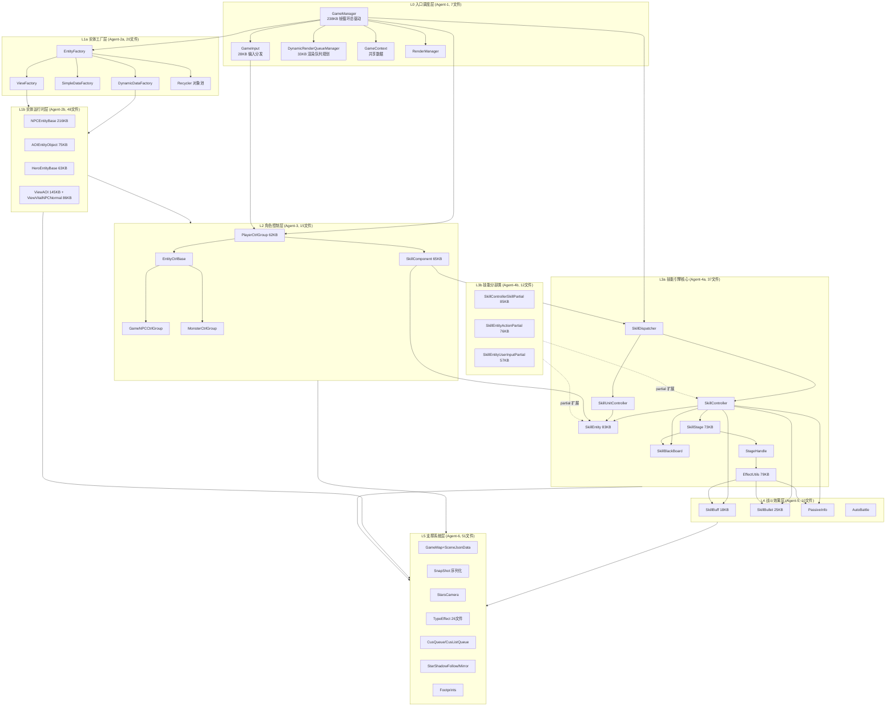

# Star 战斗层全景模块关系图 (BATTLE_OVERVIEW)

> 基于 8 个 SubAgent 分析报告的汇总。代码根：`Assets/Scripts/StarGame/Game/`，共 200 个 CS 文件，分 6 层。

## 各层职责速览

| 层 | Agent | 文件数 | 核心职责 | 巨型文件 |
|----|-------|--------|---------|---------|
| L0 入口调度 | entry | 7 | 帧循环总驱动、输入分发、渲染队列规划 | GameManager 239KB |
| L1a 工厂 | entity-factory | 20 | 三条创建链（DynamicData/SimpleData/View）+ 对象池 | ViewFactory 29KB |
| L1b 运行时 | entity-runtime | 48 | 远程实体/AOI/View 渲染表现 | NPCEntityBase 216KB, ViewAOI 145KB |
| L2 控制 | player | 15 | 控制组家族 + 组件模式 | SkillComponent 65KB, PlayerCtrlGroup 62KB |
| L3a 引擎 | skill-core | 37 | Timeline 驱动技能管线 | SkillEntity 83KB, EffectUtils 79KB |
| L3b 分部 | skill-partial | 12 | partial 类功能扩展 | SkillControllerSkillPartial 85KB |
| L4 效果 | effect | 10 | Buff/Bullet/Passive/AutoBattle | SkillBullet 25KB |
| L5 支撑 | support | 51 | 地图/快照/相机/特效/数据结构 | SceneJsonData 36KB |

## 关键架构洞察

1. **Timeline 驱动主轴**：`SkillStage → StageHandle → EffectExecuteResult → EffectUtils` 是整条技能 pipeline 核心，EffectUtils 是 L3→L4 的唯一效果落地入口。
2. **工厂+对象池模式**：EntityFactory 按 m_nType 分派三条创建链，Recycler 实现 IRecyclableObject 复用。
3. **AOI 三层裁剪**：`AOIEntityObject → ViewAOI → ViewVitalNPCNormal` 单向数据流。
4. **StageHandle 范式统一**：L3 技能阶段与 L4 Buff/Bullet/Passive 共用 StageHandle/TimeLineStage 阶段状态机。
5. **partial 物理拆分**：SkillController/SkillEntity 按功能域（输入/特效/动作/Buff等）拆分为 12 个 partial 文件，共享私有字段无接口隔离。

> 详细分层图见 `L0_ENTRY_LAYER.md` ~ `L5_SUPPORT_SYS.md`；跨层时序图见 `FLOW_*.md`。
