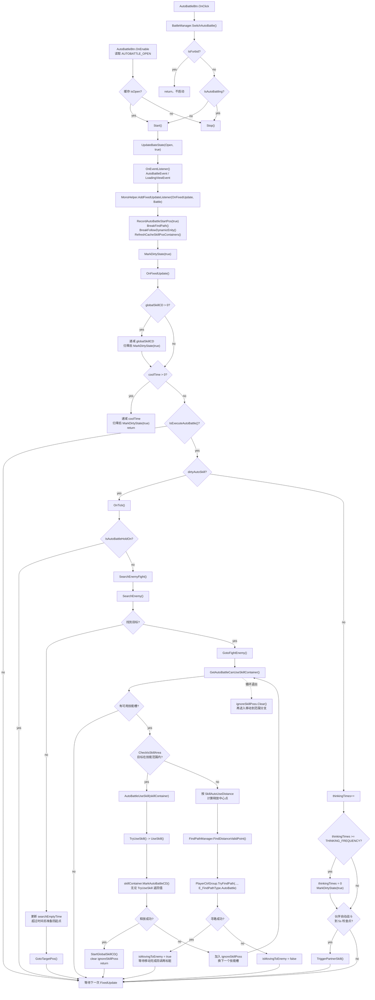
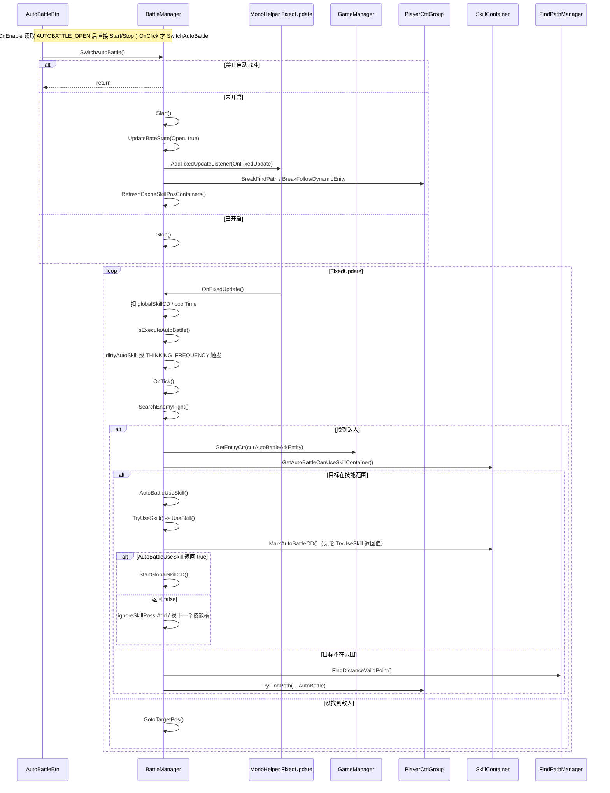

# 自动战斗详细流程

> 生成日期：2026-07-10  
> 代码主线：`Assets/Scripts/StarGame/Service/BattleManager/BattleManager.cs`  
> 历史 SVG 图：[FLOW_AUTO_BATTLE_DETAILED.svg](./FLOW_AUTO_BATTLE_DETAILED.svg)。当前代码事实以本文 Mermaid 源为准；本轮未触网安装 Mermaid CLI 重渲 SVG。

## 总览

自动战斗不是独立战斗系统，而是 `BattleManager` 在服务层做的一套“定期思考 + 索敌 + 移动到技能范围 + 复用技能施法入口”的状态机。

核心链路：

```text
AutoBattleBtn.OnClick
  -> BattleManager.SwitchAutoBattle()
  -> Start() 或 Stop()
AutoBattleBtn.OnEnable 缓存恢复
  -> 读取 AUTOBATTLE_OPEN
  -> Start() 或 Stop()
Start()
  -> MonoHelper.AddFixedUpdateListener(OnFixedUpdate)
  -> IsExecuteAutoBattle()
  -> MarkDirtyState / OnTick()
  -> SearchEnemyFight()
  -> SearchEnemy()
  -> GotoFightEnemy() 或 GotoTargetPos()
  -> GetAutoBattleCanUseSkillContainer()
  -> CheckIsSkillArea()
  -> AutoBattleUseSkill()
  -> TryUseSkill()
  -> UseSkill()
```

## 详细流程图



## 时序图



## 关键状态和分支

| 节点 | 代码位置 | 作用 |
|------|----------|------|
| `SwitchAutoBattle()` | `BattleManager.cs:1407` | UI 开关入口；禁止状态直接返回；未开启走 `Start()`，已开启走 `Stop()`。 |
| `Start()` | `BattleManager.cs:1512` | 打开状态、注册事件和 FixedUpdate、打断寻路/跟随、刷新技能槽缓存。 |
| `OnFixedUpdate()` | `BattleManager.cs:1337` | 自动战斗的定期思考循环，处理全局技能 CD、冷却、脏标记、伙伴自动战斗。 |
| `IsExecuteAutoBattle()` | `BattleManager.cs:1305` | 执行保护：主角控制组存在、自动战斗开启、未挂起、未寻路、主角未死亡。 |
| `OnTick()` | `BattleManager.cs:1397` | 非挂起状态下进入 `SearchEnemyFight()`。 |
| `SearchEnemyFight()` | `BattleManager.cs:1651` | 查怪成功进入战斗；失败时回目标点/起点。 |
| `GotoFightEnemy()` | `BattleManager.cs:1986` | 找可用技能槽，若目标在范围内直接施法；否则计算技能释放距离并寻路。 |
| `AutoBattleUseSkill()` | `BattleManager.cs:2180` | 清脏标记、调用 `TryUseSkill()`，随后无论释放结果都给当前技能槽打自动战斗 CD。 |
| `TryUseSkill()` | `BattleManager.cs:2257` | 调用 `UseSkill()`，再按是否开启预播检查施法是否成功。 |

## 与手动施法的交汇点

自动战斗自身只负责“什么时候该对哪个目标用哪个技能”。真正施法仍复用技能系统入口：

- `TryUseSkill()` 调用 `UseSkill()`。
- `UseSkill()` 不直接发送技能协议，而是通过 `InputManager.DispatchVKey(vkey, 2, true)` 触发虚拟键事件。
- `InputManager.DispatchVKey(..., isForce: true)` 最终触发 `OnVirtualInput`；`UniversalButton.Awake()` 订阅该事件，`Reset()` 取消订阅。
- `UniversalButton.InputVKey(arg == 2)` 模拟一次 `OnPointerDown(null)` + `OnPointerUp(null)`。
- 后续流程与手动点击技能一致，经 `SkillComponent.SendUserSkillReq()` 进入 `SkillController.ClientUseSkill()`；手动 `SkillEntity` 效果走 `SkillEntityActionPartial`，ServerControl/Bullet 等阶段路径才走 `StageHandle`，Damage 分支才继续进入 `EffectUtils` 等伤害落地处理。

## 追加复核证据（2026-07-15）

- `BattleManager.AutoBattleUseSkill()` 当前顺序为 `MarkDirtyState(false)` -> `TryUseSkill()` -> `skillContainer.MarkAutoBattleCD()` -> 返回结果；`MarkAutoBattleCD()` 不依赖释放成功。
- `BattleManager.GotoFightEnemy()` 只在 `AutoBattleUseSkill(...) == true` 分支调用 `StartGlobalSkillCD()`；`ignoreSkillPoss` 在入口、成功分支和循环退出后都会清空，失败分支会先加入当前技能槽再尝试下一个。
- `BattleManager.UseSkill()` 只做技能槽到虚拟按键的映射，并调用 `InputManager.Instance.DispatchVKey(keyCode, 2, true)`；它不直接调用 `SkillController`。
- `UniversalButton.InputVKey(arg == 2)` 负责把自动战斗虚拟按键转换成一次按钮按下/抬起。
