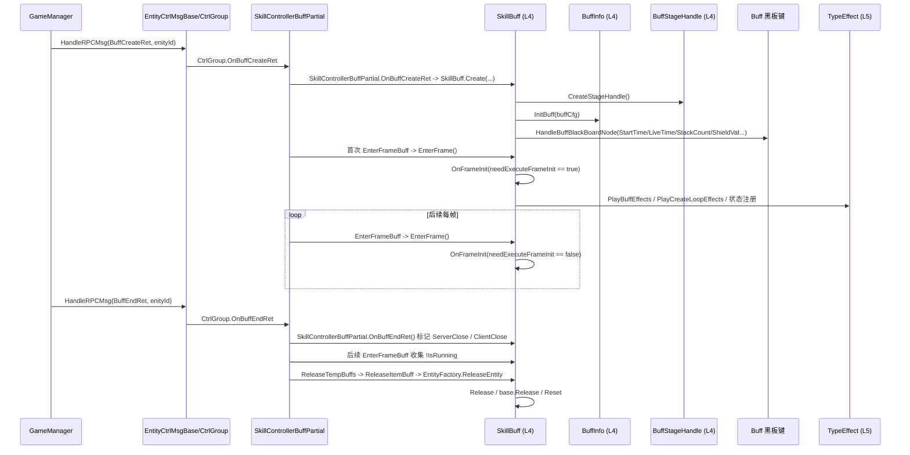

# 时序图：Buff 生命周期 (Buff Lifecycle)

> 跨层调用链：GameManager.HandleRPCMsg → EntityCtrlMsgBase/CtrlGroup → SkillControllerBuffPartial → L4 SkillBuff → BuffStageHandle / ServerControlStageEntityBase → 到期

## 链路要点

1. **挂载**：当前代码中已验证的真实入口是 `SkillBuff.Create()`、`CreateStageHandle()`、`InitBuff()`；Skill 目录定向代码图未发现 `SkillBuff.AddBuff()` 方法，旧图中的 AddBuff 只能理解为概念动作。
2. **StageHandle 驱动**：已验证 `BuffStageHandle.OnCreate()`、`OnActionExitStage()`、`OnActionStageStartCD()` 等覆写点，以及 `SkillBuff.EnterFrame()` / `OnFrameInit()` 的逐帧驱动；`ExitStage(...)` 是 `SkillStage` 的方法，不是 `BuffStageHandle` 方法。
3. **BlackBoard 同步**：`ServerControlStageEntityBase.HandleBlackList()` 将服务器 BlackList 转成 `CustomBlackBoardNode` 后调用虚方法 `HandleItemBlackBoard()`；`SkillBuff.HandleItemBlackBoard()` 先走基类写 `EntityBlackBoard` / 尝试注册服务器效果，再调用 `HandleBuffBlackBoardNode()` 处理 StartTime/LiveTime/StackCount/ShieldVal。阶段运行回包由 `SkillStage.OnRunStageRet()` 处理：普通节点写入 `StageBlackBoard` 并尝试注册效果；StartTime/LiveTime/StackCount/ShieldVal 等特殊节点只触发 `ActionOnSpecialServerBlackBoardNode?.Invoke(...)`。当前 Skill 目录定向搜索仅发现字段定义、Invoke 和 `ReleaseAction()` 清空，未发现 `+=` 或非清空赋值注册点。
   - `HandleBuffBlackBoardNode()` 对 `StartTime` / `LiveTime` / `StackCount` / `ShieldVal` 的可证行为是写 `SkillBuff` 本地字段、调用 `playerData.TriggerBuffChange(...)` 并置 `dirtyUpdateBuff`；`SkillBuff.EnterFrame()` 在后续帧把 dirty 标记转成 `ActionOnUpdateBuff -> SkillController.ActionOnBuffUpdate`。`EntityBaseData.TriggerBuffChange()` 只是构造 `BuffEventData` 后 `TriggerChange("buff_{id}", ...)`，本轮未发现它直接修改 `Attrs` 或伤害数值。
4. **视觉特效**：已验证存在 `SkillBuff.PlayBuffEffects()` / `StopBuffEffects()`，实际 TypeEffect 创建在 ServerControlStageEntityBase 的 PlayEffects 链路。
5. **到期/移除**：服务器 BuffEnd 协议先由 `GameManager.HandleRPCMsg()` 按 `enityId` 分发到 `EntityCtrlMsgBase/CtrlGroup`，CtrlGroup 再调用 `SkillControllerBuffPartial.OnBuffEndRet()`；后者转到 `SkillBuff.OnBuffEndRet()` 标记 ServerClose/ClientClose。释放不会在结束回包里直接完成，而是在后续 `EnterFrameBuff()` 收集 `!IsRunning` 后调用 `ReleaseTempBuffs()` / `ReleaseItemBuff()` / `EntityFactory.ReleaseEntity()`，实体回收落到 `SkillBuff.Release()` / `base.Release()` / `Reset()`。Skill 目录定向代码图未发现 `SkillBuff.RemoveBuff()` 方法。
6. **Passive 联动**：运行时入口是 `SkillControllerPassivePartial.OnPassiveSkillUseRet()` / `OnPassiveRunStageRet()` / `OnPassiveSkillEndRet()`，运行时实体是 `PassiveSkillEntity`；`PassiveInfo` 只负责配置 `Init/InitData/Release`，`PassiveSkillEntity.CreatePassiveInfo()` 负责创建它。Skill 目录定向代码图未发现 `PassiveInfo.TriggerPassive()` 方法。

## 涉及文件（按层）

| 层 | 关键文件 |
|----|---------|
| L3 | EffectUtils.cs, SkillBlackBoard.cs, SkillControllerBuffPartial.cs |
| L4 | SkillBuff.cs, BuffInfo.cs, BuffStageHandle.cs, PassiveSkillEntity.cs, PassiveInfo.cs, PassiveStageHandle.cs |
| L5 | TypeEffectFactory.cs, InvisibleBuffEffect.cs, ShadowFollowBuffEffect.cs, BaseTypeEffect.cs |

## 二次复核证据（2026-07-13）

- `SkillController.EnterFrame()` 的真实顺序是 `ReleaseReadyRemoveSkillEntities()`、`UpdateSkillEntities()`、`EnterFrameBuff()`、`EnterFrameBullet()`、`EnterFramePassive()`；`EnterFrameBuff()` 的直接上游由 codebase-memory `trace_path` 证实为 `SkillDispatcher.EnterFrame -> SkillController.EnterFrame -> EnterFrameBuff`。
- `SkillControllerBuffPartial.EnterFrameBuff()` 先把 `buffDic` 中 `IsRunning == false` 的项收集到 `temp2ReleaseBuffs`，先 `ReleaseTempBuffs()`，再 `EnterFrameRunnintBuff()` 调 `SkillBuff.EnterFrame()`；释放落点是 `ReleaseItemBuff(runtimeID) -> EntityFactory.ReleaseEntity(...) -> buffDic.Remove(runtimeID)`。
- 三次复核确认协议入口归属：`GameManager.HandleRPCMsg()` 按 `enityId` 转到 `EntityCtrlBase.HandleRpcMsg()` / CtrlGroup；`SkillControllerBuffPartial` 是 CtrlGroup 之后的 Buff 运行时处理器，不是最上游协议入口。
- `SkillBuff.Create(BuffCreateRet, VitalSignData)` 只做运行时初始化：写 `RuntimeID/OwnerEntityID/BuilderID`、设置 `BuffID/RuntimeLv`、`EntityBlackBoard.KEY_CFG_ID`、`CreateStageHandle()`、`InitBuff(...)`，然后 `TriggerBuffChange(BuffID, "buffCreate", stackCount)`。
- `SkillBuff.HandleBuffBlackBoardNode()` 对 `StartTime/LiveTime/StackCount/ShieldVal` 分支有明确处理；代码现状里 `ShieldVal` 会写 `shieldVal`，但通知调用是 `TriggerBuffChange(BuffID, "ShieldVal", stackCount)`，文档只记录这个现状，不推断它是否符合设计意图。
- 四次复核确认 Buff 更新通知边界：`HandleBuffBlackBoardNode()` 写入本地字段后置 `dirtyUpdateBuff`，`SkillBuff.EnterFrame()` 再调用 `ActionOnUpdateBuff`；`SkillControllerBuffPartial.RegisterBuffAction()` 将该回调接到 `OnActionUpdateBuff()`，最终触发 `ActionOnBuffUpdate`。`EntityBaseData.TriggerBuffChange()` / `TriggerChange()` 是按 `buff_{id}` 派发 `BuffEventData` 的数据变更事件，不是属性/伤害数值计算入口。
- `ActionOnSpecialServerBlackBoardNode\s*(\+=|=)` 的定向代码搜索只命中 `SkillStage.ReleaseAction()` 中的清空赋值；`SkillBuff.AddBuff`、`SkillBuff.RemoveBuff`、`PassiveInfo.TriggerPassive` 精确/近似方法名搜索结果为 0。

## 已验证边界
- `SkillBuff` 继承 `ServerControlStageEntityBase`；创建、阶段推进、结束分别由 CtrlGroup 转交后的 `SkillControllerBuffPartial.OnBuffCreateRet()`、`OnBuffRunStage()`、`OnBuffEndRet()` 驱动，客户端每帧只推进本地表现、dirty 更新通知和状态收尾。
- Buff 服务器黑板同步已验证到本地字段、Buff UI/Lua/表现通知边界；`EntityBaseData.TriggerBuffChange()` 只是按 `buff_{id}` 构造 `BuffEventData` 并 `TriggerChange(...)`，不要写成客户端属性数值计算入口。
- 客户端运行时 `buffDic` 按 `RuntimeID` 保存 `SkillBuff`；`OnBuffCreateRet()` 只在 `RuntimeID` 重复时释放旧对象，不按 `BuffID` 本地合并。`StackCount` 由服务器黑板同步后写入 `stackCount` 并用于 Buff 变化通知；`Replace` / `MaxFloor` 只能视为配置侧字段，本轮 StarGame 运行时代码未证明客户端按它们执行本地叠层/替换。
- `AttacState.cs` 与 `AttackState.cs` 都定义为 `VitalState`；`AttacState.OnEnable()` 播放 `AttackAnimations[_AttackIndex]`，`AttackState.OnEnable()` 中播放逻辑被注释。本文不声明 prefab/scene/asset/controller GUID 引用情况；那需要单独资产扫描。
