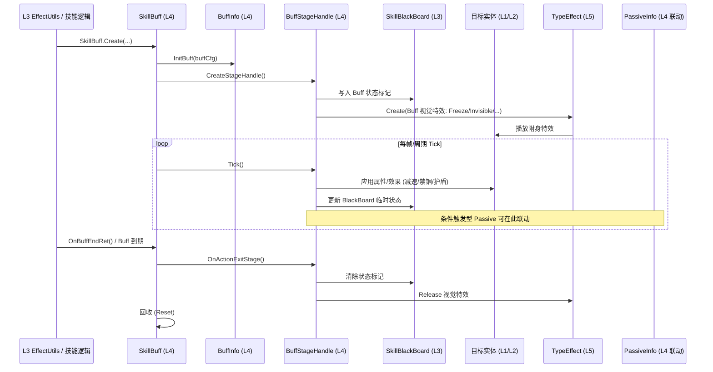

# 时序图：Buff 生命周期 (Buff Lifecycle)

> 跨层调用链：L3 EffectUtils → L4 SkillBuff → BuffStageHandle → 属性修改 → 到期

## 链路要点

1. **挂载**：当前代码中已验证的真实入口是 `SkillBuff.Create()`、`InitBuff()`、`CreateStageHandle()`；未发现 `SkillBuff.AddBuff()` 方法，旧图中的 AddBuff 只能理解为概念动作。
2. **StageHandle 驱动**：已验证 `BuffStageHandle.OnCreate()`、`OnActionExitStage()`、`OnActionStageStartCD()` 等覆写点，以及 `SkillBuff.EnterFrame()` / `OnFrameInit()` 的逐帧驱动；未发现 `BuffStageHandle.EnterStage()` / `ExitStage()` 这两个精确方法名。
3. **BlackBoard 同步**：Buff 状态标记写入 SkillBlackBoard（L3），供跨 Stage/跨效果查询（如禁锢状态影响移动）。
4. **视觉特效**：已验证存在 `SkillBuff.PlayBuffEffects()` / `StopBuffEffects()`；具体 TypeEffectFactory 调用链本文件未继续展开。
5. **到期/移除**：已验证 `SkillBuff.OnBuffEndRet()`、`Release()`、`ReleaseAction()`；`RemoveBuff()` 精确方法名未确认。
6. **Passive 联动**：已验证 `PassiveSkillEntity.CreatePassiveInfo()` 和 `PassiveInfo.Init/InitData/Release`；`PassiveInfo.TriggerPassive()` 精确方法名未确认。

## 涉及文件（按层）

| 层 | 关键文件 |
|----|---------|
| L3 | EffectUtils.cs, SkillBlackBoard.cs, SkillControllerBuffPartial.cs |
| L4 | SkillBuff.cs, BuffInfo.cs, BuffStageHandle.cs, PassiveInfo.cs, PassiveStageHandle.cs |
| L5 | TypeEffectFactory.cs, FreezeBuffEffect.cs, InvisibleBuffEffect.cs, ShadowFollowBuffEffect.cs, BaseTypeEffect.cs |

## 存疑点
- SkillBuff 与 ServerControlStageEntityBase 的"服务器控制"具体是服务器下发指令还是纯客户端模拟 [语义不清]
- Buff 层级（同类 Buff 叠加/刷新策略）在 BuffInfo 还是 SkillBuff 中管理 [待确认]
- AttacState.cs 与 AttackState.cs 疑似冗余 [语义不清]
