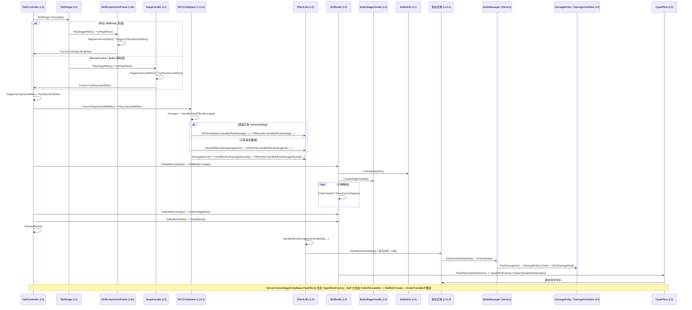

# 时序图：伤害结算管线 (Damage Pipeline)

> 跨层调用链：SkillEntityActionPartial / StageHandle 效果线 + SkillController Bullet 回包线 + EffectUtils 伤害落地

## 链路要点

1. **效果入口**：当前代码未发现 `EffectUtils.ExecuteEffect(SkillEffectParam)` 方法；已验证的阶段效果入口有两条：手动 `SkillEntity` 走 `SkillEntityActionPartial.PlayStageEffect()` → `TryPlayEffect()` → `RegisterServerEffect()` / `StageTryPlayServerEffect()` / `FuncOnTryPlayClientEffect`，ServerControl/Bullet 等阶段走 `StageHandle.PlayStageEffect()` → `TryPlayEffect()` → `RegisterServerEffect()` / `TryPlayServerEffect()` / `FuncOnTryPlayClientEffect`。客户端效果委托先回到 `SkillController.StageTryPlayClientEffect()` / `TryPlayClientEffect()`，再经 `NPCEntityBase.PlayClientSkillEffect()` 分支派发；`Damage` 分支先进入 `HandleClientEffectDamage()`，黑板已有 `HurtNodeMsg` 时走三参 `NPCEntityBase.HandleEffectDamage(...)` 再调 `EffectUtils.HandleEffectDamage(...)`，否则退到 `HandleEffectDamageTargetArr()` / `EffectUtils.HandleEffectDamageTar(...)`；`DamageSecond` 分支走 `HandleClientDamageSecond()` / `EffectUtils.HandleEffectDamageSecond(...)`。
2. **Bullet 运行模型**：已验证真实方法包括 `SkillBullet.Create()`、`CreateStageHandle()`、`CreateBulletInfo()`、`EnterFrame()`、`EnterFrameStages()`、`OnRunStageRet()`、`OnBulletEndRet()`；`SkillBullet.Create()` 用 `hasCreate` 避免服务器运行时创建与 AOI 创建通知造成重复特效；`SkillControllerBulletPartial.OnBulletEndRet()` 调 `SkillBullet.OnBulletEndRet()` 后立即 `ReleaseBullet()`。文档不再把 `SpawnBullet()` / `OnFlyUpdate()` / `OnHitTarget()` 当作真实方法名。
3. **伤害落地**：`EffectUtils.HandleEffectDamage()` 消费服务器 `HurtNodeMsg/HurtData`，查目标实体、播放受击特效/动作/闪白，并调用 `HandleHurtNodeMsg()`；`AOIEntityObject.HandleHurtNodeMsg()` 本身只触发 `ActionOnHurtNodeMsg`，真实落点是 `NPCEntityBase.OnHurtNodeMsg()`。
4. **伤害飘字**：`NPCEntityBase.OnHurtNodeMsg()` 调用 `BattleManager.OnHurtData()`；后者按命中、护盾、吸血、反伤、miss 等 `HurtData` 字段组装 `DamageData` 并调用 `PlayDamageText()`；`PlayDamageText()` 创建 `DamageEntity`，`DamageEntity.Create()` 加载 `DamageViewNew` 并 `BindDamageEntity()`。`DamageEntity` 是飘字/UI实体，不是伤害数值计算入口。
5. **Buff 持续模型**：已验证真实方法包括 `SkillBuff.Create()`、`CreateStageHandle()`、`InitBuff()`、`EnterFrame()`、`OnFrameInit()`、`OnBuffEndRet()`、`Release()`；阶段退出由 `SkillStage.ExitStage(E_SkillStageExitType)` 承担。
6. **视觉特效**：TypeEffect 通过 `TypeEffectFactory.Create(GlobalShowSerialize)` 创建，当前映射包含 `ShadowFollowBuffEffect`、`InvisibleBuffEffect`、`ParalysisBuffEffect` 等；调用点已验证在 `SkillBullet.PlayEffects()` / `ServerControlStageEntityBase.PlayEffects()`，不是 `EffectUtils`。

## 涉及文件（按层）

| 层 | 关键文件 |
|----|---------|
| L3 | SkillEntityActionPartial.cs, StageHandle.cs, SkillControllerEffectPartial.cs, SkillControllerBulletPartial.cs, EffectUtils.cs, EffectResultUtils.cs, SkillEffectParam.cs |
| L4 | SkillBullet.cs, BulletInfo.cs, BulletStageHandle.cs, SkillBuff.cs, BuffInfo.cs, BuffStageHandle.cs |
| Service/UI | BattleManager.cs, DamageViewNew.cs |
| L5 | TypeEffectFactory.cs, ShadowFollowBuffEffect.cs, InvisibleBuffEffect.cs, ParalysisBuffEffect.cs, BaseTypeEffect.cs |

## 已验证边界
- 客户端伤害数值来源按服务器 `HurtNodeMsg/HurtData` 读取；`BattleManager.OnHurtData()` 将服务器数据组装为 `DamageData`，`PlayDamageText()` 创建 `DamageEntity`。`DamageEntity.Create()` 只保存 `DamageData/HurtData`、加载 `DamageViewNew` 并 `BindDamageEntity()`，未参与伤害数值计算。
- `NPCEntityBase.HandleClientEffectDamage()` 不是直接等同于 `EffectUtils.HandleEffectDamage(HurtNodeMsg,...)`：它先尝试从黑板读取 `HurtNodeMsg` 并经三参 `NPCEntityBase.HandleEffectDamage(...)` 调 `EffectUtils.HandleEffectDamage(...)`；失败后才按 `SkillTarData` 走 `HandleEffectDamageTargetArr()` / `EffectUtils.HandleEffectDamageTar(...)`。`HandleEffectDamageTar(...)` 只播放受击特效、受击动作和闪白，未调用 `HandleHurtNodeMsg()` / `BattleManager.OnHurtData()`；`HandleEffectDamageSecond(...)` 则只按 `EffectTypeDamageSecond.FlutteringWordsID` 调用 `HandleHurtNodeMsg()`，未在该方法内播放受击特效/动作。
- `SkillBullet` 定向搜索未发现 `OnHitTarget` / `HitTarget` / `OnCollision` / `OnTrigger` / `SkillUtils` / `HandleEffectDamage` 等本地命中或直接伤害 API；当前可证链路是服务器 `RunStageRet` 经 `NPCEntityBase.OnRunStageRet -> SkillController.OnServerRunStage -> OnBulletRunStage -> SkillBullet.OnRunStageRet` 推进阶段。
- Buff 客户端侧已验证会处理服务器同步黑板键（如 `StackCount`、`LiveTime`、`ShieldVal`）：`SkillBuff.HandleBuffBlackBoardNode()` 写本地字段、触发 `EntityBaseData.TriggerBuffChange()` 并置 `dirtyUpdateBuff`，后续 `SkillBuff.EnterFrame()` 触发 `ActionOnBuffUpdate`。这些是 Buff 状态/表现/监听通知边界；本轮未发现 `TriggerBuffChange()` 直接修改 `Attrs` 或参与伤害数值计算。
