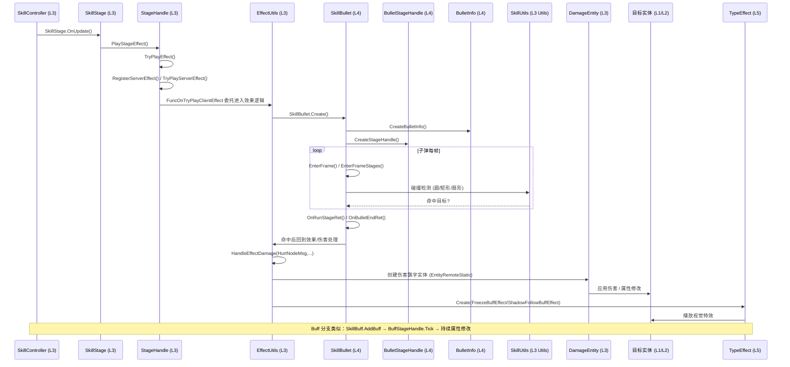

# 时序图：伤害结算管线 (Damage Pipeline)

> 跨层调用链：L3 EffectUtils → L4 Bullet/Buff → 命中 → 伤害飘字

## 链路要点

1. **效果入口**：当前代码未发现 `EffectUtils.ExecuteEffect(SkillEffectParam)` 方法；已验证的阶段效果入口是 `StageHandle.PlayStageEffect()` → `TryPlayEffect()` → `RegisterServerEffect()` / `TryPlayServerEffect()` / `FuncOnTryPlayClientEffect`。
2. **Bullet 运行模型**：已验证真实方法包括 `SkillBullet.Create()`、`CreateBulletInfo()`、`CreateStageHandle()`、`EnterFrame()`、`EnterFrameStages()`、`OnRunStageRet()`、`OnBulletEndRet()`；文档不再把 `SpawnBullet()` / `OnFlyUpdate()` / `OnHitTarget()` 当作真实方法名。
3. **伤害计算回流**：子弹命中回调交还 L3 EffectUtils，由 EffectUtils 计算伤害并创建 DamageEntity（伤害飘字，EntityRemoteStatic）。
4. **Buff 持续模型**：已验证真实方法包括 `SkillBuff.Create()`、`InitBuff()`、`CreateStageHandle()`、`EnterFrame()`、`OnFrameInit()`、`OnBuffEndRet()`、`Release()`；是否存在独立 `EnterStage()` / `ExitStage()` 方法未在当前代码中确认。
5. **视觉特效**：命中后通过 TypeEffectFactory.Create 播放 FreezeBuffEffect/ShadowFollowBuffEffect 等（L5 支撑）。

## 涉及文件（按层）

| 层 | 关键文件 |
|----|---------|
| L3 | EffectUtils.cs, SkillUtils.cs, DamageEntity.cs, EffectResultUtils.cs, SkillEffectParam.cs |
| L4 | SkillBullet.cs, BulletInfo.cs, BulletStageHandle.cs, SkillBuff.cs, BuffInfo.cs, BuffStageHandle.cs |
| L5 | TypeEffectFactory.cs, FreezeBuffEffect.cs, ShadowFollowBuffEffect.cs, BaseTypeEffect.cs |

## 存疑点
- DamageEntity 是伤害飘字实体（EntityRemoteStatic），实际伤害数值计算逻辑所在（L3 内部还是服务器下发）[待确认]
- Buff 属性修改是直接改 Entity 字段还是经 SkillBlackBoard 中转 [待确认]
