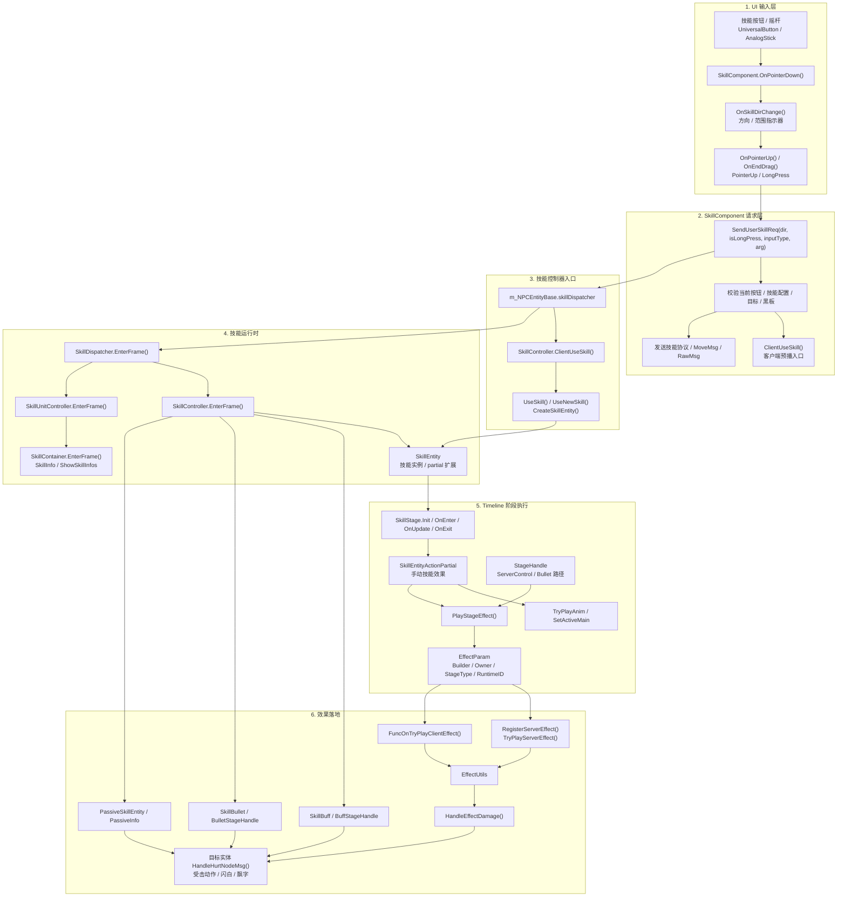
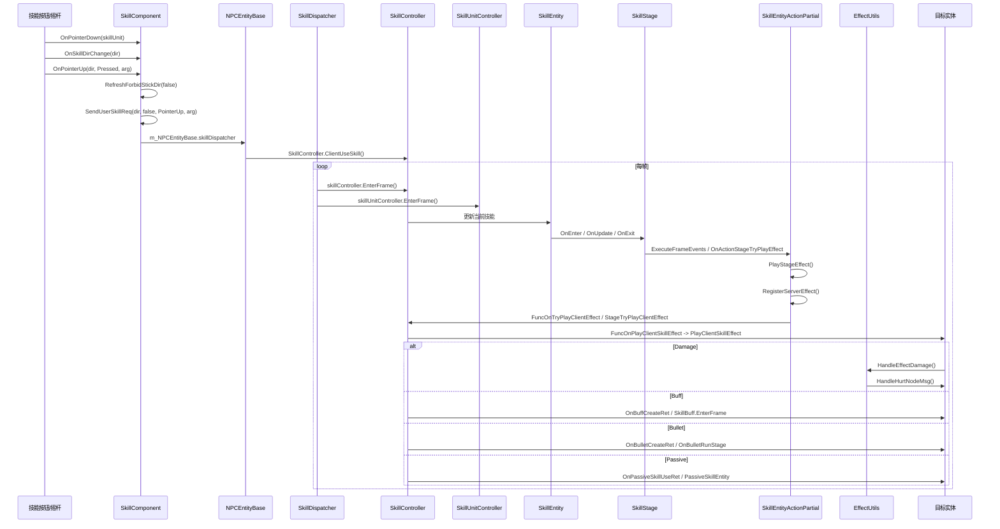

# 单次技能施法全流程

> 生成日期：2026-07-10
> 范围：手动技能按钮输入 + 自动战斗复用入口 + 客户端预播 + 技能阶段 + 效果/伤害落地
> 历史 SVG 图：[FLOW_SKILL_CAST_FULL.svg](./FLOW_SKILL_CAST_FULL.svg)。当前代码事实以本文 Mermaid 源为准；本轮未触网安装 Mermaid CLI 重渲 SVG。

## 总览

一个技能施法不是单个函数完成，而是分为 6 段：

1. UI 输入：按钮按下、拖拽方向、抬起或长按触发。
2. `SkillComponent` 构造施法请求：校验当前按钮、方向、技能配置、黑板、目标。
3. 本地技能入口：手动技能由 `SkillComponent.SendUserSkillReq()` 直接进入 `SkillController.ClientUseSkill()`；`GameManager.InputVKey()` 是 VKey 移动/虚拟输入链路。
4. 技能运行时：`SkillDispatcher` 每帧驱动 `SkillController` 和 `SkillUnitController`。
5. Timeline 阶段：`SkillStage` 进入、更新、退出；手动 `SkillEntity` 路径由 `SkillEntityActionPartial` 在阶段帧播放动画、音效、特效和服务器/客户端效果。
6. 效果落地：`SkillEntityActionPartial` 分发手动技能的客户端/服务器效果线；`StageHandle` 用于 ServerControl/Bullet 等阶段路径。Buff/Bullet/Passive 协议先经 `GameManager.HandleRPCMsg -> EntityCtrlMsgBase/CtrlGroup`，再由 `SkillController*Partial` 创建运行时实体；伤害最终经 `EffectUtils.HandleEffectDamage()` 进入目标实体 `HandleHurtNodeMsg()`。

## 全流程图

## 时序图

## 关键代码锚点

| 阶段 | 代码位置 | 作用 |
|------|----------|------|
| UI 抬起 | `SkillComponent.cs:542` | `OnPointerUp()` 在按钮处于 `Pressed` 时调用 `SendUserSkillReq()`。 |
| 请求构造 | `SkillComponent.cs:842` | `SendUserSkillReq()` 是手动技能释放的核心入口，也会处理客户端预播、目标、黑板、协议数据。 |
| 手动施法 | `SkillComponent.cs:1188` | `SendUserSkillReq()` 通过 `m_NPCEntityBase.skillDispatcher.SkillController.ClientUseSkill()` 进入技能控制器。 |
| VKey 移动 | `GameManager.cs:2455` / `PlayerCtrlGroup.cs:730` | `InputVKey()` 按 `playerId` 找到 `PlayerCtrlGroup`，再进入 `DoVKey_Move()`；这不是手动技能释放主链路。 |
| 技能调度 | `SkillDispatcher.cs:86` | 每帧驱动 `SkillController` 和 `SkillUnitController`。 |
| 手动阶段效果 | `SkillEntityActionPartial.cs:505` | `PlayStageEffect()` 创建 `EffectParam`，把阶段效果包装后交给执行逻辑。 |
| 手动效果执行 | `SkillEntityActionPartial.cs:800` | `TryPlayEffect()` 注册服务器效果、尝试服务器效果，再调用客户端效果委托。 |
| ServerControl/Bullet 阶段效果 | `StageHandle.cs:406` / `StageHandle.cs:556` | `StageHandle` 在 Buff/Bullet/Passive 等阶段路径负责同类效果包装和分发。 |
| 伤害落地 | `EffectUtils.cs:1342` | `HandleEffectDamage()` 查目标实体、播放受击特效/动作，调用 `HandleHurtNodeMsg()`。 |

## 自动战斗复用点

自动战斗的 `AutoBattleUseSkill() -> TryUseSkill() -> BattleManager.UseSkill()` 会进入同一条按钮施法管线。区别在输入来源：

- 手动施法：玩家按钮/摇杆触发 `SkillComponent.SendUserSkillReq()`。
- 自动战斗：`BattleManager` 先索敌、选技能槽、判断距离，再调用 `InputManager.Instance.DispatchVKey(keyCode, 2, true)`；`UniversalButton.InputVKey(arg == 2)` 会模拟 `OnPointerDown()` + `OnPointerUp()`，后续回到 `SkillComponent.SendUserSkillReq()`。

## 需要注意的边界

- `SkillComponent.SendUserSkillReq()` 方法很长，承担了输入校验、目标选择、预播、协议和提示等多个职责。
- 手动 `SkillEntity` 路径的关键分叉点是 `SkillEntityActionPartial.TryPlayEffect()`；`StageHandle.TryPlayEffect()` 用于 ServerControl/Bullet 等阶段路径。
- `EffectUtils.HandleEffectDamage()` 并不只算数字，它还负责受击特效、受击动作和伤害飘字落地。
- 自动战斗和手动施法共享按钮后的技能系统，因此改 `SkillComponent.SendUserSkillReq()`、`SkillController`、`SkillEntity`、`SkillEntityActionPartial`、`StageHandle`、`EffectUtils` 都会同时影响两者。
