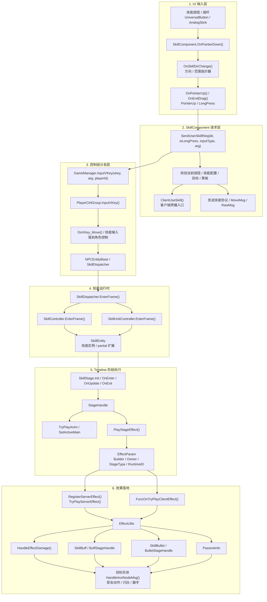
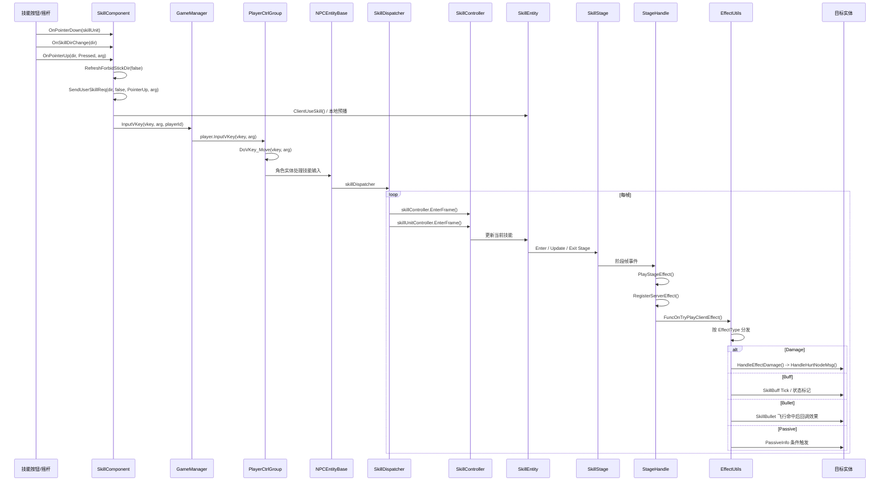

# 单次技能施法全流程

> 生成日期：2026-07-10  
> 范围：手动技能按钮输入 + 自动战斗复用入口 + 客户端预播 + 技能阶段 + 效果/伤害落地  
> 可直接打开的 SVG 图：[FLOW_SKILL_CAST_FULL.svg](./FLOW_SKILL_CAST_FULL.svg)

## 总览

一个技能施法不是单个函数完成，而是分为 6 段：

1. UI 输入：按钮按下、拖拽方向、抬起或长按触发。
2. `SkillComponent` 构造施法请求：校验当前按钮、方向、技能配置、黑板、目标。
3. 本地控制分发：`GameManager.InputVKey()` 找到 `PlayerCtrlGroup`，再进入角色控制逻辑。
4. 技能运行时：`SkillDispatcher` 每帧驱动 `SkillController` 和 `SkillUnitController`。
5. Timeline 阶段：`SkillStage` 进入、更新、退出；`StageHandle` 在阶段帧播放动画、音效、特效和服务器/客户端效果。
6. 效果落地：`EffectUtils` 分发 Buff、Bullet、Passive、Damage；伤害最终进入目标实体 `HandleHurtNodeMsg()`。

## 全流程图

## 时序图

## 关键代码锚点

| 阶段 | 代码位置 | 作用 |
|------|----------|------|
| UI 抬起 | `SkillComponent.cs:542` | `OnPointerUp()` 在按钮处于 `Pressed` 时调用 `SendUserSkillReq()`。 |
| 请求构造 | `SkillComponent.cs:842` | `SendUserSkillReq()` 是手动技能释放的核心入口，也会处理客户端预播、目标、黑板、协议数据。 |
| 控制分发 | `GameManager.cs:2455` | `InputVKey()` 按 `playerId` 找到 `PlayerCtrlGroup` 并转发。 |
| 角色控制 | `PlayerCtrlGroup.cs:730` | `InputVKey()` 进入 `DoVKey_Move()`，技能输入落到角色控制层。 |
| 技能调度 | `SkillDispatcher.cs:86` | 每帧驱动 `SkillController` 和 `SkillUnitController`。 |
| 阶段效果 | `StageHandle.cs:406` | `PlayStageEffect()` 创建 `EffectParam`，把阶段效果包装后交给执行逻辑。 |
| 效果执行 | `StageHandle.cs:556` | `TryPlayEffect()` 注册服务器效果、尝试服务器效果，再调用客户端效果委托。 |
| 伤害落地 | `EffectUtils.cs:1342` | `HandleEffectDamage()` 查目标实体、播放受击特效/动作，调用 `HandleHurtNodeMsg()`。 |

## 自动战斗复用点

自动战斗的 `AutoBattleUseSkill() -> TryUseSkill() -> UseSkill()` 会进入同一条施法管线。区别只在输入来源：

- 手动施法：玩家按钮/摇杆触发 `SkillComponent.SendUserSkillReq()`。
- 自动战斗：`BattleManager` 先索敌、选技能槽、判断距离，再调用 `UseSkill()` 复用后续逻辑。

## 需要注意的边界

- `SkillComponent.SendUserSkillReq()` 方法很长，承担了输入校验、目标选择、预播、协议和提示等多个职责。
- `StageHandle.TryPlayEffect()` 同时处理服务器效果注册和客户端效果委托，是阶段效果执行的关键分叉点。
- `EffectUtils.HandleEffectDamage()` 并不只算数字，它还负责受击特效、受击动作和伤害飘字落地。
- 自动战斗和手动施法共享后半段技能系统，因此改 `UseSkill`、`SkillEntity`、`StageHandle`、`EffectUtils` 都会同时影响两者。
