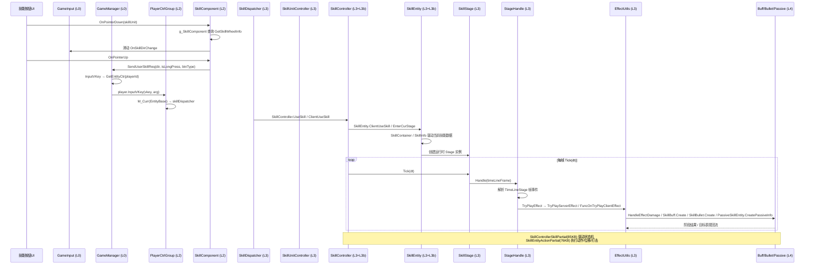

# 时序图：技能释放链路 (Skill Release Flow)

> 跨层调用链：L0 输入 → L2 控制 → L3 引擎 → L3b 分部 → L4 效果

## 链路要点

1. **输入入口**：技能按钮 → SkillComponent（不继承 PlayerComponent，由 PlayerCtrlGroup.g_SkillComponent 显式持有）→ GameManager.InputVKey → PlayerCtrlGroup。
2. **调度分发**：当前代码中 `SkillDispatcher.EnterFrame()` 每帧驱动 `SkillController.EnterFrame()` 与 `SkillUnitController.EnterFrame()`；施法入口已验证到 `SkillController.UseSkill()` / `ClientUseSkill()`。
3. **Timeline 主轴**：SkillStage 持有 TimeLineStage[] → StageHandle 逐帧解析 → `PlayStageEffect()` / `TryPlayEffect()`。
4. **效果落地**：StageHandle 通过 `RegisterServerEffect()` / `TryPlayServerEffect()` / `FuncOnTryPlayClientEffect` 进入效果逻辑；伤害落地已验证到 `EffectUtils.HandleEffectDamage()`，Buff/Bullet/Passive 分别由 `SkillBuff.Create()`、`SkillBullet.Create()`、`PassiveSkillEntity.CreatePassiveInfo()` 等真实方法承接。
5. **partial 扩展**：SkillControllerSkillPartial 驱动技能状态机；SkillEntityActionPartial 执行底层动作（动画/位移/打击点）。

## 涉及文件（按层）

| 层 | 关键文件 |
|----|---------|
| L0 | GameInput.cs, GameManager.cs |
| L2 | PlayerCtrlGroup.cs, SkillComponent.cs |
| L3 | SkillDispatcher.cs, SkillUnitController.cs, SkillController.cs, SkillEntity.cs, SkillStage.cs, StageHandle.cs, EffectUtils.cs |
| L3b | SkillControllerSkillPartial.cs, SkillEntityActionPartial.cs, SkillEntityUserInputPartial.cs |
| L4 | SkillBuff.cs, SkillBullet.cs, PassiveInfo.cs |
