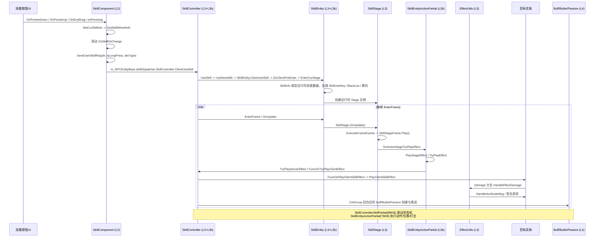

# 时序图：技能释放链路 (Skill Release Flow)

> 跨层调用链：技能按钮 → L2 SkillComponent → L3 SkillController/SkillEntity → L3b 分部 → L4 效果

## 链路要点

1. **输入入口**：手动技能按钮的 `UniversalButton.OnPointerDown/OnPointerUp/OnEndDrag/onPressing` 会通过委托进入 `SkillComponent.OnPointerDown/OnPointerUp/OnEndDrag/OnPressingAction()`（SkillComponent 不继承 PlayerComponent，由 PlayerCtrlGroup.g_SkillComponent 显式持有）→ `SendUserSkillReq()` → `SkillController.ClientUseSkill()`；不是 `GameManager.InputVKey()` / `PlayerCtrlGroup.InputVKey()` 链路。
2. **调度分发**：当前代码中 `SkillDispatcher.EnterFrame()` 每帧驱动 `SkillController.EnterFrame()` 与 `SkillUnitController.EnterFrame()`；施法入口已验证到 `SkillController.UseSkill()` / `ClientUseSkill()`。
3. **Timeline 主轴**：SkillInfo/BaseConfigInfo 提供 TimeLineStage[]；运行期 `SkillStage.OnUpdate()` / `ExecuteFrameEvents()` 播放帧事件，手动 SkillEntity 路径由 `SkillEntityActionPartial.PlayStageEffect()` / `TryPlayEffect()` 执行动作和效果。
4. **效果落地**：`SkillEntityActionPartial` 的 `TryPlayEffect()` 通过 `TryPlayServerEffect` / `FuncOnTryPlayClientEffect` 进入效果逻辑；`StageHandle.PlayStageEffect()` / `TryPlayEffect()` 用于 ServerControl/Bullet 等阶段路径。伤害落地已验证到 `EffectUtils.HandleEffectDamage()`。Buff/Bullet/Passive 运行时创建来自上游协议分发后的 `SkillController*Partial` 处理。
5. **partial 扩展**：SkillControllerSkillPartial 驱动技能状态机；SkillEntityActionPartial 执行底层动作（动画/位移/打击点）。

## 涉及文件（按层）

| 层 | 关键文件 |
|----|---------|
| UI | UniversalButton.cs |
| L2 | PlayerCtrlGroup.cs, SkillComponent.cs |
| L3 | SkillDispatcher.cs, SkillUnitController.cs, SkillController.cs, SkillEntity.cs, SkillStage.cs, EffectUtils.cs |
| L3b | SkillControllerSkillPartial.cs, SkillEntityActionPartial.cs, SkillEntityUserInputPartial.cs |
| L4 | SkillBuff.cs, SkillBullet.cs, PassiveInfo.cs |
