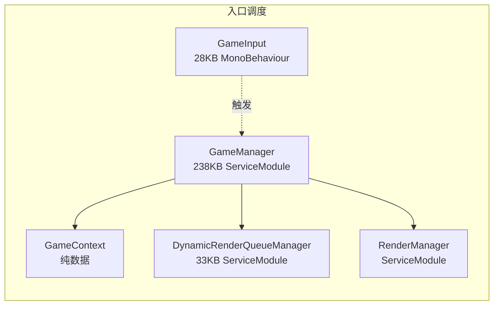
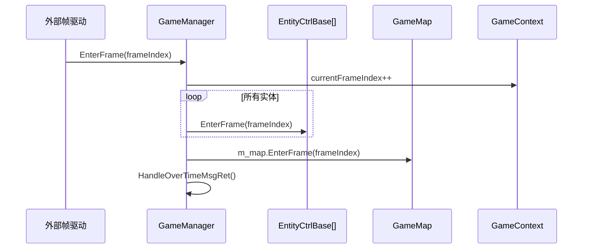

# L0 入口调度层 (Entry Layer)

> Agent-1 [entry] | 7 文件 | `Game/` 根目录

## 层级内部模块关系



## 输入-处理-输出

```
外部帧驱动(MonoHelper/World) 
  → GameManager.EnterFrame(frameIndex)
    → [处理] 递增 currentFrameIndex → 遍历 m_listEntityCtrl.EnterFrame → 遍历 m_LocalEntitys.EnterFrame → m_map.EnterFrame → HandleOverTimeMsgRet
    → [输出] 驱动所有实体/地图/战斗逻辑帧更新

用户输入(GameInput) 
  → GameManager.InputVKey(vkey, arg, playerId)
    → [处理] GetEntityCtr(playerId) → PlayerCtrlGroup.InputVKey
    → [输出] 直达 Player 层技能/移动
```

## 关键调用链



## 对外接口（与其他层契约）

**GameManager（核心调度面）**
- `EnterFrame(int)` / `EnterFixLaterFrame()` — 帧驱动入口（被 Battle/World 层调用）
- `InputVKey(int, float, ulong)` — 输入层 → Player 层入口
- `GetEntityCtr(ulong) : EntityCtrlBase` — 获取实体控制层
- `CreateGame(GameParam)` / `ReleaseGame()` — 生命周期
- `mainPlayerId` / `M_MainPlayerCtrlBase` — 主角引用
- `Context : GameContext` / `M_Map : GameMap` — 上下文/地图访问

**GameInput（输入分发）**
- `static Create()` / `AddSkillBtn(int, UniversalButton)` / `SetTouchState(string, bool)`
- 摇杆事件 → `InputManager.OnJoystickMove(dir)`

**DynamicRenderQueueManager（渲染优化）**
- `AddNewRender(Renderer[], E_OutlineEntityType) : int` — 实体创建时登记描边
- `ReInit()` — 场景加载时批量规划 renderQueue

## 关键发现

1. **GameManager 非 MonoBehaviour**：是 `ServiceModule<GameManager>`，无 Unity Update/LateUpdate，帧循环由外部 `EnterFrame` 驱动。
2. **DynamicRenderQueueManager 职责**：基于 Shader 名规划 Renderer 的 renderQueue，配合 SRP Batcher/EarlyZ 降低 DrawCall；描边材质按 `SceneScore < 80` 阈值保留（主角强制保留）。
3. **GameContext 是纯数据类**：持有 random/currentFrameIndex/mapSize/颜色缓存，非单例。
4. **输入分发链路**：GameInput 摇杆 → InputManager；虚拟按键 → GameManager.InputVKey → PlayerCtrlGroup。

## 依赖下层
- → **L1 实体工厂**：持有 EntityFactory/SimpleDataFactory/ViewFactory（CreateGame 时 Init）
- → **L2 控制层**：GetEntityCtr 返回 EntityCtrlBase，InputVKey 直达 PlayerCtrlGroup
- → **L5 支撑**：持有 CameraManager/MapScript 引用
