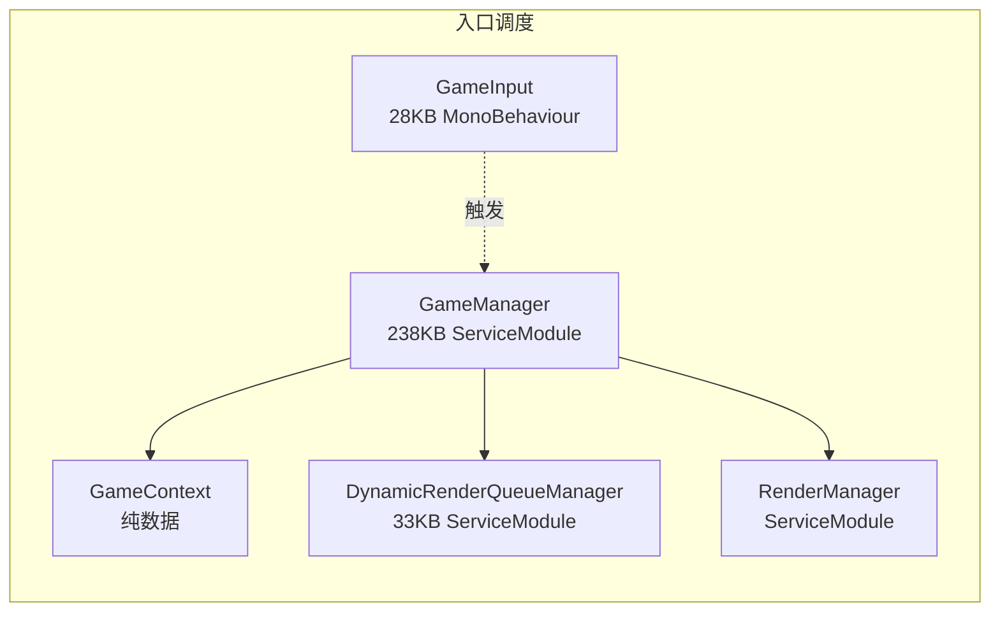
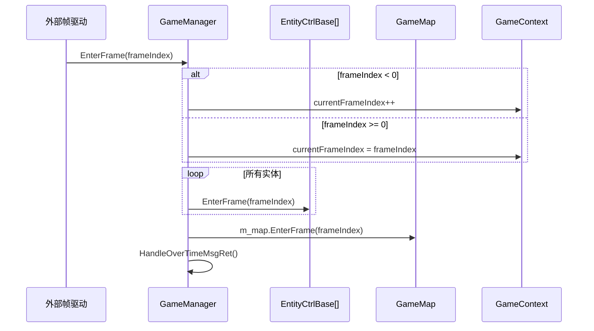

# L0 入口调度层 (Entry Layer)

> Agent-1 [entry] | 7 文件 | `Game/` 根目录

## 层级内部模块关系



## 输入-处理-输出

```
外部帧驱动(StarWorldGame.OnEnterFrame/World)
  → GameManager.EnterFrame(frameIndex)
    → [处理] frameIndex < 0 时 currentFrameIndex++，否则 currentFrameIndex = frameIndex
    → [处理] 遍历 m_listEntityCtrl.EnterFrame → 遍历 m_LocalEntitys.EnterFrame → m_map.EnterFrame → HandleOverTimeMsgRet
    → [输出] 驱动实体/本地实体/地图/超时消息处理
  → BattleManager.EnterFrame(frameIndex) 与 GameManager 并列由 StarWorldGame.OnEnterFrame 调用

用户输入(GameInput) 
  → GameManager.InputVKey(vkey, arg, playerId)
    → [处理] GetEntityCtr(playerId) → PlayerCtrlGroup.InputVKey
    → [输出] PlayerCtrlGroup.DoVKey_Move，仅处理 MoveX/MoveZ 移动虚拟键
```

## 关键调用链



## 对外接口（与其他层契约）

**GameManager（核心调度面）**
- `EnterFrame(int)` / `EnterFixLaterFrame()` — 帧驱动入口；`StarWorldGame.OnEnterFrame()` 并列调用 `GameManager.EnterFrame()` 与 `BattleManager.EnterFrame()`
- `InputVKey(int, float, ulong)` — 输入层 → PlayerCtrlGroup 移动虚拟键入口
- `GetEntityCtr(ulong) : EntityCtrlBase` — 获取实体控制层
- `CreateGame(GameParam)` / `ReleaseGame()` — 生命周期
- `mainPlayerId` / `M_MainPlayerCtrlBase` — 主角引用
- `Context : GameContext` / `M_Map : GameMap` — 上下文/地图访问

**GameInput（输入分发）**
- `static Create()` / `AddSkillBtn(int, UniversalButton)` / `SetTouchState(string, bool)`
- 摇杆事件 → `InputManager.OnJoystickMove(dir)`

**DynamicRenderQueueManager（渲染优化）**
- `AddNewRender(Renderer[], E_OutlineEntityType) : int` — 实体创建时登记描边
- `ReInit()` — 重建 `MaterialRenderQueueSTAND` / `Other` 等 renderQueue 标准表

## 关键发现

1. **GameManager 非 MonoBehaviour**：是 `ServiceModule<GameManager>`，无 Unity Update/LateUpdate，帧循环由外部 `EnterFrame` 驱动。
2. **DynamicRenderQueueManager 职责**：`AddNewRender()` 调 `DealDynamicMetrals()`，按 `MaterialRenderQueueSTAND` / Shader 名设置 `material.renderQueue` 与 `enableInstancing`；`Init()` 检测 `supportsEarlyZ` 并在支持时开启主相机 depth texture，`InitMaterialRenderQueueSTAND()` 会按 `supportsEarlyZ` 调整部分队列值；描边线材质按 `SceneScore < MAT_OVER_SCORE` 保留，`MAT_OVER_SCORE` 由画质/描边设置写入（如 80/50/0）。SRP Batcher 是 `AppMain` 画质设置里的独立开关，本层文档不写成 `DynamicRenderQueueManager` 的直接调用链。
3. **GameContext 是纯数据类**：持有 random/currentFrameIndex/mapSize/颜色缓存，非单例；当前由 `CreateMap(GameParam)` 懒创建并重置随机种子、帧号和地图尺寸。
4. **输入分发链路**：GameInput 摇杆 → InputManager；移动虚拟键 → GameManager.InputVKey → PlayerCtrlGroup.InputVKey → DoVKey_Move。手动技能按钮入口见 L3/FLOW 技能文档，不经这条链路。

## 依赖下层
- → **L1 实体工厂**：`GameManager.Init()` 初始化 `SimpleDataFactory` / `DynamicDataFactory` / `EntityFactory` / `ViewFactory`；`CreateGame()` 再保障 `EntityFactory` / `ViewFactory` 的模式内初始化
- → **L2 控制层**：GetEntityCtr 返回 EntityCtrlBase，InputVKey 转发到 PlayerCtrlGroup 的移动虚拟键处理
- → **L5 支撑**：持有 CameraManager/MapScript 引用
