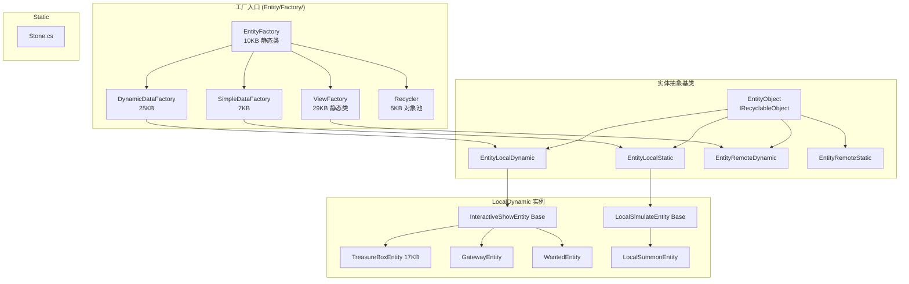
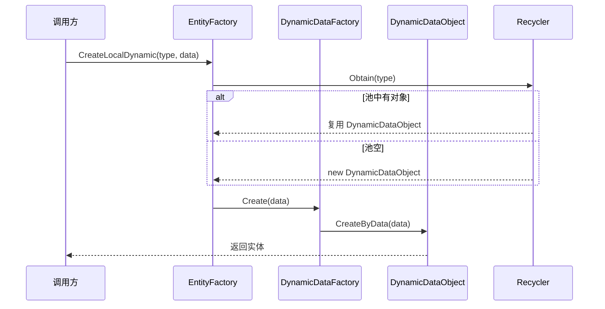

# L1a 实体工厂层 (Entity Factory Layer)

> Agent-2a [entity-factory] | 20 文件 | `Entity/Factory/` + `Entity/LocalDynamic/` + `Entity/Static/`

## 层级内部模块关系



## 输入-处理-输出

```
调用方请求创建实体(type, data)
  → EntityFactory.CreateXxx(type, data)
    → [处理] Recycler.Obtain(type) 优先复用 / 否则 new；分派到对应 Factory
    → DynamicDataFactory.Create (LocalDynamic) | SimpleDataFactory.Create (Static) | ViewFactory.CreateView (RemoteDynamic)
    → [输出] 返回 EntityObject 实例（远程实体附带 ViewObject）
```

## 关键调用链



## 对外接口（与其他层契约）

**EntityFactory（入口）**
- `CreateLocalDynamic(int type, object data)` — 本地动态实体
- `CreateRemoteDynamic(int type, object syncData)` — 远程动态实体
- `CreateLocalStatic(int type, object cfg)` / `CreateRemoteStatic(int type, object cfg)`
- `Release(EntityObject)` — 释放回池
- `GetEntity(int id)`

**DynamicDataFactory / SimpleDataFactory / ViewFactory**
- `Create(int type, object data)` / `CreateView(int viewCfgId)` / `GetView(int id)`

**Recycler（对象池）**
- `Obtain(int type) : IRecyclableObject` — 从池取/新建
- `Recycle(IRecyclableObject)` — Reset 后入池

**IRecyclableObject（所有实体实现）**
- `Reset()` / `Recycled()`

## 关键发现

1. **三条创建链分发**：EntityLocalDynamic→DynamicDataFactory（动态数据）；EntityLocalStatic/RemoteStatic→SimpleDataFactory（静态配置）；EntityRemoteDynamic→ViewFactory（需构建 View）。
2. **Recycler 对象池**：以 type 为 key 的 Stack 池，Obtain 优先复用，Recycle 调 Reset 清空状态（非 GC），降低分配开销。
3. **RemoteDynamic 与 View 强绑定**：EntityRemoteDynamic 直接派生 ViewObject，创建即伴随 View 构建，SyncData 驱动 View 更新。
4. **ViewFactory 双层管理**：工厂级 + Recycler 池级，管理 View 生命周期与缓存。
5. **LocalDynamic 公共骨架**：InteractiveShowEntity（交互表现）/ LocalSimulateEntity（本地模拟）为 LocalDynamic 基类。

## 依赖下层
- → **L1b 运行时**：DynamicDataFactory 创建本地实体最终落到 EntityLocalDynamic 子类；ViewFactory 创建的 ViewObject 即 L1b 的 View 层基类
- → **L2 控制层**：创建的 EntityObject 被 GameManager 包装为 EntityCtrlBase 控制组
