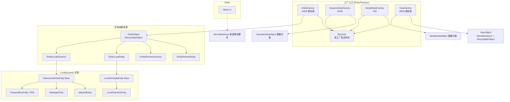
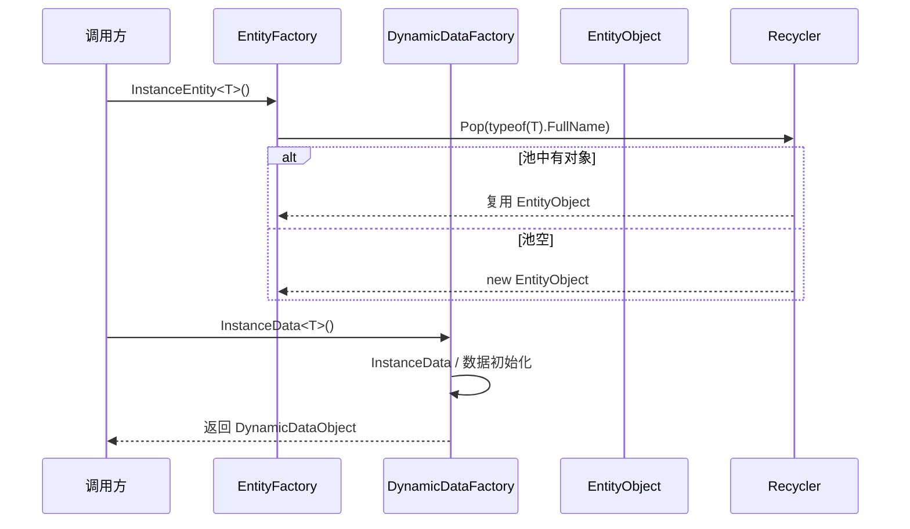

# L1a 实体工厂层 (Entity Factory Layer)

> Agent-2a [entity-factory] | 20 文件（Factory 13 + LocalDynamic 根目录 4 + Base 2 + Static 1） | `Entity/Factory/` + `Entity/LocalDynamic/` + `Entity/Static/`

## 层级内部模块关系



## 输入-处理-输出

```
调用方请求创建实体 / 数据对象 / View(type, data)
  → EntityFactory.InstanceEntity<T>() / DynamicDataFactory.InstanceData<T>() / SimpleDataFactory.InstanceData<T>() / ViewFactory.CreateViewAsync(...)
    → [处理] Entity/Simple 用 Recycler.Pop(typeof(T).FullName) 优先复用；ViewFactory 用 resPath 作为池 key；Entity/Simple 释放先标记，ClearReleasedObjects 再 Push，Dynamic/View 释放时直接 Push
    → [输出] 返回 EntityObject / DynamicDataObject / SimpleDataObject；ViewFactory 推荐路径为 CreateViewAsync：池命中 callback GameObject 后 SetView，未命中异步加载成功且 entity 未释放时 callback GameObject 并 SetView
```

## 关键调用链



## 对外接口（与其他层契约）

**EntityFactory（入口）**
- `InstanceEntity<T>() where T : EntityObject, new()` — 从池取或创建实体
- `ReleaseEntity(EntityObject)` — 调 `ReleaseInFactory()` 标记释放，不立即从工厂列表移除
- `ClearReleasedObjects()` — 清理 `IsReleased` 对象并 `Recycler.Push(...)` 回池

**DynamicDataFactory / SimpleDataFactory / ViewFactory**
- `DynamicDataFactory.InstanceData<T>()` / `PopEarliestDataByRecorde<T>()`
- `SimpleDataFactory.InstanceData<T>()` / `ReleaseData(...)`
- `ViewFactory.CreateViewAsync(...)`（推荐路径：callback 返回 GameObject 后 `SetView`）/ `[Obsolete] CreateView(...)` / `[Obsolete] CreateViewAddressables(...)` / `ReleaseView(...)`

**Recycler（对象池）**
- `Pop(string) : IRecyclableObject` — 从指定 key 的池取对象
- `Push(IRecyclableObject)` — 按 `GetRecycleType()` 入池
- `Release()` — Dispose 池内对象

**IRecyclableObject（所有实体实现）**
- `GetRecycleType()` / `Dispose()`

## 关键发现

1. **不是单一 CreateXxx 分发口**：EntityFactory 管 EntityObject；DynamicDataFactory 管动态数据；SimpleDataFactory 管简单数据；ViewFactory 管 ViewObject，四者各有入口。
2. **Recycler 对象池**：以 string key 的 Stack 池，`Pop` 优先复用，`Push` 回收；`IRecyclableObject` 接口只有 `GetRecycleType()` / `Dispose()`，没有 `Reset()` / `Recycled()`。
3. **RemoteDynamic 与 View 分离**：EntityRemoteDynamic 继承 EntityObject；ViewObject 是独立 MonoBehaviour 表现基类，远程实体子类按需调用 ViewFactory 创建/绑定 View。
4. **ViewFactory 双层管理**：工厂级 + Recycler 池级，管理 View 生命周期与缓存；`CreateView` / `CreateViewAddressables` 仍存在但已标记为请使用 `CreateViewAsync`。
5. **LocalDynamic 公共骨架**：根目录 4 个具体实体，InteractiveShowEntity（交互表现）/ LocalSimulateEntity（本地模拟）为 Base 目录下 2 个基类。
6. **Static 边界**：`Stone.cs` 是普通 `MonoBehaviour` 静态脚本，不是 `EntityObject` / 池化实体。

## 依赖下层
- → **L1b 运行时**：EntityFactory 创建 EntityObject 分支（EntityLocalDynamic / EntityLocalStatic / EntityRemoteDynamic 等）；DynamicDataFactory 创建 DynamicDataObject 数据对象；ViewFactory 创建的 ViewObject 即 L1b 的 View 层基类
- → **L2 控制层**：创建的 EntityObject 被 GameManager 包装为 EntityCtrlBase 控制组
