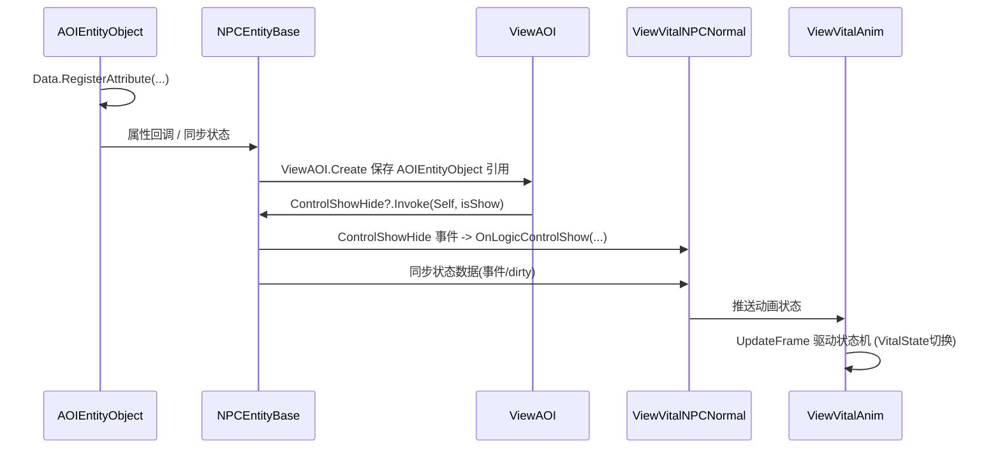

# L1b 实体运行时层 (Entity Runtime Layer)

> Agent-2b [entity-runtime] | 48 文件 + Data 8 文件补充折入 | `Entity/RemoteDynamic/` + `Entity/View/` + `Entity/LocalDynamic/` + `Game/Data/`

## 层级内部模块关系

```mermaid
flowchart TB
    subgraph 远程实体["RemoteDynamic (10文件)"]
        NPC[NPCEntityBase 216KB]
        HERO[HeroEntityBase 63KB]
        MON[MonsterEntityBase 20KB]
        SUM[SummonEntityBase 21KB]
        PART[PartnerEntityBase 15KB]
        GNP[GameNPCEntityBase 13KB]
        OBS[ObstacleBase]
        BUL[BulletEntity]
        AUX[AuxiliarySummoner]
        AOI[AOIEntityObject 75KB 基类]
    end
    subgraph View层["View 渲染层 (38文件)"]
        VAOI[ViewAOI 145KB 基类]
        VNP[ViewVitalNPCNormal 86KB 基类]
        VAN[ViewVitalAnim 36KB 动画状态机]
        VON[ViewObjectNormal 39KB 非生命体]
        VL[ViewLocal 26KB 本地基类]
        VLD[ViewLocalDynamic]
        VLS[ViewLocalStatic]
        OUT[OutLifeEntityViewBase]
        VI[ViewInterctive/SummonView/TreasureBoxView...]
    end
    subgraph Data层["Game/Data (8文件)"]
        EBD[EntityBaseData<br/>DynamicDataObject]
        VSD[VitalSignData]
        NVSD[NoneVitalSignData]
        VAD[VitalSignAttrData]
    end

    AOI --> NPC & HERO & MON & SUM & PART & GNP & OBS & BUL & AUX
    AOI --> EBD
    EBD --> VSD & NVSD
    VSD --> VAD
    VAOI --> VNP & VAN
    VNP --> ViewVitalHeroNormal & ViewVitalMonsterNormal & ViewVitalSummonNormal & ViewVitalGameNPCNormal & ViewVitalPartnerNormal
    VAN --> ViewVitalGameNPCAnim & ViewVitalSummonAnim & ViewVitalMonsterAnim & ViewVitalPartnerAnim
    VON --> OUT
    VL --> VLD & VLS
```



## 输入-处理-输出

```
服务器同步数据 / AOI 可见性事件
  → GameManager.UpdateEntityData(...) → EntityBaseData.UpdateWithAttr(...)
  → AOIEntityObject.Data.RegisterAttribute(...) 属性回调
    → [处理] Position/PathPoses/CurrPathIndex/Rot/TruthSpeed/Faction 等同步字段变化
    → [输出] ViewAOI 持有 AOIEntityObject 引用，ViewVitalNPCNormal 通过事件/回调处理可见性和常态表现

本地客户端逻辑（无 AOI 依赖）
  → ViewLocal.Update / 事件
    → [处理] 本地实体直接驱动
    → [输出] ViewLocalDynamic → 具体 View 直接表现
```

## 关键调用链



## 对外接口（与其他层契约）

**AOIEntityObject（实体层 AOI 入口）**
- `Data.RegisterAttribute(...)` — 注册 Position/PathPoses/CurrPathIndex/Rot/TruthSpeed/Faction 等属性回调
- AOI/逻辑显隐主链为 `ViewAOI.HideModel/ShowModel -> ViewAOI.ControllShowHide(bool) -> M_EntityBase.ControlShowHide?.Invoke(EntityShowHidenTag.Self,isShow) -> ViewVitalNPCNormal.OnLogicControlShow(...)`；`ViewVitalNPCNormal.OnEventListener()` 订阅该事件，`OffEventListener()` 反订阅。StarGame C# 代码图结果为 `ViewVitalNPCNormal.OnActionVisible(bool)` 无调用方，不能写成主调度入口；`ViewObjectNormal.OnActionVisible(bool)` 是 OutLifeEntity 自身 Hide/ShowModel 使用的独立方法；`OnAOIUpdate()` / `SetVisible(bool)` 精确方法名查询为 0 命中。

**Game/Data 数据底座（补充折入）**
- 目录 8 个 C#：`EntityBaseData` / `VitalSignData` / `NoneVitalSignData` / `VitalSignAttrData` / `VitalSignViewShowData` / `GameParam` / `GameVKey` / `MapData`。
- `EntityBaseData : DynamicDataObject` 是 AOI 实体数据基类；`VitalSignData` / `NoneVitalSignData` 分别承接生命体和 `E_EntityType.Interact` 非生命体数据。
- 属性同步链路是 `GameManager.HandlePropSync/CreateEntityData -> UpdateEntityData -> EntityBaseData.UpdateWithAttr -> UpdatePropList -> HandleProperty/InvokeAttrChange`。
- 战斗状态链路由 `EntityBaseData.HandleClientBattleStates(...)` 承接，调用方包括 `GameManager.RegisterMainPlayerClientBattleStates/UnRegisterMainPlayerClientBattleStates`、`SkillController.OnActionRefreshStates`、`SkillEntityUserInputPartial`。

**NPCEntityBase（216KB 仅读法名）**
- 继承自 AOIEntityObject；方法域涵盖外观/移动/技能/状态/属性同步

**ViewAOI / ViewVitalNPCNormal（View 基类）**
- `ViewAOI.Create(...)` 保存 `AOIEntityObject` 引用
- `ViewVitalNPCNormal.OnLogicControlShow(...)` — 通过 `ControlShowHide` 触发的逻辑显隐主处理；`ViewVitalNPCNormal.OnActionVisible(bool)` 代码图结果为无调用方，不写成主入口
- 常态表现更新入口（Normal 表现基类）

**I_VVitalAnim（动画接口契约）**
- 生命体动画层对外接口，`ViewVitalAnim` 实现

**ViewState 数据契约**
- `VitalState` 状态枚举 / `AnimParam` 动画参数 / `AttackState`/`AttacState`

**本地 View 支线**
- `ViewLocal` / `ViewLocalDynamic` / `ViewLocalStatic` / `SummonView` / `TreasureBoxView` / `WantedView` / `GatewayView` / `ViewInterctive`

**Bullet / Summon 边界**
- `E_EntityType.BulletEntity` 的现行创建链在 `GameManager.CreateEntity()` 中走 `CreateBulletSummon(gameCommand)`，而 `CreateBulletSummon()` 直接复用 `CreateSummon(gameCommand)`，实际控制组是 `SummonCtrlGroup`。
- `SummonCtrlGroup.OnBulletCreateRet()` 转发到 `m_CurrentCtrledVitBase.OnBulletCreateRet(bulletCreateRet)`；`OnBulletEndRet()` 转发后用 `bulletEndRet.OwnerEntityID` 构造 `E_Command.Destroy`，在帧末调用 `GameManager.EntityDataCommand(...)` 销毁该子弹召唤物。
- `BulletEntity : AOIEntityObject` 和 `BulletEntityCtrl` 是代码中存在的程序定义非生命体 Bullet 支线；`BulletEntity.CreateRuntime(BulletCreateRet)` 只保存 `runtimeID` / `bulletID` / `bulletCreateRet`，不要把它写成当前 `CreateBulletSummon` 主链的实体类型。

## 关键发现

1. **NPCEntityBase 216KB 功能域**：方法数量级极大，按策略仅读法名，功能域涵盖外观装载/移动同步/技能动作/状态机/AOI回调/属性同步。
2. **Data 是实体运行时的数据底座**：`EntityBaseData.UpdateWithAttr()` 被 `GameManager.UpdateEntityData/HandlePropSync/CreateEntityData` 调用，`HandleClientBattleStates()` 被 GameManager 与 Skill 层调用；它不是独立战斗循环。
3. **AOI 三层架构数据流**：逻辑实体链为 `NPCEntityBase → AOIEntityObject → EntityRemoteDynamic`，表现链为 `ViewVitalNPCNormal → ViewAOI → ViewModel`；`ViewAOI.Create()` 持有 AOIEntityObject 引用后由事件/属性回调驱动表现。
4. **View 层 38 文件三类分工**：Anim 类（动画状态机）/ Normal 类（常态表现）/ ViewState 类（纯数据接口）。另有 OutLifeEntity（非生命体）与 LocalDynamicEntity（本地）两条独立支线。
5. **View 更新策略**：已证实属性回调/事件订阅链路；本文件不把“Anim/状态机每帧 Update”或“脏标记”写成通用策略，具体类以各自源码为准。
6. **远程 vs 本地差异**：远程继承 AOIEntityObject（服务器同步+AOI裁剪，低频）；本地继承 ViewLocal（本地模拟直接驱动，高频）。
7. **Bullet 命名边界**：`BulletEntity` 类存在，但当前 `E_EntityType.BulletEntity` 进入 `GameManager.CreateBulletSummon -> CreateSummon -> SummonCtrlGroup`；策划语义里的 BulletSummon 与程序定义的 `BulletEntity/BulletEntityCtrl` 不是同一条主链。
8. **异常项**：`AttacState.cs` 与 `AttackState.cs` 都是真实文件/类型且都继承 `VitalState`；`AttacState.OnEnable()` 播放 `AttackAnimations[_AttackIndex]`，`AttackState.OnEnable()` 的播放逻辑被注释。本图只保留代码可证差异，不声明 prefab/scene/asset/controller GUID 引用状态；中文命名文件（主角配角宝宝.cs 等）为外形配置。

## 依赖下层
- → **L2 控制层**：EntityCtrlBase 持有 M_Curr（抽象 AOIEntityObject）作为逻辑层实体统一访问点
- → **L5 支撑**：View 层消费 TypeEffect（Buff 视觉特效）、StarShadowFollow/Mirror（影子）
