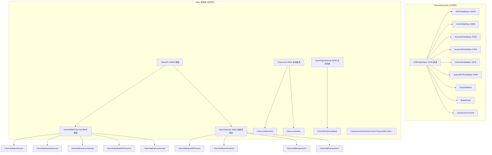
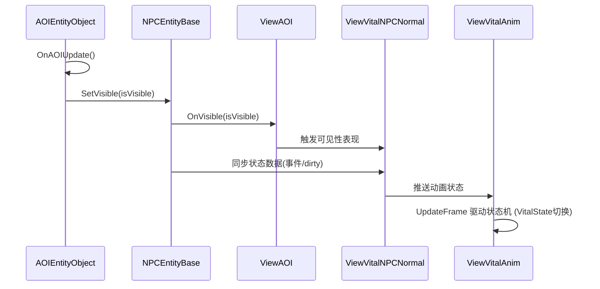

# L1b 实体运行时层 (Entity Runtime Layer)

> Agent-2b [entity-runtime] | 48 文件 | `Entity/RemoteDynamic/` + `Entity/View/` + `Entity/LocalDynamic/`

## 层级内部模块关系



## 输入-处理-输出

```
服务器同步数据 / AOI 可见性事件
  → AOIEntityObject.OnAOIUpdate() / SetVisible(isVisible)
    → [处理] 判定是否在兴趣范围；远程实体状态由服务器同步推送
    → [输出] SetVisible → ViewAOI.OnVisible → ViewVitalNPCNormal 常态表现

本地客户端逻辑（无 AOI 依赖）
  → ViewLocal.Update / 事件
    → [处理] 本地实体直接驱动
    → [输出] ViewLocalDynamic → 具体 View 直接表现
```

## 关键调用链



## 对外接口（与其他层契约）

**AOIEntityObject（实体层 AOI 入口）**
- `OnAOIUpdate()` — 可见性更新逻辑入口
- `SetVisible(bool)` — 设置实体可见性

**NPCEntityBase（216KB 仅读法名）**
- 继承自 AOIEntityObject；方法域涵盖外观/移动/技能/状态/属性同步

**ViewAOI / ViewVitalNPCNormal（View 基类）**
- `OnVisible(...)` — 可见性表现调度
- 常态表现更新入口（Normal 表现基类）

**I_VVitalAnim（动画接口契约）**
- 生命体动画层对外接口，`ViewVitalAnim` 实现

**ViewState 数据契约**
- `VitalState` 状态枚举 / `AnimParam` 动画参数 / `AttackState`/`AttacState`

**本地 View 支线**
- `ViewLocal` / `ViewLocalDynamic` / `ViewLocalStatic` / `SummonView` / `TreasureBoxView` / `WantedView` / `GatewayView` / `ViewInterctive`

## 关键发现

1. **NPCEntityBase 216KB 功能域**：方法数量级极大，按策略仅读法名，功能域涵盖外观装载/移动同步/技能动作/状态机/AOI回调/属性同步。
2. **AOI 三层架构数据流**：`AOIEntityObject → ViewAOI → ViewVitalNPCNormal`，数据自上而下单向，由 AOI 触发 View 响应。
3. **View 层 38 文件三类分工**：Anim 类（动画状态机）/ Normal 类（常态表现）/ ViewState 类（纯数据接口）。另有 OutLifeEntity（非生命体）与 LocalDynamicEntity（本地）两条独立支线。
4. **View 更新策略**：Anim/状态机为每帧 Update 驱动；实体同步侧为事件/脏标记驱动（服务器同步才推状态）。
5. **远程 vs 本地差异**：远程继承 AOIEntityObject（服务器同步+AOI裁剪，低频）；本地继承 ViewLocal（本地模拟直接驱动，高频）。
6. **异常项**：`AttacState.cs` 与 `AttackState.cs` 文件名近似，疑似拼写冗余；中文命名文件（主角配角宝宝.cs 等）为外形配置。

## 依赖下层
- → **L2 控制层**：EntityCtrlBase 持有 M_Curr（抽象 AOIEntityObject）作为逻辑层实体统一访问点
- → **L5 支撑**：View 层消费 TypeEffect（Buff 视觉特效）、StarShadowFollow/Mirror（影子）
