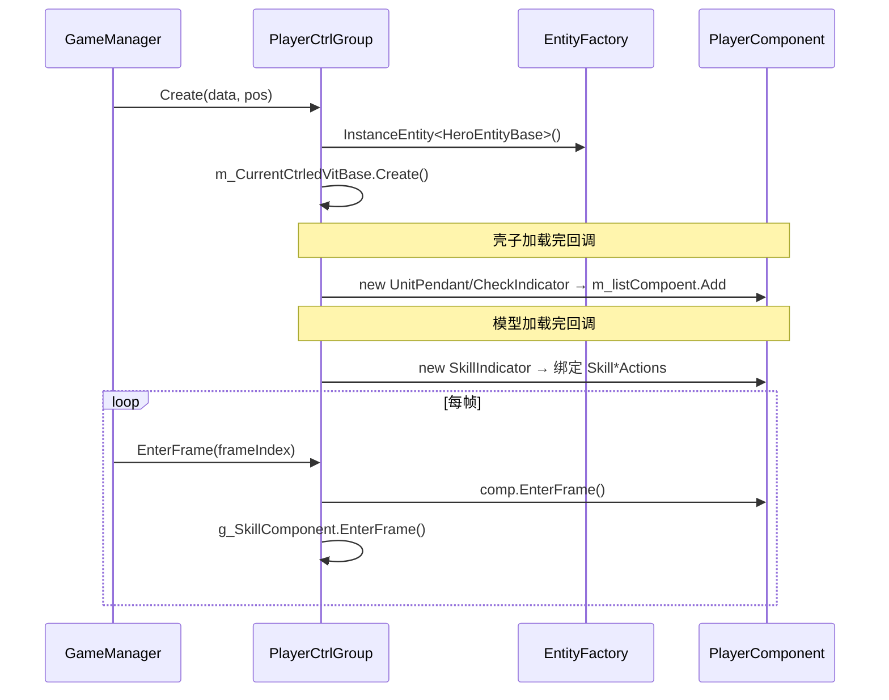

# L2 角色控制层 (Player Control Layer)

> Agent-3 [player] | 15 文件 + Object 2 / PartnerManager 1 补充折入 | `Player/` + `Player/Component/` + `Game/Object/` + `Game/Partner/`

## 层级内部模块关系

```mermaid
flowchart TB
    subgraph 控制组["控制层类 (Player/ 8文件 + Object 2)"]
        PCG[PlayerCtrlGroup 62KB]
        GNPG[GameNPCCtrlGroup 20KB]
        MCG[MonsterCtrlGroup 19KB]
        PACG[PartnerCtrlGroup 18KB]
        SCG[SummonCtrlGroup 16KB]
        BC[BulletEntityCtrl<br/>文件 BulletCtrl.cs 5KB]
        OCG[ObjectCtrlGroup<br/>Game/Object]
    end
    subgraph 基类["控制层基类"]
        ECB[EntityCtrlBase 30KB]
        ECMB[EntityCtrlMsgBase 8KB RPC分发]
    end
    subgraph 组件["Component 模式 (Player/Component/ 7文件)"]
        SC[SkillComponent 65KB UI协调器]
        UP[UnitPendant 15KB 头顶面板]
        SI[SkillIndicator 7KB 范围指示器]
        CI[CheckIndicator 6KB 选中指示器]
        AI[PCEnityAI 6KB 玩家AI(停用)]
        ETV[EntityTempVisibility 2KB]
        OUP[ObjectUnitPendant<br/>Game/Object/Component]
        PC[PlayerComponent 基类]
    end
    subgraph Manager补充["Partner Manager (1文件)"]
        PM[PartnerManager]
    end

    ECB --> PCG & GNPG & MCG & PACG & SCG & BC & OCG
    ECMB --> ECB
    PC --> UP & SI & CI & AI & OUP
    PCG --> SC
    PCG --> UP & SI & CI
    OCG --> OUP
    PM --> PACG
```

## 输入-处理-输出

```
GameManager.Init 初始化服务工厂；CreateGame 初始化 EntityFactory/ViewFactory/相机和运行标记；CreateMap 懒创建并重置 GameContext；网络实体创建进入 GameManager.CreateEntity
  → CtrlGroup.Create(data, pos)：先调用 EntityCtrlBase.Create 做公共初始化，再由子类绑定 OnTemplateCreateFinifh / OnActionOnViewCreateFinifh 回调
    → [处理] 子类按需在 OnTemplateCreateFinifh / OnActionOnViewCreateFinifh 注册组件
             PlayerCtrlGroup：壳子完成时加 UnitPendant/CheckIndicator，模型完成时为主角加 SkillIndicator
    → [输出] 控制组就绪，每帧 EnterFrame 驱动组件 + m_CurrentCtrledVitBase

GameManager.CreateEntity 遇到 E_EntityType.BulletEntity
  → CreateBulletSummon(gameCommand)
    → CreateSummon(gameCommand) / new SummonCtrlGroup()
    → [处理] OnBulletCreateRet 转发给 SummonEntityBase -> SkillController.OnBulletCreateRet -> SkillBullet.Create
    → [输出] OnBulletEndRet 先经 SummonEntityBase -> SkillControllerBulletPartial.OnBulletEndRet，内部先 skillBullet.OnBulletEndRet(...) 再 ReleaseBullet()；随后帧末用 E_Command.Destroy 销毁 bulletEndRet.OwnerEntityID

GameManager.CreateEntity 遇到 E_EntityType.Interact
  → CreateInterActionObject(gameCommand) / new ObjectCtrlGroup()
    → [处理] ObjectCtrlGroup.Create 绑定 NoneVitalSignData，创建 ObstacleBase，模型完成后 new ObjectUnitPendant + CreateTrigger
    → [输出] EnterFrame 延迟创建模型并驱动 ObjectUnitPendant，交互/显隐仍由 GameManager 与业务模块查询 ObjectCtrlGroup

PartnerManager 服务
  → AppMain.InitServices -> PartnerManager.Init -> AddEventListener
    → [处理] 监听 PartnerConcretizeRet/TempPartnerCreateNtf/PartnerSwitchEndTimeNtf、FixUpdateDef.Partner、GlobalEvent.OnPartnerCreate/OnPartnerLeave
    → [输出] 维护 CurConcretizationPartner 与 GetInPlayedPartners()，供 BattleManager.GetCanUsePartner() 等路径使用

用户输入（技能按钮）
  → SkillComponent.OnPointerDown/Up
    → [处理] 查询 GetSkillWheelInfo → 滑动方向 → SendUserSkillReq
    → [输出] 组装 SkillUseReq/BlackList 后交给 SkillController.ClientUseSkill；后续由 SkillController.UseSkill 分支决定发送/预播/缓存
```

## 关键调用链



## 对外接口（与其他层契约）

**EntityCtrlBase（通用 API）**
- `Create(EntityBaseData, Vector3)` / `Release()` / `EnterFrame(int)` / `abstract M_Curr`
- `ForceSyncPos(Vector3)` / `BreakFindPath()`
- 技能委托字段：`SkillPointerDownActions` / `SkillDirChangeActions` / `SkillPointerUpActions`
- BUFF/变身/隐身效果：`HandleStackEffect` / `Freez` / `StartChangeAvatarEffect` / `StartTranslucentEffect` 等

**PlayerCtrlGroup**
- `currentCtrlNttId` / `M_Curr` / `IsPlayingSkill` / `g_SkillComponent`
- `AddPlayerView()` / `UpdatePlayerSkill()`

**各 CtrlGroup RPC 重写**
- `PlayerCtrlGroup.OnBuffCreateRet/OnBuffEndRet/OnRuntimeSyncRet/OnRunStageRet/OnRunStageForceEndRet/OnServerSetPosNTF/OnCDUpdateNotice/OnSkillUseRet/OnSkillEndRet`
- `MonsterCtrlGroup.OnBuffCreateRet/OnBuffEndRet/OnRuntimeSyncRet/OnSkillUseRet/OnSkillEndRet/OnRunStageRet/OnRunStageForceEndRet`
- `PartnerCtrlGroup.OnBuffCreateRet/OnBuffEndRet/OnCDUpdateNotice/OnRuntimeSyncRet/OnSkillUseRet/OnSkillEndRet/OnRunStageRet/OnRunStageForceEndRet/OnServerSetPosNTF`
- `GameNPCCtrlGroup.LookAtMainPlayer/SetVisiable`
- `SummonCtrlGroup.OnBulletCreateRet/OnBulletEndRet`：创建回包转发到 `m_CurrentCtrledVitBase.OnBulletCreateRet(...) -> SummonEntityBase.OnBulletCreateRet(...) -> SkillControllerBulletPartial.OnBulletCreateRet(...) -> SkillBullet.Create(...)`；结束回包先转发到 `SummonEntityBase.OnBulletEndRet(...) -> SkillControllerBulletPartial.OnBulletEndRet(...) -> SkillBullet.OnBulletEndRet(...) -> ReleaseBullet()`，再按 `bulletEndRet.OwnerEntityID` 组 `E_Command.Destroy`，帧末交给 `GameManager.EntityDataCommand(...)`
- `ObjectCtrlGroup`：`GameManager.CreateEntity(E_EntityType.Interact) -> CreateInterActionObject -> ObjectCtrlGroup.Create`；内部绑定 `NoneVitalSignData`，创建 `ObstacleBase`，`OnTemplateCreateFinifh()` 添加 `ObjectUnitPendant` 并 `CreateTrigger()`。

**PartnerManager（Game/Partner 补充折入）**
- `AppMain.InitServices()` 调 `PartnerManager.Instance.Init()`；`Init()` 进入 `AddEventListener()`。
- `AddEventListener()` 注册伙伴网络消息、`FixUpdateDef.Partner`，并监听 `GlobalEvent.OnPartnerCreate/OnPartnerLeave`。
- `PartnerCtrlGroup.CreateSkillComponent()` / `RomveSkillComponent()` 分别触发 `OnPartnerCreate` / `OnPartnerLeave`；`PartnerManager.OnPartnerCtrlBaseCreate()` 维护 `CurConcretizationPartner`。
- `BattleManager.GetCanUsePartner()` 调 `PartnerManager.Instance.GetInPlayedPartners()` 获取可战斗伙伴列表；因此它是 L2 PartnerCtrlGroup 的管理支撑，不是独立技能执行器。

**SkillComponent（独立 UI 协调器）**
- `Init(EntityCtrlBase)` / `SendUserSkillReq(Vector3, bool, E_BtnInputType, float)` / `SetCurSkillInfo(SkillInfo)`

## 关键发现

1. **三段式异步加载**：三段式不是 `EntityCtrlBase.Create()` 单独完成；各 `CtrlGroup.Create()` 先调用 `EntityCtrlBase.Create()` 做公共初始化，再由子类绑定 `OnTemplateCreateFinifh` / `OnActionOnViewCreateFinifh` 回调，组件在子类回调中按需 `new` 并 Add 到 `m_listCompoent`（非统一注册）。
2. **EntityCtrlBase 多态调度**：GameManager 通过 `GetEntityCtr(ulong)` 返回基类引用，统一持有数组；RPC 经 `EntityCtrlMsgBase.HandleRpcMsg` 的 `rpcMsgHandles` 字典分发到子类重写方法。
3. **SkillComponent 是独立 UI 协调器**：不继承 PlayerComponent，由 PlayerCtrlGroup.g_SkillComponent 显式持有并在 EnterFrame 单独驱动；直接读 skillDispatcher.SkillController 查询技能，`SendUserSkillReq` 组装 `SkillUseReq/BlackList` 后交给 `SkillController.ClientUseSkill`，实际发送/预播/缓存由 `SkillController.UseSkill` 的结果分支决定（与 EntityCtrlBase 耦合过紧，代码注释 TODO 解绑）。
4. **各 CtrlGroup 差异**：PlayerCtrlGroup 持 g_SkillComponent + FollowDynamicTarget；GameNPCCtrlGroup 独有触发器/LookAtMainPlayer；MonsterCtrlGroup 处理 Buff/Skill/RunStage/RuntimeSync 回包 + Boss 掉落，未找到 `OnBulletCreateRet`；PartnerCtrlGroup 在主角召唤物创建/离开时通过事件通知伙伴技能按钮刷新，主角侧 SkillComponent 仍由 PlayerCtrlGroup.g_SkillComponent 路径承担；SummonCtrlGroup 负责现行 `E_EntityType.BulletEntity` 的 BulletSummon 控制链；BulletEntityCtrl（文件 `BulletCtrl.cs`）直接继承 EntityCtrlBase，是程序定义 `BulletEntity` 支线，非 CtrlGroup。
5. **BulletSummon 创建/销毁边界**：`GameManager.CreateEntity(E_EntityType.BulletEntity)` 不直接 new `BulletEntityCtrl`，而是 `CreateBulletSummon -> CreateSummon -> SummonCtrlGroup`；`SummonCtrlGroup.CreateMContainer()` 对 `E_EntityType.BulletEntity` 不走主角召唤物 `DotRemoveRoot` 分支，保持 `RemoveRoot`；Bullet 运行时释放和控制实体销毁是两段：`SkillControllerBulletPartial.OnBulletEndRet()` 释放 `SkillBullet`，随后 `SummonCtrlGroup.OnBulletEndRet()` 帧末销毁 `bulletEndRet.OwnerEntityID`。
6. **Object 交互物控制分支**：`E_EntityType.Interact` 先由 `GameManager.CreateEntityData()` 创建 `NoneVitalSignData`，再由 `CreateInterActionObject()` 创建 `ObjectCtrlGroup`；它复用 L2 控制组模式，但表现实体是 `ObstacleBase`，头顶 UI 是 `ObjectUnitPendant`。
7. **PartnerManager 是伙伴控制支撑**：初始化在 `AppMain.InitServices()`，运行时维护伙伴具象化状态和可战斗伙伴列表；实际技能协议仍经 `PartnerCtrlGroup` / `SkillController` 路径。

## 依赖上层/下层
- ← **L0 入口**：`GameManager.CreateGame` 初始化工厂/相机/运行状态，`CreateMap` 创建/重置 `GameContext`；网络实体创建走 `CreateEntity -> CreatePlayer/CreateNpc/... -> EntityCtrlBase.Create`；`EnterFrame` 驱动；移动虚拟键 `InputVKey` 转发到 `PlayerCtrlGroup.InputVKey -> DoVKey_Move`
- ← **L1 运行时**：M_Curr（抽象 AOIEntityObject）是逻辑层实体访问点
- → **L3 引擎**：SkillComponent 查询 skillDispatcher.SkillController 触发技能；SendUserSkillReq 交给 ClientUseSkill，发送/预播/缓存由 UseSkill 分支决定
- → **L5 支撑**：消费 TypeEffect（Buff 视觉）、UnitPendant/ObjectUnitPendant 头顶信息
