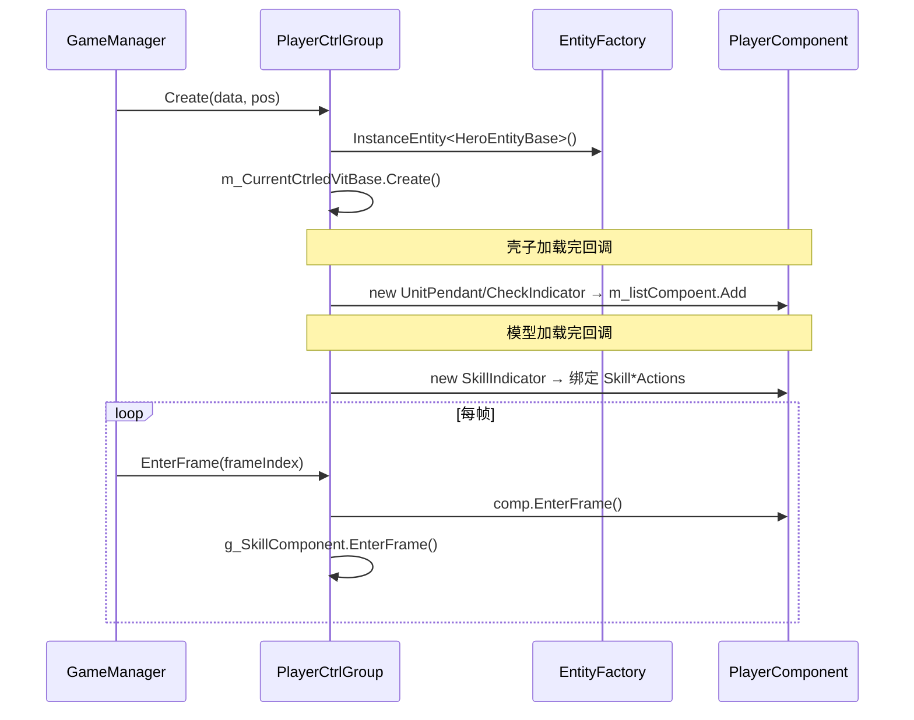

# L2 角色控制层 (Player Control Layer)

> Agent-3 [player] | 15 文件 | `Player/` + `Player/Component/`

## 层级内部模块关系

```mermaid
flowchart TB
    subgraph 控制组["CtrlGroup 家族 (Player/ 8文件)"]
        PCG[PlayerCtrlGroup 62KB]
        GNPG[GameNPCCtrlGroup 20KB]
        MCG[MonsterCtrlGroup 19KB]
        PACG[PartnerCtrlGroup 18KB]
        SCG[SummonCtrlGroup 16KB]
        BC[BulletCtrl 5KB]
    end
    subgraph 基类["控制层基类"]
        ECB[EntityCtrlBase 30KB]
        ECMB[EntityCtrlMsgBase 8KB RPC分发]
    end
    subgraph 组件["Component 模式 (Player/Component/ 7文件)"]
        SC[SkillComponent 65KB UI协调器]
        UP[UnitPendant 15KB 头顶面板]
        SI[SkillIndicator 7KB 范围指示器]
        CI[CheckIndicator 6KB 选中指示器]
        AI[PCEnityAI 6KB 玩家AI(停用)]
        ETV[EntityTempVisibility 2KB]
        PC[PlayerComponent 基类]
    end

    ECB --> PCG & GNPG & MCG & PACG & SCG & BC
    ECMB --> ECB
    PC --> UP & SI & CI & AI
    PCG --> SC
    PCG --> UP & SI & CI
```

## 输入-处理-输出

```
GameManager.CreateGame / 网络创建实体
  → EntityCtrlBase.Create(data, pos) [三段式异步加载]
    → [处理] OnTemplateCreateFinifh（壳子加载完）→ new UnitPendant/CheckIndicator 加入 m_listCompoent
             OnActionOnViewCreateFinifh（模型加载完）→ new SkillIndicator 赋值委托
    → [输出] 控制组就绪，每帧 EnterFrame 驱动组件 + m_CurrentCtrledVitBase

用户输入（技能按钮）
  → SkillComponent.OnPointerDown/Up
    → [处理] 查询 GetSkillWheelInfo → 滑动方向 → SendUserSkillReq
    → [输出] 发网络协议，触发 L3 技能释放
```

## 关键调用链



## 对外接口（与其他层契约）

**EntityCtrlBase（通用 API）**
- `Create(EntityBaseData, Vector3)` / `Release()` / `EnterFrame(int)` / `abstract M_Curr`
- `ForceSyncPos(Vector3)` / `BreakFindPath()`
- 技能委托字段：`SkillPointerDownActions` / `SkillDirChangeActions` / `SkillPointerUpActions`
- BUFF/变身/隐身效果：`HandleStackEffect` / `Freez` / `StartChangeAvatarEffect` / `StartTranslucentEffect` 等

**PlayerCtrlGroup**
- `currentCtrlNttId` / `M_Curr` / `IsPlayingSkill` / `g_SkillComponent`
- `AddPlayerView()` / `UpdatePlayerSkill()`

**各 CtrlGroup RPC 重写**
- `MonsterCtrlGroup.OnBuffCreateRet/OnSkillUseRet/OnBulletCreateRet`
- `PartnerCtrlGroup.OnCDUpdateNotice` / `GameNPCCtrlGroup.LookAtMainPlayer/SetVisiable`

**SkillComponent（独立 UI 协调器）**
- `Init(EntityCtrlBase)` / `SendUserSkillReq(Vector3, bool, E_BtnInputType, float)` / `SetCurSkillInfo(SkillInfo)`

## 关键发现

1. **三段式异步加载**：`Create→OnTemplateCreateFinifh→OnActionOnViewCreateFinifh`，组件在子类回调中按需 `new` 并 Add 到 `m_listCompoent`（非统一注册）。
2. **EntityCtrlBase 多态调度**：GameManager 通过 `GetEntityCtr(ulong)` 返回基类引用，统一持有数组；RPC 经 `EntityCtrlMsgBase.HandleRpcMsg` 的 `rpcMsgHandles` 字典分发到子类重写方法。
3. **SkillComponent 是独立 UI 协调器**：不继承 PlayerComponent，由 PlayerCtrlGroup.g_SkillComponent 显式持有并在 EnterFrame 单独驱动；直接读 skillDispatcher.SkillController 查询技能并封装 SendUserSkillReq 发协议（与 EntityCtrlBase 耦合过紧，代码注释 TODO 解绑）。
4. **各 CtrlGroup 差异**：PlayerCtrlGroup 持 g_SkillComponent + FollowDynamicTarget；GameNPCCtrlGroup 独有触发器/LookAtMainPlayer；MonsterCtrlGroup 处理全套技能 RPC + Boss 掉落；PartnerCtrlGroup 挂到主角根节点 + 聚合技能槽；SummonCtrlGroup 区分 Summon/Bullet（子弹不建头顶组件）；BulletCtrl 直接继承 EntityCtrlBase 非 CtrlGroup。

## 依赖上层/下层
- ← **L0 入口**：GameManager.CreateGame/InputVKey 创建并驱动
- ← **L1 运行时**：M_Curr（抽象 AOIEntityObject）是逻辑层实体访问点
- → **L3 引擎**：SkillComponent 查询 skillDispatcher.SkillController 触发技能；SendUserSkillReq 发协议
- → **L5 支撑**：消费 TypeEffect（Buff 视觉）、UnitPendant 头顶信息
