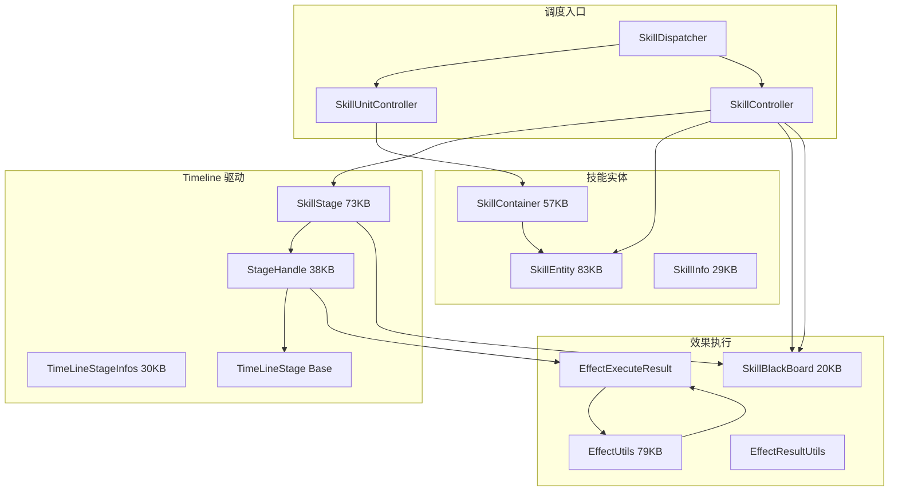
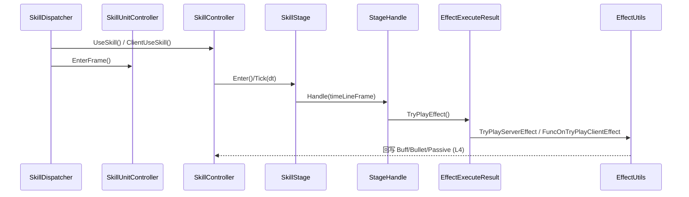

# L3a 技能引擎核心层 (Skill Engine Core)

> Agent-4a [skill-core] | 37 文件 | `Skill/` 根(20) + `Skill/Base/`(7) + `Skill/Utils/`(3) + `Skill/Power/`(6) + `Skill/ClientEffect/`(1)

> 注：Power/ (6文件) 与 ClientEffect/ (1文件) 属战力计算/移动特效，与 Timeline 引擎核心弱相关。

## 层级内部模块关系



## 输入-处理-输出

```
SkillComponent.SendUserSkillReq / GameManager.InputVKey
  → PlayerCtrlGroup.InputVKey → SkillController.UseSkill / ClientUseSkill
    → [处理] SkillContainer.GetSkill → SkillEntity 生成 SkillStage 实例
    → SkillDispatcher.EnterFrame 逐帧推进 SkillController / SkillUnitController
    → [输出] StageHandle.PlayStageEffect → TryPlayEffect
    → RegisterServerEffect / TryPlayServerEffect / FuncOnTryPlayClientEffect
```

## 关键调用链



## 对外接口（与其他层契约）

**SkillDispatcher（每帧调度入口）**
- `EnterFrame()` / `Create()` / `Reset()` / `Release()`

**SkillController（施法和状态机）**
- `UseSkill(...)` / `ClientUseSkill(...)` / `InterruptSkill()` / `GetSkillStage()`

**SkillUnitController**
- `Create(...)` / `EnterFrame()` / `GetSkillUnit(...)`

**SkillStage**
- `Enter()` / `Exit()` / `Tick(dt)` / `GetTimeLineStage() : TimeLineStage[]`

**SkillContainer**
- `AddSkill(SkillEntity)` / `GetSkill(int)` / `Tick(dt)`

**EffectUtils（已验证的效果处理接口）**
- `HandleEffectDamage(...)` / `HandleEffectDamageTar(...)` / `HandleEffectDamageSecond(...)`
- 未发现 `ExecuteEffect(SkillEffectParam)` / `ApplyBuff` / `SpawnBullet` / `TriggerPassive` 这些精确方法名

**SkillBlackBoard**
- `SetValue(key, val)` / `GetValue(key)` / `Reset()`

## 关键发现

1. **Timeline 驱动主轴**：`SkillStage.TimeLineStage[]` → 每帧 `StageHandle` 解析 → `EffectExecuteResult` → `EffectUtils` 执行，是整条 pipeline 核心。
2. **三层实体关系**：SkillContainer 管理多个 SkillEntity（按 skillId）；SkillEntity 引用 SkillInfo 配置并生成 SkillStage 运行时；SkillStage 由 SkillController 驱动支持中断/重入。
3. **StageHandle 对接效果层**：当前代码证据支持 `StageHandle.PlayStageEffect()` / `TryPlayEffect()` 作为阶段效果分叉点；`EffectUtils.HandleEffectDamage()` 是已验证的伤害落地方法。旧版 `ExecuteEffect/ApplyBuff/SpawnBullet/TriggerPassive` 不是当前代码中的真实方法名。
4. **SkillBlackBoard 作用域**：单技能运行期 key-value 黑板，SkillController 与 SkillStage 均可读写，跨 Stage 传递临时状态（连击数/蓄力值），技能结束 Reset，不跨技能共享。
5. **SkillDispatcher 总入口**：统一接收输入与计时，向下分发到 SkillUnitController（单位级）与 SkillController（技能级）。
6. **StageHandle 职责单一**：仅做"时间线帧→效果结果"的翻译+编排，实体增删归 SkillController。
7. **ClientEffect 与 Server 分离**：ClientMoveFx 仅消费 FxParam/FxUtils 产出表现，不介入逻辑判定。

## 依赖上层/下层
- ← **L2 控制**：SkillComponent 查询 skillDispatcher.SkillController 触发；SendUserSkillReq 输入
- ← **L3b 分部**：SkillControllerSkillPartial/SkillEntityActionPartial 等 12 个 partial 扩展主类
- → **L4 效果**：StageHandle/EffectUtils 分别连接 SkillBuff、SkillBullet、PassiveSkillEntity、伤害处理
- → **L5 支撑**：消费 TypeEffect（技能视觉特效）、SkillUtils 碰撞检测依赖 CustomDataStruct
