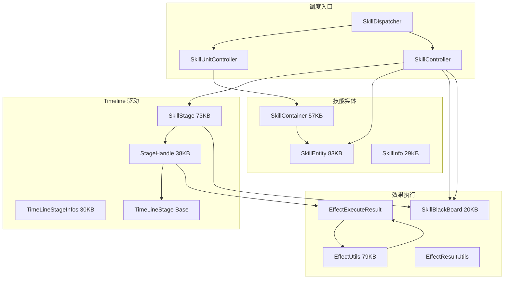
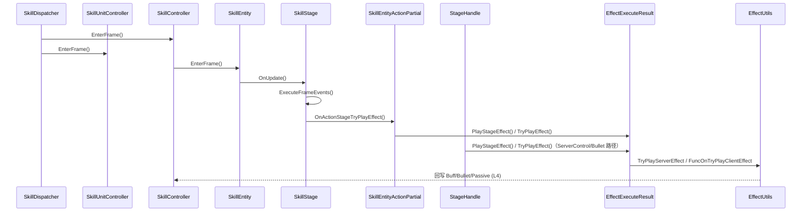

# L3a 技能引擎核心层 (Skill Engine Core)

> Agent-4a [skill-core] | 37 文件 | `Skill/` 根(20) + `Skill/Base/`(7) + `Skill/Utils/`(3) + `Skill/Power/`(6) + `Skill/ClientEffect/`(1)

> 注：Power/ (6文件) 与 ClientEffect/ (1文件) 属战力计算/移动特效，与 Timeline 引擎核心弱相关。

## 层级内部模块关系



## 输入-处理-输出

```
手动技能按钮:
  UniversalButton.OnPointerDown/OnPointerUp/OnEndDrag/onPressing
    → SkillComponent.OnPointerDown/OnPointerUp/OnEndDrag/OnPressingAction
    → SkillComponent.SendUserSkillReq
    → m_NPCEntityBase.skillDispatcher.SkillController.ClientUseSkill
    → SkillController.UseSkill / UseNewSkill
    → [处理] CreateSkillEntity → SkillEntity.ClientUseSkill → OnClientPreEnter → EnterCurStage
    → SkillDispatcher.EnterFrame 逐帧推进 SkillController / SkillUnitController
VKey 移动:
  GameManager.InputVKey → PlayerCtrlGroup.InputVKey → DoVKey_Move
    → [输出] 只处理移动输入，不进入技能 Stage/效果链
技能阶段效果:
  SkillController.EnterFrame → SkillEntity.EnterFrame/OnUpdate → SkillStage.OnUpdate/ExecuteFrameEvents
    → [手动 SkillEntity] SkillEntityActionPartial.PlayStageEffect → TryPlayEffect
    → [ServerControlStageEntityBase/SkillBullet] StageHandle.PlayStageEffect → TryPlayEffect
    → RegisterServerEffect / TryPlayServerEffect / FuncOnTryPlayClientEffect
```

## 关键调用链



## 对外接口（与其他层契约）

**SkillDispatcher（每帧调度入口）**
- `EnterFrame()` / `Create()` / `Reset()` / `Release()`

**SkillController（施法和状态机）**
- `UseSkill(...)` / `ClientUseSkill(...)` / `ClientBreakActiveSkill(...)` / `BreakSkillEntity(...)` / `GetActiveStage()`

**SkillUnitController**
- `Create(...)` / `EnterFrame()` / `GetSkillUnit(...)`

**SkillStage**
- `OnEnter(...)` / `OnUpdate()` / `ExitStage(...)` / `ExecuteFrameEvents(...)`；`GetTimeLineStage(...)` 在 `SkillInfo/BaseConfigInfo`

**SkillContainer**
- `Create(...)` / `EnterFrame()` / `CheckCanUseSkill(...)` / `ServerUseSkill(...)` / `RefreshCD(...)` / `FindSkillInfo(...)`

**EffectUtils（已验证的效果处理接口）**
- `HandleEffectDamage(...)` / `HandleEffectDamageTar(...)` / `HandleEffectDamageSecond(...)`
- 未发现 `ExecuteEffect(SkillEffectParam)` / `ApplyBuff` / `SpawnBullet` / `TriggerPassive` 这些精确方法名

**SkillBlackBoard**
- `SkillBlackBoard : BaseBlackBoard`，实际 API 是 `Set(key, value, tag, ...)` / `Get(key, tag)` / `Clear()`

## 关键发现

1. **Timeline 驱动主轴**：`SkillInfo/BaseConfigInfo.GetTimeLineStage(...)` 提供 `TimeLineStage[]`，运行期由 `SkillStage.OnUpdate()` / `ExecuteFrameEvents()` 播放帧事件；手动技能走 `SkillEntityActionPartial.PlayStageEffect()`，Buff/Bullet/Passive 等 ServerControl 路径走 `StageHandle.TryPlayEffect()`。
2. **三层实体关系**：SkillContainer 管理技能槽 `SkillInfo` / `ShowSkillInfos`；SkillController 通过 `CreateSkillEntity` 生成 SkillEntity；SkillEntity 引用 SkillInfo 配置并生成 SkillStage 运行时；SkillStage 由 SkillController 驱动支持中断/重入。
3. **阶段效果分叉点**：手动 `SkillEntity` 路径的效果入口在 `SkillEntityActionPartial.PlayStageEffect()` / `TryPlayEffect()`；`StageHandle.PlayStageEffect()` / `TryPlayEffect()` 用于 `ServerControlStageEntityBase` / `SkillBullet` 等阶段路径。`EffectUtils.HandleEffectDamage()` 是已验证的伤害落地方法。旧版 `ExecuteEffect/ApplyBuff/SpawnBullet/TriggerPassive` 不是当前代码中的真实方法名。
4. **SkillBlackBoard 作用域**：单技能运行期 key-value 黑板，SkillController 与 SkillStage 均可读写，跨 Stage 传递临时状态（连击数/蓄力值），技能结束经 `BaseBlackBoard.Clear()` 清理，不跨技能共享。
5. **SkillDispatcher 运行时聚合点**：创建并持有 SkillController / SkillUnitController，并在 `EnterFrame()` 中推进两者；技能输入由 SkillComponent 或自动战斗虚拟按键进入 `SkillController.ClientUseSkill()`，不是 SkillDispatcher 直接接收。
6. **StageHandle 职责边界**：在 ServerControl/Bullet 等路径中做"时间线帧→效果结果"的翻译+编排；手动 SkillEntity 的动作/效果执行在 SkillEntityActionPartial。
7. **ClientEffect 与 Server 分离**：ClientMoveFx 仅消费 FxParam/FxUtils 产出表现，不介入逻辑判定。

## 依赖上层/下层
- ← **L2 控制**：SkillComponent 查询 skillDispatcher.SkillController 触发；SendUserSkillReq 输入
- ← **L3b 分部**：SkillControllerSkillPartial/SkillEntityActionPartial 等 12 个 partial 扩展主类
- → **L4 效果**：SkillEntityActionPartial/StageHandle 连接阶段效果线；EffectUtils 负责已验证的伤害处理
- → **L5 支撑**：消费 TypeEffect（技能视觉特效）、SkillUtils 碰撞检测依赖 CustomDataStruct
