# L3b 技能分部类扩展层 (Skill Partial Extension)

> Agent-4b [skill-partial] | 12 文件 | `Skill/SkillPartial/`

## 层级内部模块关系（partial 归属）

```mermaid
graph TD
    subgraph SC["SkillController (主类)"]
        CS[SkillControllerSkillPartial 85KB<br/>核心调度]
        CUI[SkillControllerUserInputPartial 43KB<br/>输入]
        CE[SkillControllerEffectPartial 36KB<br/>特效]
        CB[SkillControllerBuffPartial 8KB<br/>Buff]
        CM[SkillControllerMsgPartial 6KB<br/>消息]
        CBu[SkillControllerBulletPartial 5KB<br/>子弹]
        CP[SkillControllerPassivePartial 5KB<br/>被动]
        CBase[SkillControllerBasePartial 2KB<br/>基础]
    end
    subgraph SE["SkillEntity (主类)"]
        EA[SkillEntityActionPartial 76KB<br/>动作]
        EUI[SkillEntityUserInputPartial 57KB<br/>输入]
        EC[SkillEntityCfgPartial 13KB<br/>配置]
        ED[SkillEntityDebugDataPartial 6KB<br/>调试]
    end
    CS --> SkillController
    CUI --> SkillController
    CE --> SkillController
    CB --> SkillController
    CM --> SkillController
    CBu --> SkillController
    CP --> SkillController
    CBase --> SkillController
    EA --> SkillEntity
    EUI --> SkillEntity
    EC --> SkillEntity
    ED --> SkillEntity
```



## 输入-处理-输出

```
12 个 partial 文件共享同一主类私有字段，无接口隔离
  → [处理] 按功能域物理拆分：UserInput/Effect/Action/Buff/Msg/Bullet/Passive/Cfg/DebugData/Skill/Base
  → [输出] 编译期合并为 SkillController / SkillEntity 完整类
```

## 核心方法分布

| 主类 | partial | 方法领域 |
|------|---------|---------|
| SkillController | SkillPartial (85KB) | UseSkill/ClientUseSkill/InterruptSkill/状态查询/冷却 |
| SkillController | UserInputPartial (43KB) | CacheUserInput/SendUserInput/TriggerServerInput/预播输入 |
| SkillController | EffectPartial (36KB) | 特效创建/挂点矩阵/同步 |
| SkillController | BuffPartial | OnBuffCreateRet/OnBuffRunStage/EnterFrameBuff/EnterFrameRunnintBuff |
| SkillController | MsgPartial | SendPreUseSkillReq/SendUseSkillReq/SendEnergyEndNotice/SendSkillQuit |
| SkillController | BulletPartial | OnBulletCreateRet/OnBulletRunStage/OnBulletEndRet/EnterFrameBullet |
| SkillController | PassivePartial | OnPassiveSkillUseRet/OnPassiveRunStageRet/EnterFramePassive |
| SkillEntity | ActionPartial (76KB) | 动作播放/位移/打击判定 |
| SkillEntity | UserInputPartial (57KB) | 摇杆解析/技能键映射 |
| SkillEntity | CfgPartial | 配置表读取/动作绑定 |
| SkillEntity | DebugDataPartial | 调试快照 |

## 对外接口（partial 暴露的 public 方法）

**SkillControllerSkillPartial（85KB，抽样验证）**
- `UseSkill` / `ClientUseSkill` / `InterruptSkill` / `GetSkillStage`

**SkillEntityActionPartial（76KB，未在本轮逐项展开）**
- 文件存在；具体方法需继续按符号验证后再写，不能沿用旧的概念方法名。

**SkillEntityUserInputPartial（57KB，未在本轮逐项展开）**
- 文件存在；具体输入方法需继续按符号验证后再写。

**<30KB 文件的真实方法抽样**
- `SkillControllerBuffPartial.OnBuffCreateRet/OnBuffRunStage/OnBuffEndRet/EnterFrameBuff`
- `SkillControllerMsgPartial.SendPreUseSkillReq/SendUseSkillReq/SendEnergyEndNotice/SendSkillQuit`
- `SkillControllerBulletPartial.EnterFrameBullet/OnBulletCreateRet/OnBulletRunStage/OnBulletEndRet`
- `SkillControllerPassivePartial.EnterFramePassive/OnPassiveSkillUseRet/OnPassiveRunStageRet/OnPassiveSkillEndRet`

## 关键发现

1. **按功能域拆分（非生命周期）**：12 个 partial 全按"谁负责什么"组织，无创建/更新/销毁阶段拆分。
2. **纯物理拆分**：所有文件共享主类私有字段，跨 partial 可直接访问彼此方法/字段，无接口隔离。
3. **双主类结构**：SkillController 侧重"调度与系统交互"（输入→协议→特效→子弹→Buff→被动）；SkillEntity 侧重"表现与配置"（动作→输入→配置→调试）。
4. **存疑点**：
   - `SkillControllerUserInputPartial` 与 `SkillEntityUserInputPartial` 均处理输入，职责边界可能重叠 [待确认]
   - `SkillControllerSkillPartial`(85KB) 体量超过部分主类，是否应下沉为 SkillStateMachine 独立类 [待确认]

## 依赖关系
- → **L3a 引擎核心**：本层是 SkillController/SkillEntity 的物理拆分，编译期合并
- → **L4 效果**：SkillControllerBuffPartial/BulletPartial/PassivePartial 直接调用 L4 实体
- → **L5 支撑**：特效挂点依赖 TypeEffect/ViewModel
