# L3b 技能分部类扩展层 (Skill Partial Extension)

> Agent-4b [skill-partial] | 12 文件 | `Skill/SkillPartial/`

## 层级内部模块关系（partial 归属）

```mermaid
graph TD
    subgraph SC["SkillController (主类)"]
        CS[SkillControllerSkillPartial 85KB<br/>核心调度]
        CUI[SkillControllerUserInputPartial 43KB<br/>输入]
        CE[SkillControllerEffectPartial 36KB<br/>特效]
        CB[SkillControllerBuffPartial 8KB<br/>Buff]
        CM[SkillControllerMsgPartial 6KB<br/>消息]
        CBu[SkillControllerBulletPartial 5KB<br/>子弹]
        CP[SkillControllerPassivePartial 5KB<br/>被动]
        CBase[SkillControllerBasePartial 2KB<br/>基础]
    end
    subgraph SE["SkillEntity (主类)"]
        EA[SkillEntityActionPartial 76KB<br/>动作]
        EUI[SkillEntityUserInputPartial 57KB<br/>输入]
        EC[SkillEntityCfgPartial 13KB<br/>配置]
        ED[SkillEntityDebugDataPartial 6KB<br/>调试]
    end
    CS --> SkillController
    CUI --> SkillController
    CE --> SkillController
    CB --> SkillController
    CM --> SkillController
    CBu --> SkillController
    CP --> SkillController
    CBase --> SkillController
    EA --> SkillEntity
    EUI --> SkillEntity
    EC --> SkillEntity
    ED --> SkillEntity
```



## 输入-处理-输出

```
12 个 partial 文件共享同一主类私有字段，无接口隔离
  → [处理] 按功能域物理拆分：UserInput/Effect/Action/Buff/Msg/Bullet/Passive/Cfg/DebugData/Skill/Base
  → [输出] 编译期合并为 SkillController / SkillEntity 完整类
```

## 核心方法分布

| 主类 | partial | 方法领域 |
|------|---------|---------|
| SkillController | SkillPartial (85KB) | UseSkill/ClientUseSkill/ClientBreakActiveSkill/BreakSkillEntity/状态查询/冷却 |
| SkillController | UserInputPartial (43KB) | CacheUserInput/SendUserInput/TriggerServerInput/预输入缓存与协议 |
| SkillController | EffectPartial (36KB) | 特效创建/挂点矩阵/同步 |
| SkillController | BuffPartial | OnBuffCreateRet/OnBuffRunStage/OnBuffEndRet/EnterFrameBuff/EnterFrameRunnintBuff |
| SkillController | MsgPartial | SendPreUseSkillReq/SendUseSkillReq/SendEnergyEndNotice/SendSkillQuit |
| SkillController | BulletPartial | OnBulletCreateRet/OnBulletRunStage/OnBulletEndRet/EnterFrameBullet |
| SkillController | PassivePartial | OnPassiveSkillUseRet/OnPassiveRunStageRet/OnPassiveSkillEndRet/EnterFramePassive |
| SkillEntity | ActionPartial (76KB) | 动画播放/阶段退出/效果执行/服务器注册效果 |
| SkillEntity | UserInputPartial (57KB) | 输入轴黑板/ExecuteUserInput/蓄力状态 |
| SkillEntity | CfgPartial | 配置引用/阶段与蓄力运行参数/轮盘配置选择/黑板回填 |
| SkillEntity | DebugDataPartial | 调试快照 |

## 关键接口与内部方法（partial 中定义的方法）

**SkillControllerSkillPartial（85KB，抽样验证）**
- `UseSkill` / `ClientUseSkill` / `ClientBreakActiveSkill` / `BreakSkillEntity` / `GetActiveStage`

**SkillEntityActionPartial（76KB，本轮补查关键效果链）**
- 已验证核心方法包括 `OnFuncStageTryPlayAnim()` / `StagePlayAnim()` / `OnActionExitStage()` / `BreakStage()` / `BreakCurStageToNext()` / `PlayStageEffect()` / `TryPlayEffect()` / `StageTryPlayServerEffect()` / `RegisterServerEffect()` / `TryPlayRegistedServerEffect()` / `TryPlayServerRegEffect()` / `StopStageEffect()` / `ReleaseAction()`。
- 已验证手动阶段效果链：`OnActionStageTryPlayEffect()` → `PlayStageEffect()` → `TryPlayEffect()`，再进入 `RegisterServerEffect()` / `StageTryPlayServerEffect()` / `FuncOnTryPlayClientEffect`；`StageTryPlayServerEffect()` 内部通过服务器黑板数据调用 `TryPlayServerRegEffect()` 并更新执行结果。

**SkillControllerUserInputPartial / SkillControllerMsgPartial（输入缓存与协议）**
- 已验证 `CacheUserInput()` / `UpdateClientInputCache()` / `SendUserInput()` / `CancelUserInputReq()` / `TriggerServerInput()` / `TriggerWaitSendInputCache()` / `PrePlayUserInput()`。
- `SendUserInput()` 先 `FormatSkillUseReq()`，再调用 `UpdateClientInputCache()`；若当前活跃阶段尚未 `ServerCreateStage`，则只写入 `_waitSendInputCache` 并暂不发协议，否则才更新 `_clientInputCache`。
- `sendUseSkill == true` 时调用 `SkillControllerMsgPartial.SendPreUseSkillReq()`；否则按运行中输入轴调用 `SkillMsgUtils.SendPreSkillUseInput()`。取消预输入走 `CancelUserInputReq()` -> `sendPreSkillUseInputCancelReq()`。

**SkillEntityUserInputPartial（57KB，输入轴与蓄力执行）**
- 已验证输入轴核心方法：`OnClientUserInputEffect()` / `OnServerInputEffect()` / `StartUserInput()` / `ExecuteUserInput()` / `ExecuteServerUserInput()` / `CheckCanPreTriggerUserInput()` / `OnTriggerUserInput()` / `DelayInvokeExecuteUserInput()` / `CancelInvokeExecuteUserInput()` / `SetUserInputState()` / `StartEnergy()` / `OnEnergyUpdate()` / `StopEnergy()`。
- `OnClientUserInputEffect()` 写 `BaseBlackBoard.KEY_USER_INPUT`，`ExecuteUserInput()` 在客户端结果和服务器黑板结果之间合流，再分派到 `ExecuteSkillUserInput()` 或 `ExecuteEnergyUserInput()`；蓄力线由 `StartEnergy()` / `OnEnergyUpdate()` / `StopEnergy()` 维护计时与 UI 事件。
- `ExecuteEnergyUserInput()` 在客户端蓄力不足最小时间时会 `DelayInvoker.DelayInvoke(..., DelayInvokeExecuteUserInput, ...)`；延迟回调里先 `SkillMsgUtils.SendPreSkillUseInput(RuntimeID, inputSkillUseReq, userInput.EffectID)`，再 `ExecuteUserInput(...)`，因此输入轴协议发送不只发生在 Controller partial。

**<30KB 文件的真实方法抽样**
- `SkillControllerBuffPartial.OnBuffCreateRet/OnBuffRunStage/OnBuffRuntimeSync/OnBuffEndRet/EnterFrameBuff`
- `SkillControllerMsgPartial.SendPreUseSkillReq/SendUseSkillReq/SendEnergyEndNotice/SendSkillQuit`
- `SkillControllerBulletPartial.EnterFrameBullet/OnBulletCreateRet/OnBulletRunStage/OnBulletRuntimeSync/OnBulletEndRet/ReleaseBullet/ResetBullet`
- `SkillControllerPassivePartial.EnterFramePassive/OnPassiveSkillUseRet/OnPassiveRunStageRet/OnPassiveSkillEndRet`
- `SkillControllerBuffPartial.EnterFrameRunnintBuff` / `JoyStickCancleBuff` 为代码中的实际方法名拼写，本文件保留原拼写以便搜索定位。

## 关键发现

1. **按功能域拆分（非生命周期）**：12 个 partial 全按"谁负责什么"组织，无创建/更新/销毁阶段拆分。
2. **纯物理拆分**：所有文件共享主类私有字段，跨 partial 可直接访问彼此方法/字段，无接口隔离。
3. **双主类结构**：SkillController 侧重"调度与系统交互"（输入→协议→特效→子弹→Buff→被动）；SkillEntity 侧重"表现与配置"（动作→输入→配置→调试）。
4. **UserInput 边界**：`SkillControllerUserInputPartial` 负责预输入缓存、等待服务器阶段创建的 `_waitSendInputCache`、服务器输入缓存触发和 `SendUserInput()` 决策；协议发送分散在 `SkillControllerMsgPartial.SendPreUseSkillReq()`、`SkillMsgUtils.SendPreSkillUseInput()` 和 `sendPreSkillUseInputCancelReq()`。`SkillEntityUserInputPartial` 负责 `BaseBlackBoard.KEY_USER_INPUT` 的开启与结束状态处理、客户端与服务器结果合流、`ExecuteUserInput()` 执行，以及 Energy 蓄力计时；蓄力延迟执行回调会自行补发 `SkillMsgUtils.SendPreSkillUseInput()` 后再落地输入结果。
5. **设计建议边界**：`SkillControllerSkillPartial` 体量大是事实；是否下沉为 `SkillStateMachine` 属于重构建议，不应作为当前代码事实写入架构结论。

## 依赖关系
- → **L3a 引擎核心**：本层是 SkillController/SkillEntity 的物理拆分，编译期合并
- → **L4 效果**：SkillControllerBuffPartial/BulletPartial/PassivePartial 直接调用 L4 实体
- → **L5 支撑**：特效挂点依赖 TypeEffect/ViewModel
