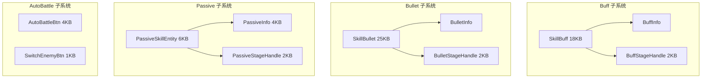
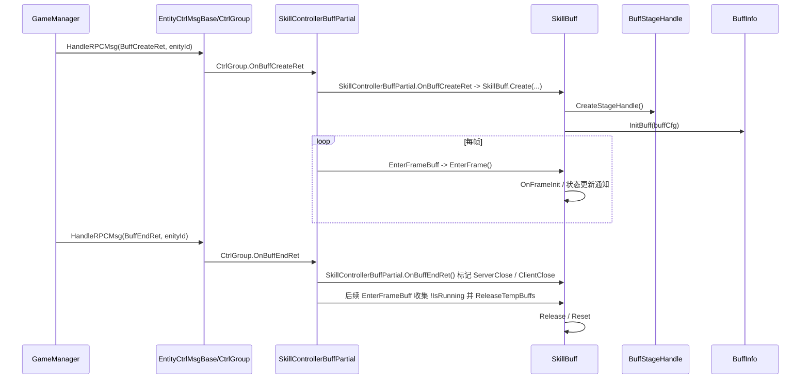

# L4 战斗效果层 (Combat Effect Layer)

> Agent-5 [effect] | 10 文件 | `Skill/Buff/`(3) + `Skill/Bullet/`(3) + `Skill/Passive/`(2) + `Skill/AutoBattle/`(2)

## 层级内部模块关系



## 输入-处理-输出

```
L3 阶段效果执行器：SkillEntityActionPartial（手动）/ StageHandle（ServerControl、Bullet 等）
  → [阶段效果] 包装 EffectParam，走服务器/客户端效果线
  → [运行时创建] 服务器回包先经 GameManager/EntityCtrlMsgBase/CtrlGroup，再由 SkillController partial 分发
    → Buff: OnBuffCreateRet → SkillBuff.Create / CreateStageHandle / InitBuff → EnterFrame
    → Bullet: OnBulletCreateRet → SkillBullet.Create / CreateStageHandle / CreateBulletInfo → EnterFrameStages / OnRunStageRet；OnBulletEndRet 后 ReleaseBullet
    → Passive: OnPassiveSkillUseRet → PassiveSkillEntity.Create / CreateStageHandle / CreatePassiveInfo
  → [输出] 效果同步、阶段推进、伤害落地和视觉特效
```

## 关键调用链



## 对外接口（与其他层契约）

**SkillBuff**
- `Create(...)` / `CreateStageHandle()` / `InitBuff(...)` / `EnterFrame()` / `OnBuffEndRet()` / `Release()`
- 属性 `buffInfo` / `buffStageHandle`

**SkillBullet**
- `Create(...)` / `CreateStageHandle()` / `CreateBulletInfo()` / `CreateStage()` / `EnterFrame()` / `EnterFrameStages()` / `OnRunStageRet()` / `OnBulletEndRet()`
- 已验证阶段推进和服务器回包链路；`RegisterBulletAction()` 将 Bullet 的 `FuncOnTryPlayClientEffect` / `FuncOnTryPlayServerEffect` 分别接到 `StageTryPlayClientEffect()` / `OnFuncStageTryPlayServerEffect()`。
- `SkillBullet.Create(BulletCreateRet)` 用 `hasCreate` 避免服务器运行时创建与 AOI 创建通知造成重复子弹特效；创建时写 RuntimeID/BulletID/Owner/Builder，随后 `CreateStageHandle()`、`CreateBulletInfo()`、`HandleBlackList(...)`、`PlayCreateLoopEffects(...)`、`PlayEffects(...)`。
- `SkillControllerBulletPartial.OnBulletEndRet()` 先调用 `SkillBullet.OnBulletEndRet()` 处理结束黑板并 `StopEffects()`，随后立即 `ReleaseBullet()`；不是等每帧延迟回收。
- Bullet scoped search 未发现 `OnHitTarget` / `HitTarget` / `OnCollision` / `OnTrigger` / `SkillUtils` / `HandleEffectDamage` 等本地命中或直接伤害 API。

**PassiveSkillEntity / PassiveInfo**
- `PassiveSkillEntity.Create(...)` / `CreateStageHandle()` / `CreatePassiveInfo()`
- `PassiveInfo.Init()` / `InitData()` / `Release()`，仅承载被动配置

**BuffStageHandle / BulletStageHandle / PassiveStageHandle**
- `OnCreate()` / `OnActionExitStage()` / `OnActionStageStartCD()` / `Reset()` 等 StageHandle 覆写点
- 已验证的效果入口在 L3 `StageHandle.TryPlayEffect()` 及其服务器/客户端效果分支

## 关键发现

1. **统一抽象是 StageHandle/SkillStage 而非 IBaseEffect**：三者均通过 `*StageHandle` 驱动生命周期，实体类本身偏薄（持有 Info + Handle），与 L3 技能阶段模型一致。
2. **基类差异**：`SkillBuff` / `PassiveSkillEntity` 继承 `ServerControlStageEntityBase`；`PassiveInfo` 继承 `BaseConfigInfo`，只承载被动配置；`SkillBullet` 继承 `EntityRemoteStatic`。
3. **结构差异**：SkillBuff 通过 `EnterFrame()` / `OnFrameInit()` 持续更新，并在后续帧回收；SkillBullet 通过 `EnterFrame()` / `EnterFrameStages()` 和阶段回包推进，结束回包后由 `SkillControllerBulletPartial.ReleaseBullet()` 立即回收；PassiveSkillEntity 持有 PassiveInfo + PassiveStageHandle。
4. **触发时机**：Buff/Bullet/Passive 的创建和阶段推进均已验证经过 `SkillController*Partial` 处理；协议入口在更上游的 `GameManager.HandleRPCMsg -> EntityCtrlMsgBase/CtrlGroup`。Bullet 的效果执行通过 `FuncOnTryPlayClientEffect` / `FuncOnTryPlayServerEffect` 委托回到 `SkillControllerEffectPartial`，未发现独立的 `OnHitTarget -> EffectUtils` 方法链。
5. **AutoBattle 决策在 BattleManager**：AutoBattleBtn 仅 UI 入口，真正决策逻辑在 `BattleManager.OnFixedUpdate/SearchEnemyFight/GotoFightEnemy/AutoBattleUseSkill`。
6. **L4 与 L3 对接**：L4 负责"效果载体与生命周期"；伤害落地由 L3 `EffectUtils.HandleEffectDamage()` 消费服务器 `HurtNodeMsg` 并转交目标实体 `HandleHurtNodeMsg()`。`HandleEffectDamageTar()` 只验证到客户端目标受击特效/动作线，不进入 `BattleManager.OnHurtData()` 飘字链。
7. **Passive 配置来源**：`PassiveInfo.InitData()` 读取 `PassiveSkillConfig`，运行时实体是 `PassiveSkillEntity`。

## 依赖上层/下层
- ← **L3 引擎**：StageHandle 连接 ServerControl/Bullet 等阶段效果线；手动 SkillEntity 效果线在 SkillEntityActionPartial；SkillController partial 负责 CtrlGroup 之后的 Buff/Bullet/Passive 回包处理
- → **L5 支撑**：消费 TypeEffect（当前映射包含 ShadowFollowBuffEffect、InvisibleBuffEffect、ParalysisBuffEffect 等）
