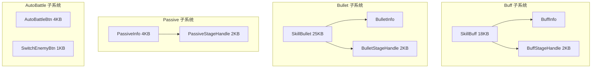
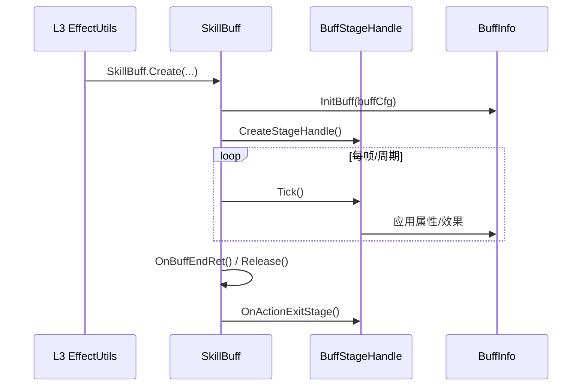

# L4 战斗效果层 (Combat Effect Layer)

> Agent-5 [effect] | 10 文件 | `Skill/Buff/`(3) + `Skill/Bullet/`(3) + `Skill/Passive/`(2) + `Skill/AutoBattle/`(2)

## 层级内部模块关系



## 输入-处理-输出

```
L3 StageHandle.PlayStageEffect / TryPlayEffect(param)
  → [处理] 按 EffectType 分支
    → Buff: SkillBuff.Create / InitBuff / CreateStageHandle → EnterFrame 周期更新
    → Bullet: SkillBullet.Create / CreateBulletInfo / CreateStageHandle → EnterFrameStages / OnRunStageRet
    → Passive: PassiveSkillEntity.CreatePassiveInfo / PassiveInfo.InitData
  → [输出] 效果落地（属性修改/位移/伤害/视觉特效）
```

## 关键调用链



## 对外接口（与其他层契约）

**SkillBuff**
- `Create(...)` / `InitBuff(...)` / `CreateStageHandle()` / `EnterFrame()` / `OnBuffEndRet()` / `Release()`
- 属性 `buffInfo` / `buffStageHandle`

**SkillBullet**
- `Create(...)` / `CreateBulletInfo()` / `CreateStageHandle()` / `CreateStage()` / `EnterFrame()` / `EnterFrameStages()` / `OnRunStageRet()` / `OnBulletEndRet()`
- 命中回调向 L3 回传，由 EffectUtils 执行效果

**PassiveInfo**
- `PassiveSkillEntity.Create(...)` / `CreatePassiveInfo()` / `PassiveInfo.Init()` / `InitData()` / `Release()`

**BuffStageHandle / BulletStageHandle / PassiveStageHandle**
- `OnCreate()` / `OnActionExitStage()` / `OnActionStageStartCD()` / `Reset()` 等 StageHandle 覆写点
- 已验证的效果入口在 L3 `StageHandle.TryPlayEffect()` 及其服务器/客户端效果分支

## 关键发现

1. **统一抽象是 StageHandle/SkillStage 而非 IBaseEffect**：三者均通过 `*StageHandle` 驱动生命周期，实体类本身偏薄（持有 Info + Handle），与 L3 技能阶段模型一致。
2. **基类差异**：SkillBuff/PassiveInfo 继承 ServerControlStageEntityBase（服务器控制挂载/移除）；SkillBullet 继承 EntityRemoteStatic（客户端表现为主，含飞行插值）。
3. **结构差异**：SkillBuff 通过 `EnterFrame()` / `OnFrameInit()` 持续更新；SkillBullet 通过 `EnterFrame()` / `EnterFrameStages()` 和阶段回调推进；PassiveInfo 主要承载配置初始化与释放。
4. **触发时机**：Buff Tick 周期 / Bullet 命中瞬间 / Passive 事件条件触发。
5. **AutoBattle 决策在 BattleMgr**：AutoBattleBtn 仅 UI 入口，真正决策逻辑需向其他层确认 [语义不清]。
6. **L4 与 L3 对接**：L4 负责"效果载体与生命周期"，L3 EffectUtils 负责"效果计算与落地"；子弹命中回调交还 L3。
7. **Passive 配置来源**：文件集仅含 PassiveInfo+PassiveStageHandle，缺独立配置类，可能内聚读取 [语义不清]。

## 依赖上层/下层
- ← **L3 引擎**：StageHandle 的阶段效果执行连接本层；SkillBullet 阶段结果可回到效果/伤害处理
- → **L5 支撑**：消费 TypeEffect（Buff 视觉特效如 FreezeBuffEffect/ShadowFollowBuffEffect）
