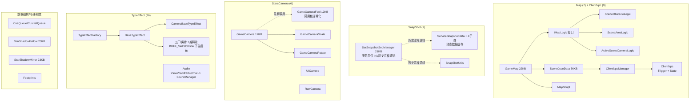
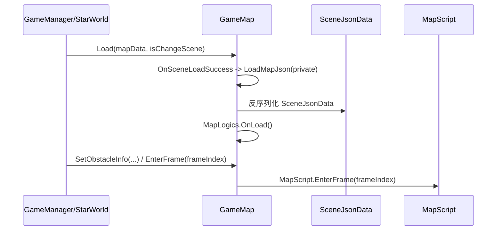
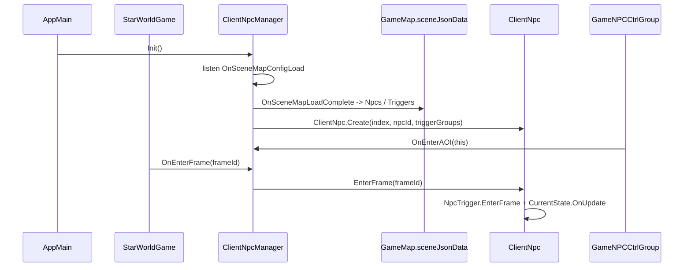
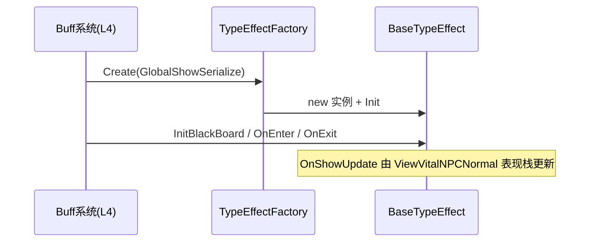

# L5 支撑系统层 (Support System Layer)

> Agent-6 [support] | 51 文件 + ClientNpc 9 文件补充折入 | Map(7) / ClientNpc(9) / SnapShot(7) / StarsCamera(6) / TypeEffect(26) / CustomDataStruct(2) / SpecialUtilComp(2) / ViewEffect(1)

## 层级内部模块关系



## 输入-处理-输出

```
各类上层请求支撑服务
  → Map: GameMap.Load / SetObstacleInfo / EnterFrame → private LoadMapJson / SceneJsonData / SceneObstacleLogic / SceneAreaLogic / MapScript
  → ClientNpc: AppMain.InitServices 初始化 ClientNpcManager；OnSceneMapConfigLoad 读取 SceneJsonData.Npcs/Triggers 创建 ClientNpc；StarWorldGame.OnEnterFrame 驱动 Trigger/State
  → SnapShot: SerSnapshotSeqManager 当前只保留 Init 与大段历史注释逻辑；ServiceSnapshotData 子类仍作为 DynamicDataFactory 缓存数据对象使用
  → Camera: StarsCamera 模块（GameCamera / Scale / Rotate / Feel / UI / Raw）配合 CameraManager 更新相机参数
  → TypeEffect: GlobalShowSerialize → TypeEffectFactory.Create(...) 只完成 BaseTypeEffect.Init；OnEnter/OnExit 由 TypeEffect 持有者触发，OnShowUpdate 由表现栈更新
  → Audio: SkillController 音效事件 → ViewVitalNPCNormal → SoundManager.PlayAudioParam/StopAudio
```

## 关键调用链







## 对外接口（与其他层契约）

**Map**
- `GameMap.Load(...)` / `SetObstacleInfo(...)` / `EnterFrame(int)`
- `LoadMapJson(...)` 是 `GameMap` private 内部 JSON 加载入口，由场景加载成功后触发
- `SceneJsonData` 承载 Areas / Obstacles 等静态场景配置
- `IMapLogic` 当前只声明 `GetLogicType()` / `OnCreate()` / `OnLoad()` / `OnClear()` / `OnUnLoad()`；`Game/Map` 下未找到 `RegisterEntity` / `WorldToGrid` / `QueryObstacle` / `QueryArea` / `Update(...)` 方法

**ClientNpc**
- 目录 9 个文件：`ClientNpcManager` / `ClientNpc` / `IClientNpc` + `NPCState` 状态与移动逻辑。
- `AppMain.InitServices()` 调 `ClientNpcManager.Instance.Init()`；`Init()` 监听 `GlobalEvent.OnSceneMapConfigLoad`，场景地图配置加载后从 `GameMap.sceneJsonData.Npcs` / `Triggers` 创建 `ClientNpc`。
- `StarWorldGame.OnEnterFrame()` 每帧调用 `ClientNpcManager.EnterFrame(frameId)`；`ClientNpc.EnterFrame()` 更新当前 `GameNPCCtrlGroup` 位置、驱动 `NpcTrigger.EnterFrame()` 和 `CurrentState.OnUpdate()`。
- `GameNPCCtrlGroup.OnTemplateCreateFinifh()` 调 `ClientNpcManager.OnEnterAOI(this)` 绑定实际 NPC 控制组；`Release()` 调 `OnLeaveAOI(index)` 解绑。

**SnapShot**
- `SerSnapshotSeqManager.Init()`；当前 PushFrame/Serialize/Deserialize/GetReplay/THD 相关主体为历史注释逻辑，不作为现行链路描述
- `ServiceSnapshotData` 子类是现行 `DynamicDataObject` 缓存对象：`NetworkManager.CacheMessageSnapData -> DynamicDataFactory.InstanceData<SerMessageSnapData> -> InvokeMessageSnapDataCache -> PopEarliestDataByRecorde<SerMessageSnapData> -> HandleMessageHandleData`
- `GameManager.CacheRPCMsg -> SerRPCOneFrameSnapALLData._rPCMsgList -> ClientAddSpeedInvoke -> InvokeFrameRPCDataCache -> PopEarliestDataByRecorde<SerRPCOneFrameSnapALLData> -> HandleAoiMsg/HandleRPCMsg`
- `SerNttAOIOneFrameSnapALLDataTHD` 与 `SerNttAOIOneFrameSnapALLDataMainPlayer` 仍保留缓存字段和 Pop 函数，但当前 `ClientAddSpeedInvoke()` 中 THD/MainPlayer 两个调用被注释，AOI 入口直接 `HandleAoiMsg`，PropSync 入口直接 `HandlePropSync` 后 `return`

**StarsCamera**
- `GameCamera.cs` / `GameCameraScale.cs` / `GameCameraRotate.cs` / `GameCameraFeel.cs` / `UICamera.cs` / `RawCamera.cs`
- 已验证真实方法包括 `GameCamera.Update()`（无参，更新 WorldToUI 挂点）、`LateUpdate()`（目标箭头）、`GameCameraScale.Awake()` / `SwitchCameraDefalultParam()`、`GameCameraRotate.Update()` / `OnDrag()`；未找到 `GameCamera.Update(target)` 或统一 `Apply(...)` 接口；`GameCameraFeel` 在 `GameCamera` / `UICamera` 的调用为注释状态，不写成有效调用链。普通技能 Camera 效果会到 `SkillController.OnActionPlayCamera()`，但该函数当前开头直接 `return`；CameraShake 独立走 `OnActionPlayCameraShake -> GlobalEvent.OnVirtualCameraShakeEvent`。

**TypeEffect**
- `TypeEffectFactory.Create(GlobalShowSerialize) : BaseTypeEffect`
- `BaseTypeEffect.Init(GlobalShowSerialize)` / `InitBlackBoard()` / `OnEnter()` / `OnExit()` / `OnShowEnter()` / `OnShowUpdate()` / `OnShowExit()`

**Audio**
- `SkillController.ActionOnSkillPlayAudio/ActionOnSkillStopAudio` 由 `ViewVitalNPCNormal` 表现层订阅，再调用 `SoundManager.PlayAudioParam(...)` / `StopAudio(...)`；主角表现创建时设置全局监听。

**Special/DataStruct**
- `StarShadowFollow` / `StarShadowMirror` 继承 ViewModel 并实现 I_VVitalAnim，通过 Create/Release 和状态/位置/角度回调同步表现
- `CusQueue.cs` 实际定义 `QueueExtends<T> : Queue<T>`，提供 `HeadEnqueue` / `Remove`
- `CusListQueue<T> : List<T>`，提供 `Enqueue` / `Dequeue`

## 关键发现

1. **GameMap 地图配置枢纽**：对外入口是 `Load(...)` / `SetObstacleInfo(...)` / `EnterFrame(int)`；private `LoadMapJson(...)` 加载 SceneJsonData 后交给 SceneObstacleLogic / SceneAreaLogic / ActiveSceneCameraLogic；动态阻挡通过 `SetObstacleInfo` 转发。
2. **ClientNpc 是地图配置驱动的客户端 NPC 支撑**：它不属于 Skill/Buff 主链；创建数据来自 `SceneJsonData.Npcs/Triggers`，实体绑定来自 `GameNPCCtrlGroup.OnEnterAOI`，帧驱动来自 `StarWorldGame.OnEnterFrame -> ClientNpcManager.EnterFrame`。
3. **MapLogic 生命周期**：private `LoadMapJson(...)` 后调用各 Logic.OnLoad、卸载时调用 OnUnLoad；`IMapLogic` 不含 `Update()`，`GameMap.EnterFrame(int)` 只转发 `MapScript.EnterFrame(int)`，当前 `MapScript.EnterFrame` 没有调用 MapLogic 更新。
4. **SnapShot 当前边界**：`SerSnapshotSeqManager` 现行代码只保留空 `Init()`，消息注册、帧序列、序列化、回放等主体逻辑为注释化历史代码；但 `ServiceSnapshotData` 的 4 个子类不是全废弃，其中 `SerMessageSnapData` 仍由 NetworkManager 缓存/弹出处理，`SerRPCOneFrameSnapALLData` 仍由 GameManager 帧循环处理，THD/MainPlayer 两条缓存分发当前入口被注释或早返回。
5. **StarsCamera 模块**：目录下包含 GameCamera、Scale、Rotate、Feel、UICamera、RawCamera；Scale/Rotate 通过输入事件和 CameraManager 写入相机参数，GameCamera 的 Update/LateUpdate 分别处理 WorldToUI 挂点和目标箭头，未发现单一 `Update(target)` 总控入口或统一 `Apply(...)` 接口；`GameCameraFeel` 当前不是有效调用链。技能普通 Camera 帧被 `SkillController.OnActionPlayCamera()` 开头 `return` 屏蔽，CameraShake 帧仍会触发全局震屏事件。
6. **TypeEffect 工厂模式**：`TypeEffectFactory.Create(GlobalShowSerialize)` 按 `GlobalShowType` 映射 17 类具体 `BaseTypeEffect` 子类并完成 `Init`；`OnEnter/OnExit` 由 TypeEffect 持有者触发（`ServerControlStageEntityBase` 覆盖 Buff/Passive/阶段实体，`SkillBullet` 覆盖子弹），`OnShowEnter/OnShowUpdate/OnShowExit` 由 `EntityCtrlBase` 栈事件转到 `ViewVitalNPCNormal` 表现层，不是工厂后的单条线性生命周期。`BUFF_SkillSlotHide` 虽可创建 `HiddenSkillSlotEffect`，但隐藏技能槽下游 `Start/StopHiddenSkillSlotEffects` 当前直接 `return` 屏蔽。
7. **CustomDataStruct 实际 API**：CusQueue.cs 是 `QueueExtends<T> : Queue<T>`，提供 HeadEnqueue/Remove；CusListQueue<T> 基于 List<T> 提供 Enqueue/Dequeue，不能称 CusQueue 为环形队列。
8. **SpecialUtilComp**：StarShadowFollow/StarShadowMirror 在 Create 订阅 `ViewVitalAnim.OnAngelChange/OnStateChange` 与 `M_EntityBase.OnPosChange/ControlShowHide/CheckHasControllerShow`，Release 反订阅并取消延迟调用；目录内未找到 `Update(...)` 方法。

## 依赖关系
- 被地图加载、相机表现、技能/子弹特效、音效表现和数据结构等链路消费；本轮未做全层级依赖审计，不写成 L0/L1/L2/L3/L4 全量覆盖结论。
- L5 多数是支撑能力，但 TypeEffect/表现支撑直接耦合 Game/Skill/Entity，例如 BaseTypeEffect 持有 BaseBlackBoard，具体 TypeEffect 可访问 GameManager / EntityCtrlBase。
