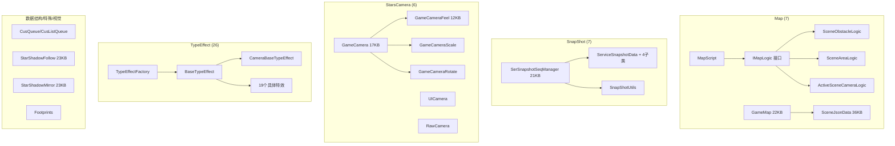
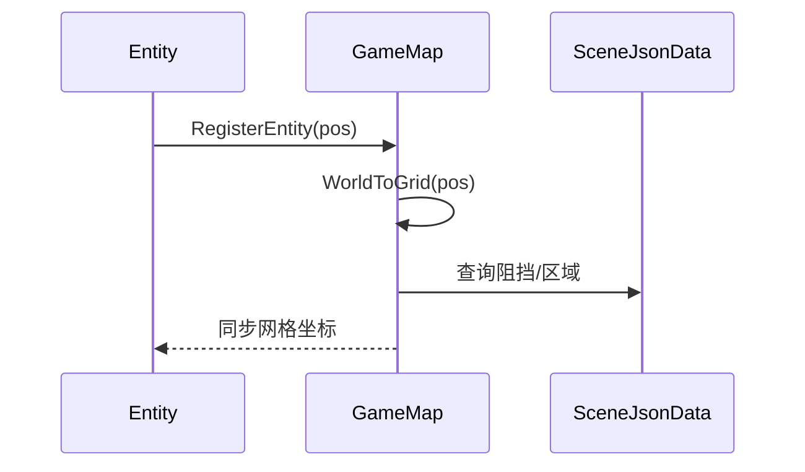
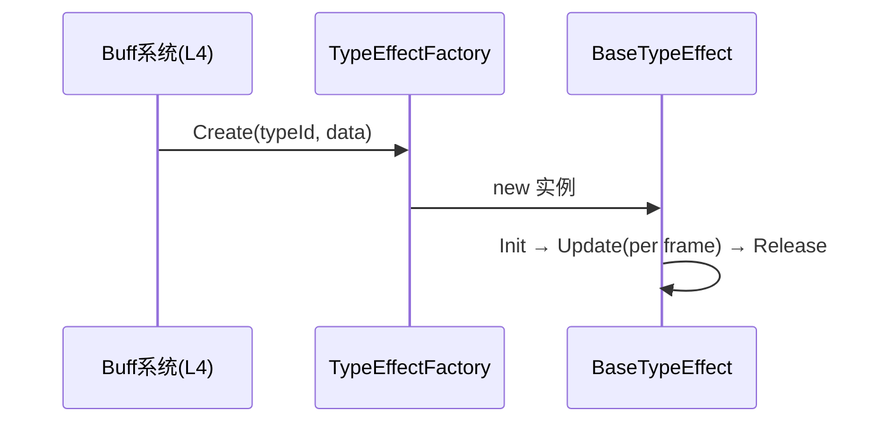

# L5 支撑系统层 (Support System Layer)

> Agent-6 [support] | 51 文件 | Map(7) / SnapShot(7) / StarsCamera(6) / TypeEffect(26) / CustomDataStruct(2) / SpecialUtilComp(2) / ViewEffect(1)

## 层级内部模块关系



## 输入-处理-输出

```
各类上层请求支撑服务
  → Map: Entity.RegisterEntity(pos) → GameMap.WorldToGrid → SceneJsonData 查询阻挡/区域
  → SnapShot: 网络/逻辑层 PushFrame → SerSnapshotSeqManager 序列化（线程化 THD）→ 回放缓冲
  → Camera: 跟随目标 Update → GameCamera 合成（Rotate→Scale→Feel）
  → TypeEffect: Buff系统 Create(typeId) → TypeEffectFactory → BaseTypeEffect.Init/Update/Release
```

## 关键调用链





## 对外接口（与其他层契约）

**Map**
- `GameMap.RegisterEntity(pos)` / `WorldToGrid(...)` / `QueryObstacle(...)` / `QueryArea(...)`
- `IMapLogic.Update()` — 逻辑模块统一驱动

**SnapShot**
- `SerSnapshotSeqManager.PushFrame(...)` / `Serialize(...)` / `Deserialize(...)` / `GetReplay(...)`

**StarsCamera**
- `GameCamera.Update(target)` + Scale/Rotate/Feel 子模块 `Apply(...)`

**TypeEffect**
- `TypeEffectFactory.Create(typeId, data) : BaseTypeEffect`
- `BaseTypeEffect.Init(data)` / `Update()` / `Release()`

**Special/DataStruct**
- `StarShadowFollow.Update(transform)` / `StarShadowMirror.Update()`
- `CusQueue.Enqueue/Dequeue` / `CusListQueue` 对应方法（无 GC 队列）

## 关键发现

1. **GameMap 中央枢纽**：世界坐标↔网格换算、Entity 位置登记与邻居查询，是 Entity 位置同步核心；SceneJsonData 承载静态配置（阻挡/区域/AOI）。
2. **IMapLogic 统一抽象**：SceneObstacleLogic/SceneAreaLogic/ActiveSceneCameraLogic 由 MapScript 每帧驱动 Update（脚本驱动多 Logic 模式）。
3. **SnapShot 帧同步核心**：SerSnapshotSeqManager 维护帧序列号，序列化 ServiceSnapshotData 子类（AOI全量/RPC帧/消息），THD 后缀表明 AOI 整帧快照在线程构建避免阻塞；支持回放/追帧。
4. **GameCamera 总控**：聚合 Scale/Rotate/Feel 三子模块，每帧"目标→旋转→缩放→手感"合成相机姿态；UICamera/RawCamera 独立用途解耦。
5. **TypeEffect 工厂模式**：BaseTypeEffect 统一生命周期 Init/Update/Release；TypeEffectFactory 按 typeId 分发，是新特效唯一扩展点；19 个具体文件归类为 Buff视觉/形态切换/UI/测试。
6. **CustomDataStruct 性能解法**：CusQueue(环形)/CusListQueue(List+Queue混合) 用于高频入队出队（快照缓冲/特效池），避免 List 频繁增删的 GC 抖动。
7. **SpecialUtilComp**：StarShadowFollow(残影延迟跟随)/StarShadowMirror(镜像对称渲染) 挂在 Entity 上每帧 Update；Footprints 独立足迹特效。

## 依赖关系
- 被 L0/L1/L2/L3/L4 各层广泛依赖（地图查询/快照/相机/特效/数据结构）
- 自身为底层，不直接依赖战斗逻辑层
