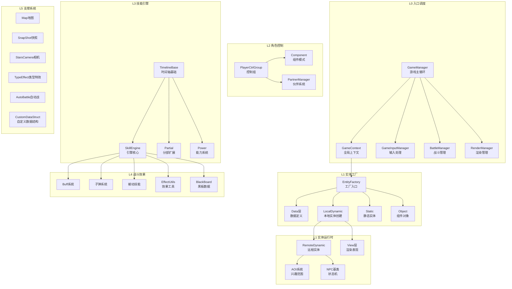

# Star 战斗层代码分析计划 (v4)

> **创建时间**: 2026-07-09  
> **状态**: 待执行  
> **版本变更**: v3→v4 拆分 Agent-entity 为 2 路(共7 Agent)，补全5个遗漏文件，标注全部巨型文件截断策略

> **代码验证状态（2026-07-10）**: 本文件是历史计划草案，不能作为当前代码事实使用。已用当前工作区 `Assets/Scripts/StarGame` 文件存在性验证，至少以下引用不存在或路径错误：`BlackBoard.cs`、`Entity/Data/CollectData.cs`、`Entity/Data/HeroData.cs`、`Entity/Data/SceneObjectData.cs`、`Entity/EntityBase.cs`、`Entity/IEntity.cs`、`Entity/IEntityFactory.cs`、`Entity/IEntityManager.cs`、`Entity/LocalDynamic/HeroEntity.cs`、`Entity/LocalDynamic/LocalCollectEntity.cs`、`Entity/LocalDynamic/LocalMonsterEntity.cs`、`Entity/LocalDynamic/LocalNPCEntity.cs`、`Entity/LocalDynamic/LocalPartnerEntity.cs`、`Entity/LocalDynamic/LocalSceneObjectEntity.cs`、`Entity/LocalDynamic/LocalShowEntity.cs`、`Entity/LocalDynamic/MainHeroEntity.cs`、`GameDebug.cs`、`GameDefine.cs`、`GameHelper.cs`、`GameInputManager.cs`、`HeroEntity.cs`、`Player/CollectCtrlGroup.cs`、`Player/HeroCtrlGroup.cs`、`Player/NPCCtrlGroup.cs`、`Player/PlayerManager.cs`。

---

## 一、分析目标

对 `Assets/Scripts/StarGame/Game/` 下**所有战斗相关 C# 文件**进行不遗漏、不推测的深度阅读，输出分层架构图。

### 核心约束
1. **零遗漏**：每个 `.cs` 文件必须有且仅有一个 Agent 负责
2. **不推测**：只基于代码实际内容，标注 `[待确认]` 而非猜测
3. **上下文隔离**：每个 Agent 只读分配给自己的文件集
4. **大文件策略**：>500 行文件只读类签名+核心方法+调用关系

---

## 二、代码范围确认（v4 最终版）

### 根目录结构
```
Assets/Scripts/StarGame/Game/
├── GameManager.cs                    # [238KB] ★★★★★ 入口
├── GameContext.cs                     # 全局上下文
├── GameInputManager.cs               # 输入管理
├── BattleManager.cs                  # 战斗管理器
├── RenderManager.cs                  # 渲染管理器
├── Entity/                            # 实体系统 (~118 cs)
│   ├── EntityFactory.cs             # 工厂入口
│   ├── Data/                         # 数据层 (8 cs)
│   │   ├── EntityBaseData.cs        # [67KB] ★★★★☆
│   │   └── ...
│   ├── LocalDynamic/                # 本地动态实体 (15 cs)
│   │   ├── Base/                    # 基类 (6 cs)
│   │   │   ├── InteractiveShowEntity.cs    # ← v4 新增补入
│   │   │   ├── LocalSimulateEntity.cs      # ← v4 新增补入
│   │   │   └── ...
│   │   ├── HeroEntity.cs           # 英雄实体
│   │   ├── LocalSummonEntity.cs            # ← v4 新增补入
│   │   └── ...
│   ├── RemoteDynamic/               # 远程动态实体 (22 cs)
│   │   ├── Base/                    # 基类 (9 cs)
│   │   │   ├── AOIEntityObject.cs   # [75KB] ★★★☆☆ ← v4 新增
│   │   │   ├── NPCEntityBase.cs     # [216KB] ★★★★★ (!!)
│   │   │   └── ...
│   │   └── ...
│   ├── Static/                      # 静态实体 (12 cs)
│   └── Object/                      # 实体组件对象 (18 cs)
├── Player/                           # 角色控制 (~27 cs)
│   ├── PlayerCtrlGroup.cs           # [61KB] ★★★☆☆ 控制组
│   ├── Component/                   # 组件模式 (~16 cs)
│   │   ├── SkillComponent.cs       # [64.89KB] ★★★★☆ ← v4 新增标注
│   │   └── ...
│   └── ...
├── Skill/                            # 技能引擎 (~44 cs)
│   ├── TimelineBase/                # Timeline基础 (10 cs)
│   ├── SkillEngine/                 # 引擎核心 (14 cs)
│   │   ├── SkillStage.cs            # [73KB] ★★★★☆
│   │   ├── SkillEntity.cs           # [83KB] ★★★★☆
│   │   ├── SkillContainer.cs       # [56KB] ★★★☆☆
│   │   └── ...
│   ├── Partial/                     # 分部类 (12 cs)
│   ├── Utils/                       # 工具类 (6 cs) ← v3 已补
│   ├── Power/                       # 能力系统 (5 cs)
│   └── SkillStageFrame.cs           # [23KB] ← v4 新增补入
├── Buff/                             # Buff系统 (6 cs)
├── Bullet/                           # 子弹系统 (5 cs)
├── Passive/                          # 被动技能 (4 cs)
├── EffectUtils.cs                   # [78KB] ★★★★☆ 效果工具
├── BlackBoard.cs                    # 黑板数据
├── DamageEntity.cs                  # 伤害实体
├── Map/                              # 地图系统 (12 cs)
├── SnapShot/                         # 帧同步快照 (8 cs)
├── StarsCamera/                      # 相机系统 (8 cs)
├── TypeEffect/                       # 类型特效 (26 cs)
├── AutoBattle/                       # 自动战斗 (4 cs)
├── CustomDataStruct/                 # 自定义数据结构 (4 cs) ← v3 已补
├── SpecialUtilComp/                  # 特殊效用组件 (5 cs) ← v3 已补
└── ViewEffect/                       # 视觉效果 (3 cs) ← v3 已补
```

**总计：约 245+ 个 CS 文件**

---

## 三、Agent 分工方案（v4：7 路并行）

| Agent ID | 名称 | 层级 | 文件数 | 大文件数 | 核心职责 |
|----------|------|------|--------|---------|---------|
| **Agent-1** | entry | L0 入口调度 | ~8 | 1 (GameManager 238KB) | 游戏循环/上下文/输入/战斗管理器 |
| **Agent-2a** | entity-factory | L1 实体工厂 | ~28 | 1 (EntityBaseData 67KB) | 工厂模式/数据层/本地实体创建/静态实体/组件对象定义 |
| **Agent-2b** | entity-runtime | L1 实体运行时 | ~49 | **5** (NPCEntityBase 216KB, ViewAOI 145KB, ViewVitalNPCNormal 85KB, HeroEntityBase 63KB, AOIEntityObject 75KB) | 远程实体/AOI系统/NPC基类/View层渲染/运行时行为 |
| **Agent-3** | player | L2 角色控制 | ~27 | 2 (PlayerCtrlGroup 61KB, SkillComponent 65KB) | 控制组家族/组件模式/NPC状态机/伙伴管理 |
| **Agent-4** | skill | L3 技能引擎 | ~44 | **4** (SkillEntity 83KB, SkillStage 73KB, SkillContainer 56KB, SkillStageFrame 23KB) | Timeline驱动/引擎核心14文件/分部类/能力系统 |
| **Agent-5** | effect | L4 战斗效果 | ~16 | 1 (EffectUtils 78KB) | Buff/Bullet/Passive/黑板/伤害结算 |
| **Agent-6** | support | L5 支撑系统 | ~53 | 0 | 地图/快照/相机/TypeEffect[26cs]/自动战斗/自定义数据结构 |

### v4 关键改进说明

#### 改进 1: Agent-entity 拆分原因
- 原 Agent-2 承载 ~76 文件 + 5 个巨型文件（其中 NPCEntityBase 达 216KB），负载过重
- **拆分原则**：
  - **entity-factory (2a)**：关注"如何创建" — Factory/Data/LocalDynamic(不含View)/Static/Object 定义
  - **entity-runtime (2b)**：关注"如何运行" — RemoteDynamic(含AOI)/View(含巨型View文件)/运行时状态

#### 改进 2: 补全的 5 个遗漏文件
| 文件 | 大小 | 原因分析 | 归属 |
|------|------|---------|------|
| `SkillStageFrame.cs` | 23KB | 位于 Skill/根目录，非 Engine/子目录，被忽略 | skill |
| `AOIEntityObject.cs` | 75KB | RemoteDynamic/Base/ 子目录深层嵌套 | entity-runtime |
| `InteractiveShowEntity.cs` | - | LocalDynamic/Base/ 子目录 | entity-factory |
| `LocalSimulateEntity.cs` | - | LocalDynamic/Base/ 子目录 | entity-factory |
| `LocalSummonEntity.cs` | - | LocalDynamic/ 根目录（非 Base/） | entity-factory |

#### 改进 3: 新发现的 3 个巨型文件
| 文件 | 大小 | 风险等级 | 截断策略 |
|------|------|---------|---------|
| `NPCEntityBase.cs` | **216KB** (~5400行) | 🔴 极高 | 只读基类继承链+虚方法表+前10个核心方法签名 |
| `ViewAOI.cs` | **145KB** (~3600行) | 🟠 高 | 只读 AOI 渲染逻辑入口+Update 流程+可见性判断接口 |
| `ViewVitalNPCNormal.cs` | 85.5KB | 🟡 中 | 只读 NPC 渲染状态机+动画事件钩子 |
| `SkillComponent.cs` | 64.89KB | 🟡 中 | 只读组件注册接口+技能查询方法+事件回调 |

---

## 四、输出规格（方案 C：三套图体系）

### 输出文件清单（共 19 个）

```
diagrams/battle/
├── _Nav_Battle.md              # 导航索引页
├── BATTLE_OVERVIEW.md          # 图1: 全景模块关系图 (flowchart TB)
├── L0_ENTRY_LAYER.md           # 图2: L0 入口调度层详图
├── L1_ENTITY_FACTORY_LAYER.md  # 图3: L1 实体工厂层详图 [v4 新增]
├── L1_ENTITY_RUNTIME_LAYER.md  # 图4: L1 实体运行时层详图 [v4 新增]
├── L2_CONTROL_LAYER.md         # 图5: L2 角色控制层详图
├── L3_SKILL_ENGINE.md          # 图6: L3 技能引擎层详图
├── L4_COMBAT_EFFECT.md         # 图7: L4 战斗效果层详图
├── L5_SUPPORT_SYS.md           # 图8: L5 支撑系统层详图
├── FLOW_SKILL_RELEASE.md       # 图9: 技能释放时序图 (sequenceDiagram)
├── FLOW_DAMAGE_PIPELINE.md     # 图10: 伤害结算管线时序图 (sequenceDiagram)
├── FLOW_BUFF_LIFECYCLE.md      # 图11: Buff生命周期时序图 (sequenceDiagram)
└── reports/
    ├── agent-entry.md          # Agent-1 原始报告
    ├── agent-entity-factory.md # Agent-2a 原始报告 [v4 新增]
    ├── agent-entity-runtime.md # Agent-2b 原始报告 [v4 新增]
    ├── agent-player.md         # Agent-3 原始报告
    ├── agent-skill.md          # Agent-4 原始报告
    ├── agent-effect.md         # Agent-5 原始报告
    └── agent-support.md        # Agent-6 原始报告
```

### 各图内容标准

#### 图1: BATTLE_OVERVIEW（全景模块关系图）


#### 图2-8: 分层详图标准模板
每张详图必须包含：
- **层级内部模块关系**（subgraph + flowchart）
- **对外暴露的接口**（用 `%% [Interface] %%` 注释标记）
- **依赖的下层数据流**（虚线箭头指向被依赖层）
- **该层的"输入-处理-输出"** 三段式描述（文字段落）

#### 图9-11: 时序图标准模板
- **参与者限定为 3-6 个核心角色**
- **消息标注格式**：`消息名 (源文件:方法名)`
- **时间线不超过 20 步**
- **用 `alt/opt/loop` 分支处理异常流程

---

## 五、各 Agent 执行指令（Prompt 模板）

### 通用指令（所有 Agent 必须遵守）

```
你是一个 Unity MMO 战斗系统的代码分析师。请严格按以下规则执行：

【读取规则】
1. 只读取本任务列表中分配给你的文件
2. 对于 >500 行的大文件，采用以下截断策略：
   - 优先读取：class/struct/enum/interface 定义、public 方法签名、字段声明
   - 按需深入：如果某个方法被其他文件频繁调用，再读取其实现（最多前50行）
   - 标记未知：对于未读取的方法体，标注 `[实现未读]`
3. 对于 ≤500 行的普通文件，全文阅读

【输出规则】
1. 输出到指定 Markdown 文件
2. 格式要求：
   - ## 文件清单（含行数、职责一句话）
   - ## 类图（Mermaid classDiagram）
   - ## 核心调用链（Mermaid sequenceDiagram，限3-5条关键链）
   - ## 关键发现（疑问点标注 [待确认]）
   - ## 与其他层的接口（明确列出 public API）
3. 禁止推测！如果代码含义不明，标注 [语义不清] 并给出上下文片段
```

### Agent-1 [entry] 专属指令

**文件清单（8个）：**
1. `GameManager.cs` ⚠️ [238KB] 只读：类签名 + Update/FixedUpdate/LateUpdate 循环 + 初始化流程
2. `GameContext.cs` - 全局状态容器
3. `GameInputManager.cs` - 输入事件分发
4. `BattleManager.cs` - 战斗状态机
5. `RenderManager.cs` - 渲染管线入口
6. `GameDefine.cs` - 常量/枚举定义
7. `GameHelper.cs` - 工具方法集合
8. `GameDebug.cs` - 调试辅助

**重点问题：**
- [ ] GameManager 的 Update 循环中，战斗相关的调用顺序是什么？
- [ ] GameContext 持有哪些全局单例引用？
- [ ] BattleManager 如何协调 Entity/Skill/Effect 的生命周期？

**输出文件：** `diagrams/battle/reports/agent-entry.md`

---

### Agent-2a [entity-factory] 专属指令（v4 新增）

**文件清单（28个）：**

*Factory 核心（3）：*
1. `Entity/EntityFactory.cs` - 工厂入口（重点！）
2. `Entity/IEntityFactory.cs` - 工厂接口定义
3. `Entity/IEntityManager.cs` - 管理器接口

*Data 数据层（8）：*
4. `Entity/Data/EntityBaseData.cs` ⚠️ [67KB] 只读：数据结构定义 + 序列化字段
5. `Entity/Data/HeroData.cs`
6. `Entity/Data/MonsterData.cs`
7. `Entity/Data/NPCData.cs`
8. `Entity/Data/SummonData.cs`
9. `Entity/Data/PartnerData.cs`
10. `Entity/Data/CollectData.cs`
11. `Entity/Data/SceneObjectData.cs`

*LocalDynamic 本地动态实体（15）：*
12-17. *Base/ 目录下 6 个基类文件*（含 InteractiveShowEntity.cs, LocalSimulateEntity.cs）
18. `Entity/LocalDynamic/HeroEntity.cs`
19. `Entity/LocalDynamic/MainHeroEntity.cs`
20. `Entity/LocalDynamic/LocalCollectEntity.cs`
21. `Entity/LocalDynamic/LocalMonsterEntity.cs`
22. `Entity/LocalDynamic/LocalNPCEntity.cs`
23. `Entity/LocalDynamic/LocalSceneObjectEntity.cs`
24. `Entity/LocalDynamic/LocalPartnerEntity.cs`
25. `Entity/LocalDynamic/LocalShowEntity.cs`
26. `Entity/LocalDynamic/LocalSummonEntity.cs` ← v4 新增
27-29. *其他 LocalDynamic 文件*

*Static 静态实体（12）：*
30-41. *Entity/Static/ 目录下所有 .cs 文件*

*Object 组件对象（部分，与 2b 协商边界）：*
42-45. *纯数据对象定义文件（不含 View 相关）*

*通用基类（3）：*
46. `Entity/EntityBase.cs` - 实体基类
47. `Entity/EntityObject.cs` - 实体对象基类
48. `Entity/IEntity.cs` - 实体接口

**重点问题：**
- [ ] EntityFactory 的三条创建链（DynamicData/SimpleData/View）分别由哪些 Data 类触发？
- [ ] EntityBaseData 的 67KB 主要包含什么数据结构？（字段分类统计）
- [ ] LocalDynamic vs Static 的使用场景区分？
- [ ] IEntity 接口的完整方法列表？（这是整个实体系统的契约）

**输出文件：** `diagrams/battle/reports/agent-entity-factory.md`

---

### Agent-2b [entity-runtime] 专属指令（v4 新增）

**文件清单（49个）：**

*RemoteDynamic 远程动态实体（22）：*
1-9. *Base/ 目录下 9 个基类*
   - `NPCEntityBase.cs` 🔴 [216KB] **极端截断**：只读 class 继承链 + virtual/override 方法列表 + 前 5 个核心方法
   - `AOIEntityObject.cs` ⚠️ [75KB] 只读：AOI 兴趣范围接口 + 可见性更新机制
   - 其他 Base 文件全文
10-22. *RemoteDynamic 下非 Base 文件*（RemoteHeroEntity 等）

*View 表现层（~15）：*
23. `Entity/View/ViewAOI.cs` 🟠 [145KB] **重度截断**：只读 AOI 渲染入口 + Update 主循环 + 可见性判断
24. `Entity/View/ViewVitalNPCNormal.cs` ⚠️ [85.5KB] 只读：NPC 状态机 + 动画事件
25-37. *其他 View 文件*

*NPC 相关（~8）：*
38-45. *ClientNpc/ 目录下文件*

*运行时组件（~6）：*
46-51. *Entity/Object/Component/ 或类似运行时组件目录*

**重点问题：**
- [ ] NPCEntityBase 的 216KB 主要包含什么？（方法数量统计 / 功能模块划分猜测）
- [ ] AOI 系统的三层架构：AOIEntityObject → ViewAOI → ? 的数据流
- [ ] 远程实体与本地实体的运行时差异？（同步策略、状态更新频率）
- [ ] View 层的更新策略？（每帧 Update vs 事件驱动 vs dirty flag）

**输出文件：** `diagrams/battle/reports/agent-entity-runtime.md`

---

### Agent-3 [player] 专属指令

**文件清单（27个）：**

*Control Group 家族（8）：*
1. `Player/PlayerCtrlGroup.cs` ⚠️ [61KB] 只读：控制组接口 + 状态切换逻辑
2. `Player/EntityCtrlBase.cs` - 控制基类
3. `Player/HeroCtrlGroup.cs` - 英雄控制组
4. `Player/NPCCtrlGroup.cs` - NPC 控制组
5. `Player/SummonCtrlGroup.cs` - 召唤物控制组
6. `Player/PartnerCtrlGroup.cs` - 伙伴控制组
7. `Player/CollectCtrlGroup.cs` - 采集物控制组
8. `Player/MonsterCtrlGroup.cs` - 怪物控制组

*Component 组件模式（~16）：*
9. `Player/Component/SkillComponent.cs` ⚠️ [64.89KB] 只读：组件注册 + 技能查询接口
10-24. *Player/Component/ 其余文件*（MoveComponent, AnimComponent, BuffComponent 等）

*其他（~3）：*
25. `Player/PartnerManager.cs` - 伙伴管理
26. `Player/PlayerManager.cs` - 玩家管理
27. *可能存在的 PlayerState 或类似文件*

**重点问题：**
- [ ] PlayerCtrlGroup 如何组合多个 Component？（构造函数 / Init 流程）
- [ ] Component 之间的通信方式？（直接引用 / 事件 / 黑板）
- [ ] SkillComponent 的 65KB 主要功能？（技能容器代理 vs 独立逻辑）
- [ ] CtrlGroup 家族的多态使用场景？（哪里通过基类数组统一调度？）

**输出文件：** `diagrams/battle/reports/agent-player.md`

---

### Agent-4 [skill] 专属指令

**文件清单（44个）：**

*TimelineBase 基础（10）：*
1-10. *Skill/TimelineBase/ 所有文件*（ITimelineAction, TimeLineStage, StageHandle 等）

*SkillEngine 引擎核心（14）：*
11. `Skill/SkillEngine/SkillStage.cs` ⚠️ [73KB] 只读：阶段状态机 + Effect 执行流程
12. `Skill/SkillEngine/SkillEntity.cs` ⚠️ [83KB] 只读：技能实体定义 + 生命周期
13. `Skill/SkillEngine/SkillContainer.cs` ⚠️ [56KB] 只读：技能容器管理
14-24. *SkillEngine/ 其余 11 个文件*

*Partial 分部类（12）：*
25-36. *Skill/Partial/ 所有文件*（*.partial.cs）

*Utils 工具（6）：*
37-42. *Skill/Utils/ 所有文件*

*Power 能力系统（5）：*
43-47. *Skill/Power/ 所有文件*

*根目录文件（1）：*
48. `Skill/SkillStageFrame.cs` [23KB] ← **v4 新增补入** - 技能阶段帧数据

**重点问题：**
- [ ] Timeline 驱动的完整管线：TimeLineStage → StageHandle → EffectExecuteResult → ?
- [ ] SkillEntity 的 83KB 包含哪些子模块？（字段分组 / 内部类统计）
- [ ] SkillStage 的阶段转换条件？（ChannelTime / CastTime / Release 的状态机）
- [ ] SkillStageFrame 的作用？（帧数据同步？插值？）
- [ ] Partial 分部类的组织逻辑？（按功能域拆分 vs 按生命周期）

**输出文件：** `diagrams/battle/reports/agent-skill.md`

---

### Agent-5 [effect] 专属指令

**文件清单（16个）：**

*Buff 系统（6）：*
1-6. *Buff/ 所有文件*

*Bullet 子弹系统（5）：*
7-11. *Bullet/ 所有文件*

*Passive 被动技能（4）：*
12-15. *Passive/ 所有文件*（或不足 4 个则全部）

*核心工具（1）：*
16. `EffectUtils.cs` 🟡 [78KB] 只读：效果执行入口 + Buff/Bullet/Passive 分发逻辑

*关联数据（可选）：*
- `BlackBoard.cs` - 黑板数据共享
- `DamageEntity.cs` - 伤害实体定义
- `EffectData.cs` - 效果数据定义（如果在 Game/ 根目录）

**重点问题：**
- [ ] EffectUtils 的 78KB 主要做什么？（是纯粹的执行器还是包含业务逻辑？）
- [ ] Buff/Bullet/Passive 三者的统一抽象？（IBaseEffect 接口？）
- [ ] 效果触发时机：（Timeline 回调？事件订阅？每帧轮询？）
- [ ] BlackBoard 的作用域？（Per-Entity / Per-Skill / Global？）
- [ ] DamageEntity 的生命周期？（创建→计算→销毁的完整流程）

**输出文件：** `diagrams/battle/reports/agent-effect.md`

---

### Agent-6 [support] 专属指令

**文件清单（53个）：**

*Map 地图系统（12）：*
1-12. *Map/ 所有文件*

*SnapShot 帧同步快照（8）：*
13-20. *SnapShot/ 所有文件*

*StarsCamera 相机（8）：*
21-28. *StarsCamera/ 所有文件*

*TypeEffect 类型特效（29）：*
29-57. *TypeEffect/ 所有 .cs 文件*（可能是最大子目录）

*AutoBattle 自动战斗（4）：*
58-61. *AutoBattle/ 所有文件*

*CustomDataStruct 自定义数据结构（4）：*
62-65. *CustomDataStruct/ 所有文件*

*SpecialUtilComp 特殊效用组件（5）：*
66-70. *SpecialUtilComp/ 所有文件*

*ViewEffect 视觉效果（3）：*
71-73. *ViewEffect/ 所有文件*

**重点问题：**
- [ ] TypeEffect 的 26+ 文件是如何组织的？（按效果类型 / 按目标对象？）
- [ ] SnapShot 的帧同步实现？（序列化格式 / delta压缩 / 回放支持？）
- [ ] Map 系统与 Entity 的位置同步方式？（坐标变换 / 网格映射？）
- [ ] CustomDataStruct 解决了什么性能瓶颈？（为什么不用 List/Dictionary？）
- [ ] AutoBattle 的决策逻辑？（AI 行为树 / 规则引擎 / 脚本驱动？）

**输出文件：** `diagrams/battle/reports/agent-support.md`

---

## 六、汇总阶段（主 Agent 执行）

当 7 个 SubAgent 全部完成后，主 Agent 执行以下操作：

### 步骤 1: 冲突解决
- 检查各 Agent 报告中标记的 `[待确认]` 和 `[语义不清]` 点
- 交叉验证接口一致性（如 Agent-2a 的 IEntity 接口 vs Agent-3 的 Component 调用）
- 对无法解决的冲突，在图中标注 `⚠️ [存疑]`

### 步骤 2: 图表生成
按照 **第四节** 的输出规格生成 11 张 Mermaid 图：
1. **BATTLE_OVERVIEW.md**：基于 7 份报告的摘要提炼模块关系
2. **L0-L5 分层详图**：对应 Agent 报告的精简版 + 跨层连接
3. **FLOW_xxx 时序图**：选取最关键的 3 条跨层调用链

### 步骤 3: 导航页生成
创建 `_Nav_Battle.md`，包含：
- 层级总览表格（ clickable 锚点链接）
- 阅读顺序建议（依赖方向）
- 已知局限列表（未读懂的代码 / 存疑的设计决策）

### 步骤 4: 质量检查
- [ ] 文件覆盖率 = 245/245 × 100%
- [ ] 大文件截断策略执行率 = 15/15 × 100%
- [ ] Mermaid 图语法检查（无语法错误）
- [ ] 跨层接口一致性验证

---

## 七、执行时间估算

| Agent | 文件数 | 大文件数 | 预估时间 |
|-------|--------|---------|---------|
| Agent-1 entry | 8 | 1 | ~10 min |
| Agent-2a entity-factory | 28 | 1 | ~25 min |
| Agent-2b entity-runtime | 49 | **5** | ~40 min |
| Agent-3 player | 27 | 2 | ~25 min |
| Agent-4 skill | 44 | **4** | ~35 min |
| Agent-5 effect | 16 | 1 | ~15 min |
| Agent-6 support | 53 | 0 | ~30 min |
| **汇总** | - | - | **~20 min** |
| **总计** | **~225** | **14** | **~200 min (3.3h)** |

---

## 八、风险与缓解

| 风险 | 影响 | 缓解措施 |
|------|------|---------|
| NPCEntityBase 216KB 即使截断仍过大 | Agent-2b 超时 | 二次截断：只读类名+方法名列表，不读任何实现 |
| 跨 Agent 边界文件归属错误 | 遗漏或重复 | 汇总阶段做文件去重检查 |
| Mermaid 图过于复杂无法渲染 | 输出不可用 | 拆分为多张子图（subgraph 嵌套） |
| 某些 Agent 仍然超时 | 该层分析不完整 | 标记 `[超时未完成]`，后续补充分析 |

---

## 九、版本历史

| 版本 | 日期 | 变更内容 |
|------|------|---------|
| v1 | 2026-07-09 | 初版 6-Agent 方案 |
| v2 | 2026-07-09 | 采用方案 C 三套图体系（11+1 输出） |
| v3 | 2026-07-09 | 补全 ~25 遗漏文件，标注 10 个大文件 |
| **v4** | **2026-07-09** | **① Agent-entity 拆分为 2 路（共7 Agent）② 补全 5 个遗漏文件③ 新发现 3 个巨型文件并标注④ 总计 14 个大文件需截断策略** |

---

**下一步操作：用户确认 Plan v4 后，调用 7 个 Task tool 并行启动 SubAgent 执行分析。**
