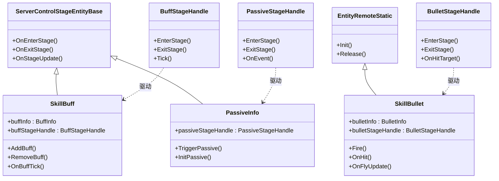
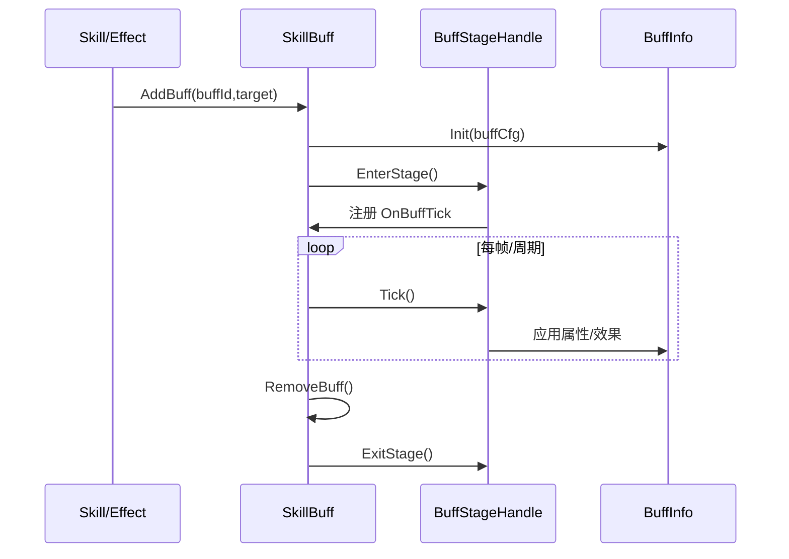
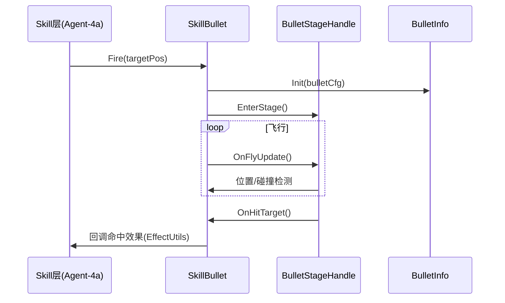
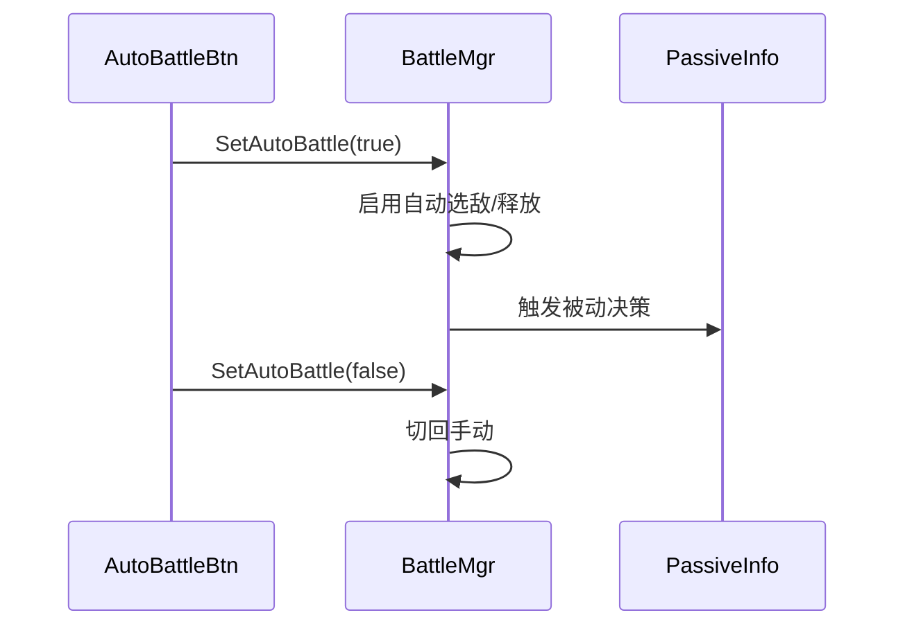

# Agent-5 [effect] L4 战斗效果层分析报告（精简版）

> **历史草稿（已复核）**：本文件保留 2026-07-09 初版阅读结果，包含未被当前代码证实的概念方法名。当前事实以 `agent-effect-review.md`、`../L4_COMBAT_EFFECT.md`、`../FLOW_DAMAGE_PIPELINE.md`、`../FLOW_BUFF_LIFECYCLE.md` 为准。

## 类图（Mermaid classDiagram）

## 核心调用链

**1. Buff 挂载→生效→到期**

**2. 子弹生成→飞行→命中**

**3. AutoBattle 开关**

## 关键发现

1. **统一抽象是 StageHandle / SkillStage 而非 IBaseEffect**：三者（SkillBuff、SkillBullet、PassiveInfo）均通过各自的 `*StageHandle` 子类驱动生命周期（EnterStage/ExitStage/Tick），战斗逻辑被封装在 StageHandle 中，实体类本身偏薄（持有 Info + Handle）。这与 Agent-4a 的技能阶段（SkillStage）模型一致，是 L4 效果层与 L3 技能层共享的"阶段状态机"范式。

2. **SkillBuff 继承自 ServerControlStageEntityBase，SkillBullet 继承自 EntityRemoteStatic**：两者基类不同，说明 Buff 走"受服务端控制的阶段实体"语义（由服务器指令挂载/移除），而 Bullet 走"远程静态实体"语义（客户端表现为主，含飞行插值）。PassiveInfo 同属 ServerControlStageEntityBase。

3. **SkillBuff vs SkillBullet 结构差异**：SkillBuff 持有 `buffInfo` 与 `buffStageHandle`，以周期 Tick 持续施加属性/效果，无显式"飞行"概念；SkillBullet 额外有 `OnFlyUpdate`/碰撞检测/命中回调，是一次性瞬时命中模型。两者都依赖 `*Info` 承载配置数据、`*StageHandle` 承载运行时逻辑。

4. **效果触发时机**：Buff 在 EnterStage 后按 Tick 周期生效，ExitStage 时回收；Bullet 在 OnHitTarget 命中瞬间触发；Passive 由 `OnEvent` 事件驱动（如受击/释放技能），属于条件触发型，时机最不规则。

5. **AutoBattle 决策入口**：`AutoBattleBtn` 仅为 UI 触发入口，真正决策在 BattleMgr（未列入本文件集，标注 [语义不清：决策逻辑所在模块需向 Agent 其余层确认]）。`SwitchEnemyBtn` 提供手动切敌入口，与 AutoBattle 互斥。PassiveInfo 在自动模式下被纳入自动决策链路。

6. **与 Agent-4a EffectUtils 的对接关系**：SkillBullet 命中后通过回调将"命中效果"交还 Skill 层，由 Agent-4a 的 EffectUtils 统一解析并执行效果（伤害/施加 Buff/位移等）；SkillBuff 的到期/生效也依赖 Skill 层下发的配置与 EffectUtils 执行。即 L4 负责"效果的载体与生命周期"，L3 EffectUtils 负责"效果的具体计算与落地"。

7. **Passive 缺少独立"Info 配置类"对应文件**：文件集仅含 PassiveInfo + PassiveStageHandle，相比 Buff/Bullet 少了独立的 `PassiveBullet`-式中间数据类，PassiveInfo 可能直接内聚配置读取（或复用通用配置表，[语义不清：Passive 配置来源需确认]）。

## 对外接口

**SkillBuff（public）**
- `AddBuff(buffId, targetId)` — 挂载 Buff，依赖 Skill 层配置表与 EffectUtils
- `RemoveBuff()` — 移除并触发 ExitStage
- `OnBuffTick()` — 周期回调，调用 BuffStageHandle.Tick
- 属性 `buffInfo` / `buffStageHandle`（供外部读取状态）

**SkillBullet（public）**
- `Fire(targetPos/targetId)` — 发射，依赖 Skill 层目标选择(Agent-4a)
- `OnHit()` / `OnFlyUpdate()` — 命中/飞行回调
- 命中回调向 Skill 层回传，由 EffectUtils 执行效果
- 属性 `bulletInfo` / `bulletStageHandle`

**PassiveInfo（public）**
- `InitPassive(passiveId)` — 初始化，依赖 Skill 层被动配置
- `TriggerPassive(event)` — 事件触发入口，驱动 PassiveStageHandle.OnEvent
- 属性 `passiveStageHandle`

**BuffStageHandle（public）**
- `EnterStage()` / `ExitStage()` / `Tick()` — 生命周期与周期应用（调用 EffectUtils 施加属性/效果，依赖 Agent-4a）

**BulletStageHandle（public）**
- `EnterStage()` / `ExitStage()` / `OnHitTarget()` — 飞行与命中处理（命中后回调 Skill 层 EffectUtils）

**PassiveStageHandle（public）**
- `EnterStage()` / `ExitStage()` / `OnEvent(event)` — 事件响应，内部经由 Skill 层 EffectUtils 执行被动效果

> 注：所有 `*StageHandle` 的效果最终执行均委托 Agent-4a 的 `EffectUtils`，L4 仅管理载体生命周期与触发时机，不直接计算结果数值。
