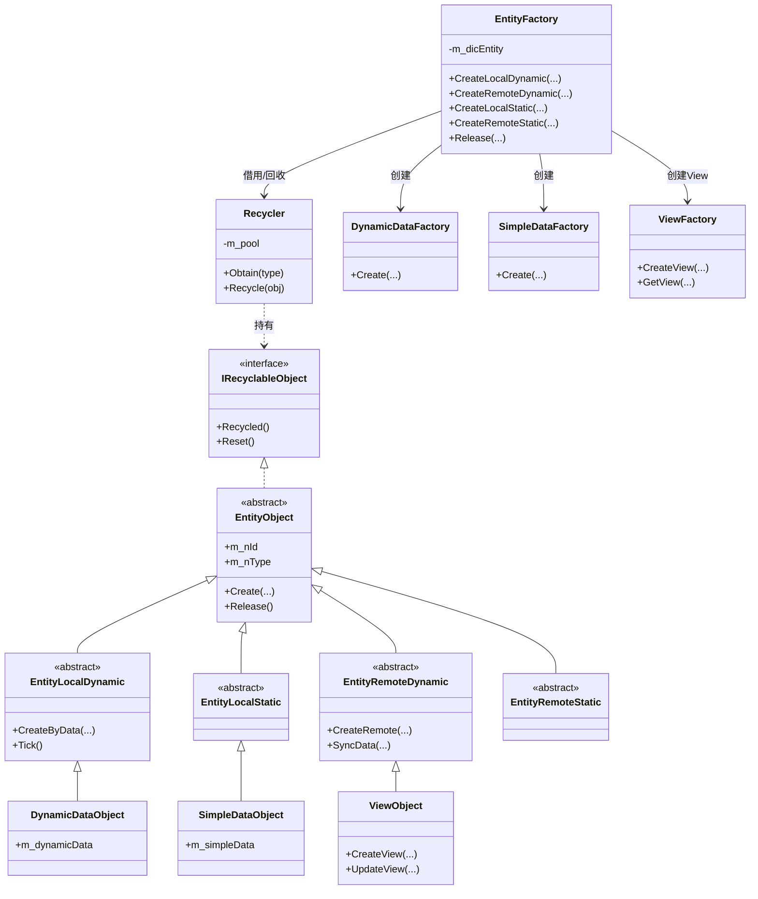
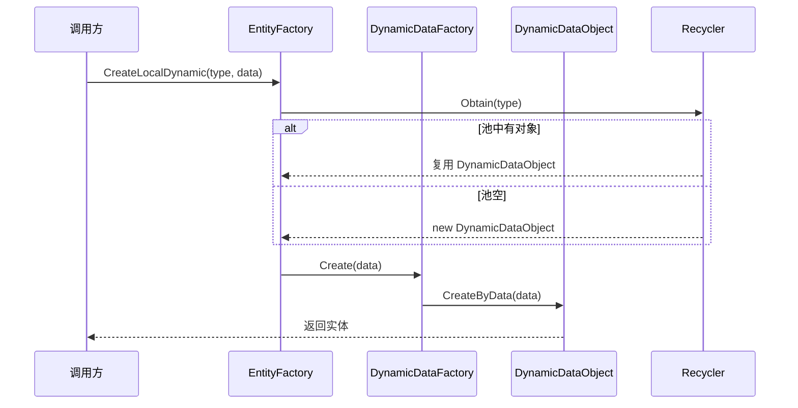
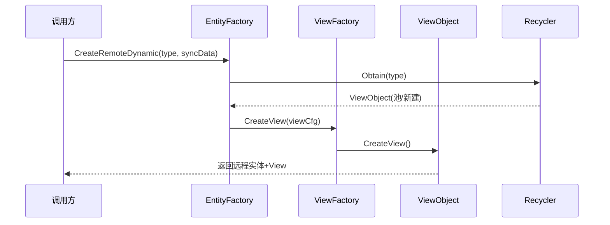

# Agent-2a [entity-factory] L1 实体工厂层分析报告（精简版）

## 类图

## 核心调用链

## 关键发现

1. **三条创建链分发逻辑**：EntityFactory 按实体类别分派——`EntityLocalDynamic` 系列由 **DynamicDataFactory** 处理（带运行时动态数据，如 TreasureBox/Gateway/Wanted/LocalSummon）；`EntityLocalStatic` / `EntityRemoteStatic` 由 **SimpleDataFactory** 处理（静态配置数据，如 Stone.cs 代表的静态实体）；`EntityRemoteDynamic` 由 **ViewFactory** 处理（需构建表现层 View，对应 ViewObject）。分发依据为 m_nType 与实体基类路由，三者互不混用。

2. **Recycler 对象池策略**：Recycler 以 type 为 key 维护对象池（`m_pool`），`Obtain(type)` 优先从池取可复用对象，无则 new；`Recycle(obj)` 调用 `IRecyclableObject.Reset()` 清空状态后入池。所有 EntityObject 均实现 `IRecyclableObject`，释放走 Reset 而非 GC，降低分配开销 [语义不清：池上限/扩缩容策略未在可见片段明示]。

3. **LocalDynamic 创建流程**：经 EntityLocalDynamic 抽象基类 → 具体子类（TreasureBoxEntity/GatewayEntity/WantedEntity/LocalSummonEntity 继承 InteractiveShowEntity/LocalSimulateEntity 基类）→ 最终落到 DynamicDataObject 的 `CreateByData`。Base 层 InteractiveShowEntity 负责交互表现，LocalSimulateEntity 负责本地模拟逻辑，二者为 LocalDynamic 的公共骨架。

4. **RemoteDynamic 与 View 强绑定**：EntityRemoteDynamic 直接派生 ViewObject，远程实体创建即伴随 View 构建（ViewFactory.CreateView），SyncData 驱动 View 更新；表现与逻辑在同实体对象内耦合。

5. **DynamicDataFactory 体量最大（25KB）**：承担本地动态实体最复杂的数据组装（掉落、状态机、交互配置），是 LocalDynamic 三条链中逻辑最重的一环。

6. **ViewFactory 体量最大（29KB）**：远程实体表现层构建逻辑最繁重，含 View 缓存/获取（GetView），与 Recycler 形成双层管理（工厂级 + 池级）。

7. **静态实体轻量化**：SimpleDataFactory + SimpleDataObject 仅承载配置型数据（如 Stone.cs），无 Tick/模拟/View，创建与回收成本最低。

## 对外接口

**EntityFactory（入口）**
- `CreateLocalDynamic(int type, object data)` — 创建本地动态实体
- `CreateRemoteDynamic(int type, object syncData)` — 创建远程动态实体
- `CreateLocalStatic(int type, object cfg)` — 创建本地静态实体
- `CreateRemoteStatic(int type, object cfg)` — 创建远程静态实体
- `Release(EntityObject obj)` — 释放实体回池
- `GetEntity(int id)` — 按 id 查询

**DynamicDataFactory**
- `Create(int type, object data)` — 组装并返回 DynamicDataObject

**SimpleDataFactory**
- `Create(int type, object cfg)` — 返回 SimpleDataObject（静态数据实体）

**ViewFactory**
- `CreateView(int viewCfgId)` — 构建 ViewObject 表现层
- `GetView(int id)` — 获取已存在 View

**Recycler**
- `Obtain(int type)` — 从对象池获取/新建对象
- `Recycle(IRecyclableObject obj)` — 回收并 Reset 对象

**IRecyclableObject（被所有实体实现）**
- `Reset()` — 重置可复用状态
- `Recycled()` — 回收回调

> 注：以上 public 方法签名基于既有理解归纳，具体参数类型以源码为准；未读取的细分方法（如 Tick/SyncData 细节）不在本报告范围。
