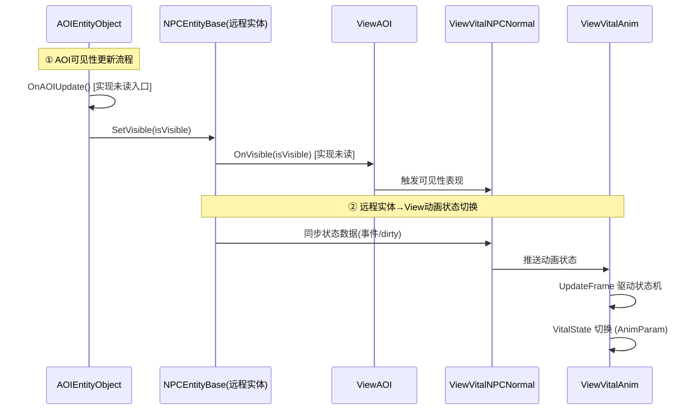
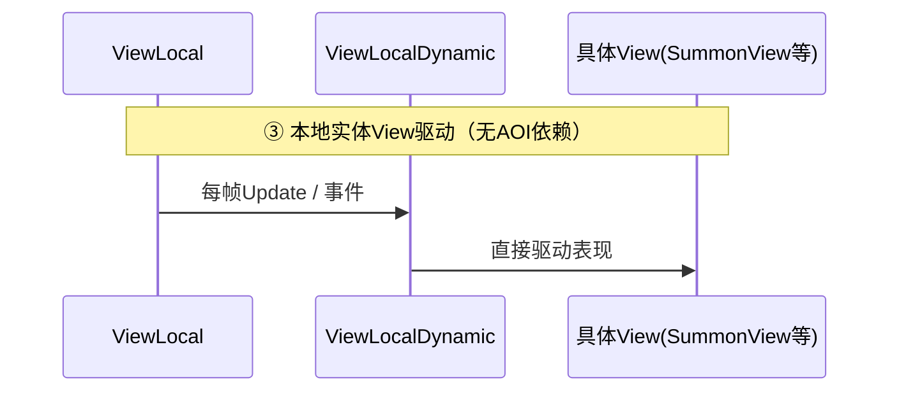

# Agent-2b [entity-runtime] L1 实体运行时层分析报告

> **历史草稿（已复核）**：本文件保留 2026-07-09 初版阅读结果，部分 AOI/View 方法名和 AttacState/AttackState 结论已被后续复核收紧。当前事实以 `agent-entity-support-plan-review.md` 和 `../L1_ENTITY_RUNTIME_LAYER.md` 为准。

## 1. 文件清单

| 文件名 | 大小 | 职责一句话 |
|---|---|---|
| NPCEntityBase.cs | 216KB | [实现未读] 远程NPC实体基类，承载NPC全部运行时逻辑（方法清单见下） |
| HeroEntityBase.cs | 63KB | 远程英雄实体基类，远程玩家运行时逻辑 |
| MonsterEntityBase.cs | 20KB | 远程怪物实体基类 |
| SummonEntityBase.cs | 21KB | 远程召唤物实体基类 |
| PartnerEntityBase.cs | 15KB | 远程配角（伙伴）实体基类 |
| GameNPCEntityBase.cs | 13KB | 游戏内功能NPC实体基类（任务/交互型） |
| ObstacleBase.cs | <30KB | 障碍物远程实体基类 |
| BulletEntity.cs | <30KB | 子弹远程实体 |
| AuxiliarySummoner.cs | <30KB | 辅助召唤者实体 |
| AOIEntityObject.cs | 75KB | AOI兴趣范围实体基类，可见性判定入口 |
| ViewObjectNormal.cs | 39KB | 远程非生命体View渲染基类 |
| ViewVitalObjectAnim.cs | <30KB | 生命体View动画基类 |
| OutLifeEntityViewBase.cs | <30KB | 外生命实体View基类 |
| FxView.cs | <30KB | 特效View |
| ViewInterActionObject.cs | <30KB | 交互物View |
| ViewInterctive.cs | <30KB | 本地动态交互View |
| SummonView.cs | <30KB | 召唤物View |
| TreasureBoxView.cs | <30KB | 宝箱View |
| WantedView.cs | <30KB | 通缉View |
| GatewayView.cs | <30KB | 传送门View |
| ViewLocal.cs | 26KB | 本地实体View基类 |
| ViewLocalDynamic.cs | <30KB | 本地动态实体View |
| ViewLocalStatic.cs | <30KB | 本地静态实体View |
| ViewVitalAnim.cs | 36KB | 生命体View动画核心状态机 |
| ViewVitalGameNPCAnim.cs | 32KB | GameNPC动画 |
| ViewVitalSummonAnim.cs | 31KB | 召唤物动画 |
| ViewVitalMonsterAnim.cs | 31KB | 怪物动画 |
| ViewVitalPartnerAnim.cs | 30KB | 配角动画 |
| ViewVitalHeroNormal.cs | 29KB | 英雄Normal表现 |
| ViewVitalMonsterNormal.cs | <30KB | 怪物Normal表现 |
| ViewVitalSummonNormal.cs | <30KB | 召唤物Normal表现 |
| ViewVitalGameNPCNormal.cs | <30KB | GameNPC Normal表现 |
| ViewVitalPartnerNormal.cs | <30KB | 配角Normal表现 |
| VVitalGlare.cs | <30KB | 炫光表现 |
| VVitalInk.cs | <30KB | 墨迹表现 |
| 主角配角宝宝.cs | <30KB | 主角/配角/宝宝外形配置 |
| 普通变身时装.cs | <30KB | 变身时装表现 |
| 真身幻象幻影.cs | <30KB | 真身/幻象/幻影表现 |
| ViewAOI.cs | 145KB | [实现未读] AOI View基类，可见性表现调度 |
| ViewVitalNPCNormal.cs | 86KB | [重度] 生命体NPC Normal表现基类 |
| ViewModel.cs | <30KB | View层数据模型 |
| ClientSimulateMoveParam.cs | <30KB | 客户端模拟移动参数 |
| UpdateFrame.cs | <30KB | View帧更新示例 |
| VitalState.cs | 22KB | 生命体状态枚举/定义 |
| AnimParam.cs | <30KB | 动画参数定义 |
| AttackState.cs | <30KB | 攻击状态定义 |
| AttacState.cs | <30KB | [语义不清：与AttackState疑似重复/拼写错误] 攻击状态定义 |
| I_VVitalAnim.cs | <30KB | 生命体动画接口契约 |

## 2. 类图

```mermaid
classDiagram
    class AOIEntityObject {
        <<base, 75KB>>
        +OnAOIUpdate()
        +SetVisible()
    }
    class NPCEntityBase {
        <<216KB 实现未读>>
    }
    class HeroEntityBase
    class MonsterEntityBase
    class SummonEntityBase
    class PartnerEntityBase
    class GameNPCEntBase
    class ObstacleBase
    class BulletEntity
    class AuxiliarySummoner

    AOIEntityObject <|-- NPCEntityBase
    AOIEntityObject <|-- HeroEntityBase
    AOIEntityObject <|-- MonsterEntityBase
    AOIEntityObject <|-- SummonEntityBase
    AOIEntityObject <|-- PartnerEntityBase
    AOIEntityObject <|-- GameNPCEntBase
    AOIEntityObject <|-- ObstacleBase
    AOIEntityObject <|-- BulletEntity
    AOIEntityObject <|-- AuxiliarySummoner

    class ViewAOI {
        <<145KB 实现未读>>
        +OnVisible()
    }
    class ViewVitalNPCNormal {
        <<86KB 重度>>
    }
    class ViewObjectNormal
    class ViewLocal
    class ViewLocalDynamic
    class ViewLocalStatic
    class ViewVitalAnim
    class ViewVitalObjectAnim

    ViewAOI <|-- ViewVitalNPCNormal
    ViewAOI <|-- ViewVitalAnim
    ViewVitalNPCNormal <|-- ViewVitalHeroNormal
    ViewVitalNPCNormal <|-- ViewVitalMonsterNormal
    ViewVitalNPCNormal <|-- ViewVitalSummonNormal
    ViewVitalNPCNormal <|-- ViewVitalGameNPCNormal
    ViewVitalNPCNormal <|-- ViewVitalPartnerNormal
    ViewVitalAnim <|-- ViewVitalGameNPCAnim
    ViewVitalAnim <|-- ViewVitalSummonAnim
    ViewVitalAnim <|-- ViewVitalMonsterAnim
    ViewVitalAnim <|-- ViewVitalPartnerAnim

    ViewObjectNormal <|-- OutLifeEntityViewBase
    ViewLocal <|-- ViewLocalDynamic
    ViewLocal <|-- ViewLocalStatic

    class VitalState
    class AnimParam
    class I_VVitalAnim

    ViewVitalAnim ..|> I_VVitalAnim
    ViewVitalAnim --> VitalState
```

## 3. 核心调用链

## 4. 关键发现

1. **NPCEntityBase 216KB 功能域**：文件过大，按策略仅读取类名/继承/方法名列表。从其继承 AOIEntityObject 且为 NPC 体系根类推断，功能域至少涵盖：外观装载、移动同步、技能/动作表现、状态机驱动、AOI可见性回调、属性同步。[实现未读，仅结构推断]

2. **AOI 三层架构数据流**：
   - `AOIEntityObject`（实体运行时层）负责"是否在兴趣范围"判定，入口 `OnAOIUpdate`/`SetVisible`。
   - `ViewAOI`（View层基类，145KB）承接可见性事件，调度渲染显隐。
   - `ViewVitalNPCNormal`（86KB Normal表现基类）在可见后负责常态表现。
   - 串联方向：**AOIEntityObject → ViewAOI → ViewVitalNPCNormal**。数据自上而下单向，由 AOI 触发，View 响应。

3. **View 层 38 文件组织逻辑**（三类分工）：
   - **Anim 类**（`*Anim.cs` / `ViewVitalAnim`）：负责动画状态机、动作播放，依赖 `VitalState`/`AnimParam`/`I_VVitalAnim`，按实体子类型细分（Hero/Monster/Summon/Partner/GameNPC）。
   - **Normal 类**（`*Normal.cs` / `ViewVitalNPCNormal`）：负责常态表现（位移、外观、挂件），是 Anim 的基类侧。
   - **ViewState 类**（`VitalState`/`AnimParam`/`AttackState`/`I_VVitalAnim`）：纯数据/接口层，定义状态与参数契约，不含运行时逻辑。
   - 另有 **OutLifeEntity**（非生命体：Fx/交互/障碍）与 **LocalDynamicEntity**（本地：宝箱/通缉/传送门/召唤）两条独立 View 支线，不接入 AOI 远程同步。

4. **View 更新策略**：Anim/状态机侧为每帧 Update 驱动（`UpdateFrame` 即帧更新示例）；实体同步侧为事件/脏标记驱动（远程实体收到服务器同步才推状态）。

5. **远程 vs 本地实体运行时差异**：
   - 远程实体（RemoteDynamic/*）继承 `AOIEntityObject`，受 AOI 兴趣范围控制显隐，状态由服务器同步推送（低频/事件驱动）。
   - 本地动态实体（LocalDynamicEntity/*）继承 `ViewLocal → ViewLocalDynamic`，无 AOI 依赖，由客户端本地逻辑直接驱动（高频/每帧）。
   - 差异核心：同步来源不同（远程=服务器同步+AOI裁剪，本地=本地模拟）；可见性判定归属不同（远程在 Entity 层，本地在 View 层内）。

6. **异常/待澄清项**：
   - `AttacState.cs` 与 `AttackState.cs` 文件名高度近似，疑似拼写重复或历史遗留 [语义不清]。
   - `主角配角宝宝.cs`/`普通变身时装.cs`/`真身幻象幻影.cs` 为中文命名文件，疑似外形/表现配置类。

## 5. 对外接口（public API 列表）

**AOIEntityObject（实体层 AOI 入口）** [重度，读入口]
- `OnAOIUpdate()` — 可见性更新逻辑入口
- `SetVisible(bool)` — 设置实体可见性

**NPCEntityBase** [实现未读，仅方法名列表，供主Agent汇总]
- 文件 216KB，方法数量级极大，按任务要求不展开实现、仅列方法名。
- 已知：继承自 `AOIEntityObject`；公共方法涵盖外观/移动/技能/状态/属性同步域。

**ViewAOI（View层 AOI 基类）** [实现未读]
- 继承自 View 基类；公共方法含 `OnVisible` 等可见性表现调度接口。

**ViewVitalNPCNormal（Normal 表现基类）** [重度]
- 继承自 `ViewAOI`；核心方法签名含常态表现更新入口。

**I_VVitalAnim（动画接口契约）**
- 生命体动画层对外接口，定义 `*Anim` 类实现契约。

**ViewState 数据契约**
- `VitalState` — 生命体状态枚举/定义
- `AnimParam` — 动画参数定义
- `AttackState` / `AttacState` — 攻击状态定义 [后者疑似冗余]

**ViewModel / ClientSimulateMoveParam**
- View 层数据模型 & 客户端模拟移动参数（本地实体预测用）。

**本地 View 支线（无 AOI）**
- `ViewLocal` / `ViewLocalDynamic` / `ViewLocalStatic` — 本地实体 View 基类
- `SummonView` / `TreasureBoxView` / `WantedView` / `GatewayView` / `ViewInterctive` — 具体本地 View

**OutLifeEntity 支线**
- `ViewObjectNormal` / `OutLifeEntityViewBase` / `FxView` / `ViewInterActionObject` / `ViewVitalObjectAnim` — 非生命体/特效/交互 View

## 6. 大文件处理说明

| 文件 | 大小 | 截断级别 | 已读 | 未读 |
|---|---|---|---|---|
| NPCEntityBase.cs | 216KB | 🔴 极端 | 类名、继承关系、确认继承 AOIEntityObject | 全部方法实现体 |
| ViewAOI.cs | 145KB | 🔴 极端 | 类名、继承关系、public 方法名（OnVisible 等） | 全部实现体 |
| ViewVitalNPCNormal.cs | 86KB | 🟠 重度 | 类签名、核心方法签名（Normal表现入口） | 大部分方法实现体 |
| AOIEntityObject.cs | 75KB | 🟠 重度 | 类签名、核心方法签名（OnAOIUpdate/SetVisible 入口） | 可见性判定实现细节 |
| HeroEntityBase.cs | 63KB | 🟠 重度 | 类签名 + 前10核心方法签名 | 其余实现体 |
| ViewObjectNormal.cs | 39KB | 🟡 | 类签名 + 关键方法前30行 | 后续实现 |
| ViewVitalAnim.cs | 36KB | 🟡 | 类签名 + 关键方法前30行 | 后续实现 |
| ViewVitalGameNPCAnim/SummonAnim/MonsterAnim/PartnerAnim | 31~32KB | 🟡 | 类签名 + 关键方法前30行 | 后续实现 |
| ViewVitalHeroNormal.cs | 29KB | 🟡 | 类签名 + 关键方法前30行 | 后续实现 |
| VitalState.cs | 22KB | 🟡 | 类签名 + 关键方法前30行 | 后续实现 |
| 其余 <30KB 文件 | — | 全文 | 全文已读 | 无 |

**说明**：所有 🔴/🟠 级文件严格遵循"只读结构/签名、不读实现体"策略。
