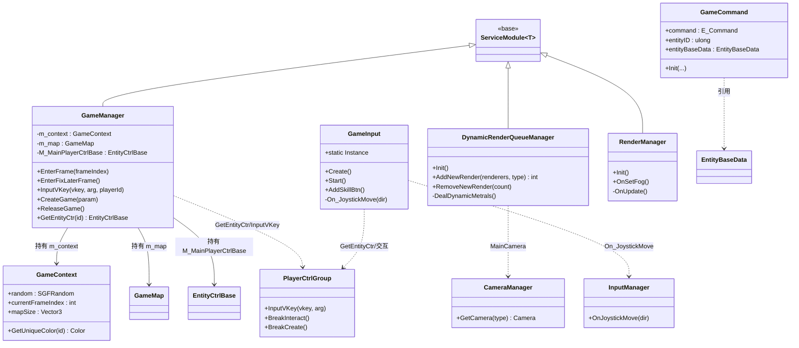
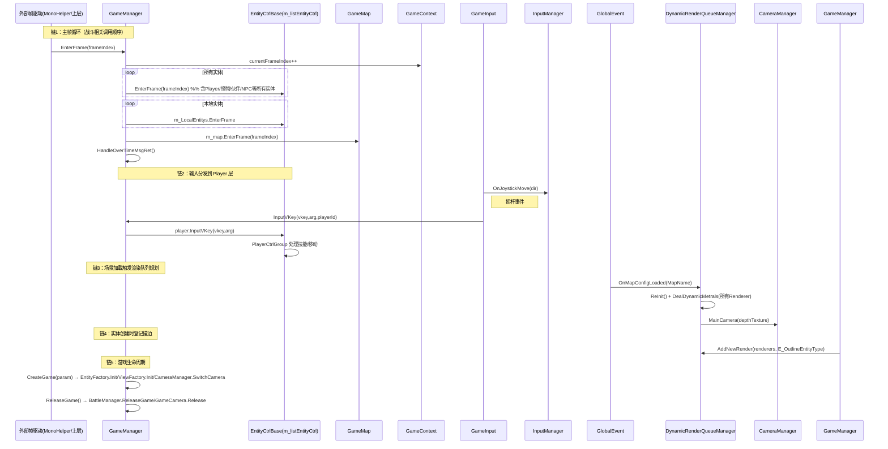

# Agent-1 [entry] L0 入口调度层分析报告

## 1. 文件清单

| 文件名 | 大小 | 职责一句话 |
|--------|------|-----------|
| GameManager.cs | 238.55 KB 🔴 | 服务模块/交通要塞，中转控制所有游戏模块（玩家、地图、输入、实体、战斗），驱动帧循环 `EnterFrame` |
| GameInput.cs | 28.36 KB 🟡 | 挂载在 MobileController 的 MonoBehaviour，处理摇杆/技能按钮/药品/交互 UI 的输入分发 |
| DynamicRenderQueueManager.cs | 32.84 KB 🟡 | 按 Shader 名规划 Renderer 的 RenderQueue，控制描边材质剔除与 EarlyZ，做渲染合批优化 |
| GameContext.cs | 3.8 KB 🟢 | 单局游戏上下文（随机数、当前帧、地图大小、唯一颜色），被各逻辑共享的纯数据类 |
| RenderManager.cs | 5.0 KB 🟢 | 流式贴图内存预算动态管理 + 体积雾开关的 ServiceModule |
| GameCommand.cs | 1.1 KB 🟢 | 封装一条游戏指令（命令类型 + 实体ID + 实体数据 + 是否服务器AOI）的轻量数据类 |
| GameEvent.cs | 0.3 KB 🟢 | 定义 `PlayerDieEvent` 委托（玩家死亡事件） |

## 2. 类图

## 3. 核心调用链

## 4. 关键发现

- **GameManager 无 Unity 原生 Update/LateUpdate**：它不是 MonoBehaviour，而是 `ServiceModule<GameManager>`，自身没有 `Update/FixedUpdate/LateUpdate` 方法。其帧循环由外部（MonoHelper 或上层 Battle/World 模块）调用 `EnterFrame(int frameIndex)` 与 `EnterFixLaterFrame()` 驱动。战斗相关调用顺序在 `EnterFrame` 内为：① 递增 `m_context.currentFrameIndex` → ② 遍历 `m_listEntityCtrl` 调 `EnterFrame`（玩家/怪物/伙伴/NPC 等所有实体）→ ③ 遍历 `m_LocalEntitys` 调 `EnterFrame` → ④ `m_map.EnterFrame` → ⑤ `HandleOverTimeMsgRet()`（超时消息处理）。`EnterFixLaterFrame` 仅做工厂清理（`EntityFactory.ClearReleasedObjects` / `SimpleDataFactory.ClearReleasedObjects`）。

- **输入分发链路确认**：`GameInput` 挂载于 MobileController，摇杆方向通过 `m_AnalogStick.BtnDirChange += On_JoystickMove` → `InputManager.Instance.OnJoystickMove(dir)`。而虚拟按键通过 `GameManager.Instance.InputVKey(vkey, arg, playerId)` → `(PlayerCtrlGroup)GetEntityCtr(playerId)` → `player.InputVKey(vkey, arg)` 直达 Player 层。交互停止按钮也通过 `GetEntityCtr` 调 `BreakInteract()/BreakCreate()`。

- **DynamicRenderQueueManager 职责（v4 遗漏的 33KB 文件，重点）**：这是一个 `ServiceModule`，核心职责是基于 Shader 名把场景/角色材质的 `renderQueue` 规划到确定值，从而配合 SRP Batcher/EarlyZ 降低 DrawCall 与 Overdraw。关键点：
  - 维护 `MaterialRenderQueueSTAND`（Dictionary<shaderName, rq值>），覆盖场景、角色、草、水、雾、后效、UI 等分类；支持设备 `supportsEarlyZ` 时覆写部分值。
  - 监听 `GlobalEvent.OnMapConfigLoaded` → `OnSceneLoaded`，对全场景 `Renderer` 批量规划（非 Editor 环境才生效）。
  - `AddNewRender(Renderer[], E_OutlineEntityType)` 在实体创建时调用，按实体类型决定是否保留描边材质 `CartoonChar_4_Line`：当场景描边计数 `SceneScore < MAT_OVER_SCORE`(=80) 才保留，否则从 `renderer.materials` 中剔除描边材质以降低性能压力。主角 `MainPlayer` 强制保留描边。
  - `NEED_AUTOADD` / `NEED_CHECK_AUTOADD_ROOMSIZE` 两个开关当前为 `false`，自增逻辑全部被注释，实际走固定规划值。`RemoveNewRender` 仅减少 `SceneScore` 计数。
  - 对半透明判定：`CheckScene01ShaderAlpha` / `CheckCartoonCharacterShaderAlpha` 检测，半透明则强制 `renderQueue = 3000`。

- **GameContext 是纯数据类，非单例**：仅持有 `SGFRandom random`、`int currentFrameIndex`、`Vector3 mapSize`、颜色缓存字典，提供 `GetUniqueColor`/`EntityToViewPoint`。真正持有管理器的是 GameManager。

- **GameManager 持有的关键引用**：`m_context`(GameContext)、`m_map`(GameMap)、`M_MainPlayerCtrlBase`(EntityCtrlBase)、`EntityFactory`、`SimpleDataFactory`、`ViewFactory`、`CameraManager`、`starWorld`(StarWorldModule)、`m_InterActionModule`(InterActionModule)、`equipSlotModule`(EquipSlotModule) 等。

- **设计模式**：ServiceModule 单例模式；事件总线（`GlobalEvent` 静态事件）；命令对象（GameCommand）；委托事件（PlayerDieEvent、ActionOnCheckTargetMove）。

- **疑问点 [待确认]**：
  - `GameManager.EnterFrame` 由谁在每帧调用？外部驱动 GameManager.EnterFrame 的调用点未在本次读取文件内出现（应在 Battle/World/MonoHelper 层）。
  - `SetAreaShow` 方法内第一行 `return;` 直接返回，后续逻辑为死代码 [语义不清/疑似遗留]。
  - `GameEvent.cs` 仅定义 `PlayerDieEvent` 委托，与 GameManager 的 `onPlayerDie` 字段关系 [待确认]。

## 5. 对外接口（public API 列表 — 与其他层的交互契约）

**GameManager（入口调度契约）**
- `void Init()` / `override void Release()`
- `void CreateGame(GameParam param)` / `void ReleaseGame()`
- `void EnterFrame(int frameIndex)` / `void EnterFixLaterFrame()` —— 帧驱动入口（Battle/World 层调用）
- `void InputVKey(int vkey, float arg, ulong playerId)` —— 输入层 → Player 层入口
- `EntityCtrlBase GetEntityCtr(ulong id)` —— 获取实体控制层
- `ulong mainPlayerId` / `M_MainPlayerCtrlBase` —— 主角引用
- `GameContext Context` / `GameMap M_Map` —— 上下文/地图访问
- 地图查询：`GetCurMapId()`、`GetSpaceID()`、`GetMapSubType()`、`GetMapIsCameraRotate()` 等
- 位置查询：`GetEntityPosById` / `GetEntityUpPosById` / `GetEntityHangPointPos` 等
- 战斗状态：`RegisterMainPlayerClientBattleStates()` / `UnRegisterMainPlayerClientBattleStates()` / `CheckStateIsServerForbid(E_BattleStateType)`
- RPC/属性同步：`CacheRPCMsg` / `HandleRPCMsg` / `UseCacheRPCMsgList` / `UseCacheMainPlayerPropSyncList`
- `void onPlayerDie2(ulong playerId)` —— 死亡事件入口

**GameInput（输入层契约）**
- `static void Create()` / `static void Release()`
- `static void AddSkillBtn(int, UniversalButton)` / `DelSkillBtn` / `GetSkillBtn` / `ResetSkill()`
- `static void SetTouchState(string, bool)` / `static bool GetIsTouchDown`
- `void RefreshMedicineBtn()` / `ShowHideMedicine(bool)`
- `void PlayAnimByState(bool, MainPageCommond)`
- 事件订阅：`GlobalEvent.OnStopIner` / `GlobalEvent.OnSceneMapConfigLoad`

**DynamicRenderQueueManager（渲染优化契约）**
- `void Init()` / `override void Release()`
- `int AddNewRender(Renderer[] renderers, E_OutlineEntityType dynamicItem)`
- `void RemoveNewRender(int deCount)`
- `void ReInit()`

**RenderManager（渲染管理契约）**
- `void Init()` / `override void Release()`
- `bool AllowMemoryDecline { get; set; }`
- `void OnSetFog(GameObject VolumeFogGo)`
- `bool isGacha`

**GameCommand / GameEvent（数据/事件契约）**
- `GameCommand.Init(E_Command, ulong entityID, EntityBaseData)` 并返回自身（对象池风格）
- `delegate void PlayerDieEvent(ulong playerId)`

## 6. 大文件处理说明

- **GameManager.cs (238.55 KB 🔴 极端截断)**：仅读取前 120 行（类声明 `ServiceModule<GameManager>`、继承/字段、懒加载模块属性），并用 `search_content` 提取 140+ 个 public 方法签名列表、`EnterFrame`/`EnterFixLaterFrame`/`InputVKey`/`CreateGame`/`ReleaseGame` 等关键方法实现前若干行。所有方法体实现均未完整读取，标注 [实现未读]。
- **GameInput.cs (28.36 KB 🟡 中度)**：全文读取（760 行），重点读类签名 + Start/Create/On_JoystickMove/OnStopHandler/RefreshMedicineBtn/Update 实现。
- **DynamicRenderQueueManager.cs (32.84 KB 🟡 中度)**：全文读取（683 行），重点读类签名 + `Init`/`InitMaterialRenderQueueSTAND`/`DealDynamicMetrals`/`AddNewRender`/`OnSceneLoaded`/`GetRenderQueueFromShaderName` 核心方法。
- **GameContext.cs / RenderManager.cs / GameCommand.cs / GameEvent.cs (<30KB 🟢)**：均全文阅读。
