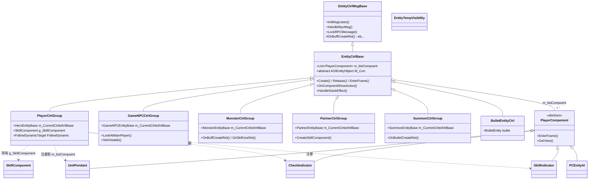
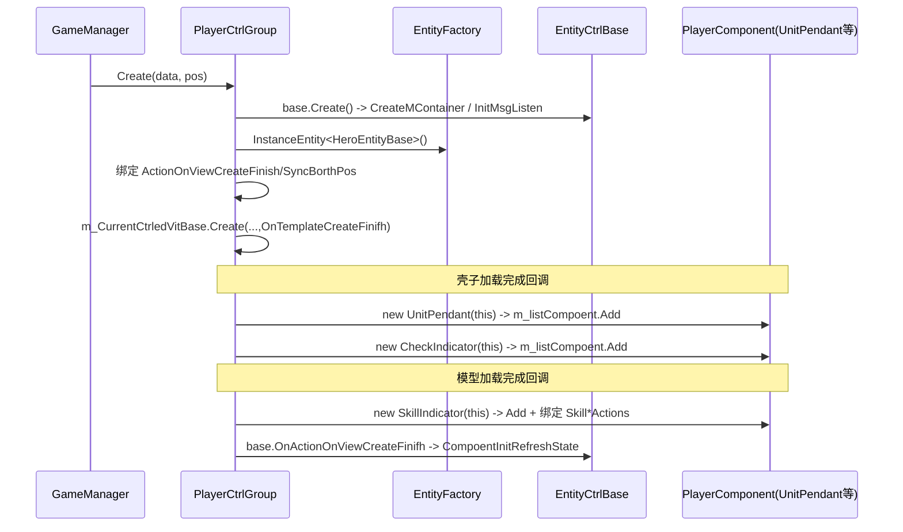
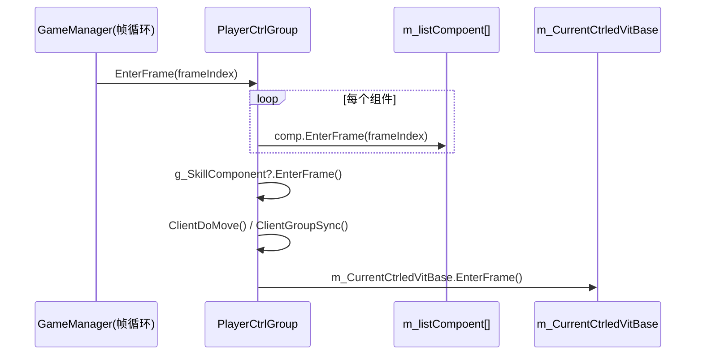
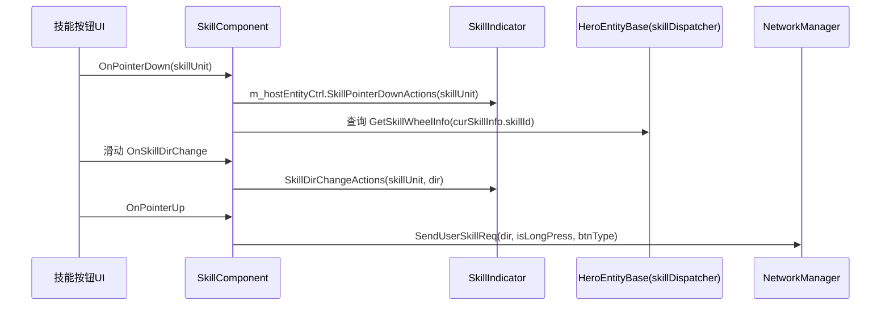
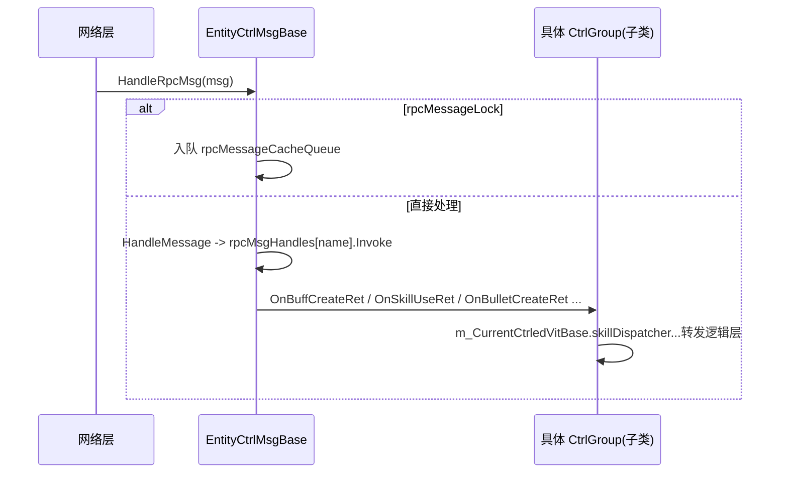

# Agent-3 [player] L2 角色控制层分析报告

## 1. 文件清单

| 文件名 | 大小 | 职责一句话 |
|---|---|---|
| PlayerCtrlGroup.cs | 61.92 KB | 任意玩家（含主角三位一体）控制组，组合 SkillComponent/UnitPendant/CheckIndicator/SkillIndicator 等组件，是组管理核心 |
| EntityCtrlBase.cs | 29.84 KB | 实体控制层抽象基类，提供组件列表 `m_listCompoent`、Create/Release/EnterFrame 模板、BUFF/变身/隐身等统一效果接口 |
| GameNPCCtrlGroup.cs | 20.44 KB | NPC 控制组（场景交互/触发器/朝向主角/LookAt），EntityCtrlBase 子类 |
| MonsterCtrlGroup.cs | 18.99 KB | 怪物控制组，处理 Buff/技能/被动/死亡复活（含 Boss 特殊删除逻辑） |
| PartnerCtrlGroup.cs | 17.74 KB | 伙伴控制组，通过 SummonHostID 挂到主角根节点，需向 PlayerCtrlGroup 注册技能槽 |
| SummonCtrlGroup.cs | 15.95 KB | 召唤物/子弹控制组，区分 Summon 与 BulletEntity，子弹不创建头顶/选中组件 |
| EntityCtrlMsgBase.cs | ~8 KB | RPC 消息分发基类：维护 `rpcMsgHandles` 字典 + 异步消息锁/缓存队列，统一调度各类 PB 消息 |
| BulletCtrl.cs | ~5 KB | 子弹实体控制层（BulletEntityCtrl，直接继承 EntityCtrlBase 非 CtrlGroup），处理子弹运行时创建/销毁 |
| SkillComponent.cs | 64.89 KB | 技能按钮 UI 逻辑组件，绑定 EntityCtrlBase，处理技能查询、指针/指示器委托、发技能请求 |
| UnitPendant.cs | 15.34 KB | 头顶信息面板组件（血条/名字/等级/状态），监听 AOI 属性变化 |
| SkillIndicator.cs | ~7 KB | 技能范围指示器组件，响应指针按下/滑动/抬起回调 |
| CheckIndicator.cs | ~6 KB | 选中指示器组件（NPC 空模型过滤），懒加载 CheckIndicatorView |
| PCEnityAI.cs | ~6 KB | 玩家 AI 组件（目前为占位/随机移动，逻辑大量注释，基本停用） |
| EntityTempVisibility.cs | ~2 KB | NPC 临时显隐数据持有者，监听 GlobalEvent.OnEntityTempVisibityChange |
| PlayerComponent.cs | ~1 KB | 组件抽象基类：GetView/Release/EnterFrame/SetFlashHide/InitRefreshState 纯虚接口 |

## 2. 类图

## 3. 核心调用链

**链1：控制组初始化并注册组件（以 PlayerCtrlGroup 为例）**

**链2：组件每帧驱动**

**链3：输入 → 组件响应（技能释放）**

**链4：RPC 消息多态分发（基类数组统一调度）**

## 4. 关键发现

- **PlayerCtrlGroup 组件组合机制**：采用「构造函数/Init 非统一」模式——`EntityCtrlBase` 提供抽象基类框架（`Create→OnTemplateCreateFinifh→OnActionOnViewCreateFinifh` 三段式异步加载），各子类在 `OnTemplateCreateFinifh`（壳子加载完）里 `new UnitPendant/CheckIndicator` 并 Add 到 `m_listCompoent`，在 `OnActionOnViewCreateFinifh`（模型加载完）里创建 `SkillIndicator` 并赋值 `SkillPointerDownActions` 等委托。组件不是统一在基类注册，而是分散在子类回调中按需 `new`。文件头注释与大量被注释的旧 `Create()` 表明该注册流程经历过重构，注释代码与现代码并存，存在历史遗留歧义。

- **EntityCtrlBase 的多态调度**：`GameManager` 通过 `GetEntityCtr(ulong)` 返回 `ObjectCtrlGroup`（基类引用），统一持有 `EntityCtrlBase` 数组。每帧 `EnterFrame` 遍历调用；RPC 消息通过 `EntityCtrlMsgBase.HandleRpcMsg` 经 `rpcMsgHandles` 字典分发到具体子类（`OnBuffCreateRet`/`OnSkillUseRet`/`OnBulletCreateRet` 等在基类中为 `virtual` 空实现，子类重写）。基类还提供 `M_Curr`（抽象 `AOIEntityObject`）作为「逻辑层实体」统一访问点，使 Hero/NPC/Monster/Partner/Summon 可被一致驱动。

- **SkillComponent 是独立逻辑还是代理**：**既是组件又是代理，但偏向独立 UI 逻辑层**。`SkillComponent` 自身持有 `m_entityCtrl`/`m_hostEntityCtrl` 并直接读 `m_NPCEntityBase.skillDispatcher.SkillController` 查询技能（`GetSkillWheelInfo`、`ActionOnEnergyStart` 等），同时封装 `SendUserSkillReq` 直接发网络协议。它不继承自 `PlayerComponent`（独立类，由 `PlayerCtrlGroup.g_SkillComponent` 显式持有并在 `EnterFrame` 单独驱动），而 `UnitPendant/CheckIndicator/SkillIndicator` 才继承 `PlayerComponent` 走 `m_listCompoent` 列表。结论：SkillComponent 与 EntityCtrlBase 耦合过紧（代码注释中明确 TODO：按钮应解绑 EntityCtrlBase，仅依赖 skillList），是一个相对独立的「技能按钮+指示器协调器」，而非纯 SkillContainer 代理。

- **各 CtrlGroup 差异点**：
  - **PlayerCtrlGroup**：持有 `g_SkillComponent`（主角技能 UI），含 `FollowDynamicTarget`、三位一体注释设计、`UpdatePlayerSkill` 委托；唯一重写 `ClientDoMove`（摇杆 30fps 限制）。
  - **GameNPCCtrlGroup**：独有触发器（`CreateTrigger`/`OnTriggerHandler`）、`LookAtMainPlayer`、`SetVisiable`（服务器/条件显隐）、`Index` 来自 `SpaceIndex`、AOI 延迟创建；死亡直接 `DelayInvoke` 销毁。
  - **MonsterCtrlGroup**：处理 `OnBuffCreateRet/OnRuntimeSyncRet/OnSkillUseRet` 全套技能链路；死亡区分 `IsBoss`+`SpaceSercet` 特殊掉落与即时删除；复活 `OnReliveDisplay`。
  - **PartnerCtrlGroup**：`CreateMContainer` 按 `SummonHostID==mainPlayerId` 挂到 `DotRemoveRoot`；`CreateSkillComponent` 通过 `GlobalEvent.OnPartnerCreate` 通知主角聚合技能槽（1 对 N）；监听 `OnLeaveSpace` 切图重置 `skillDispatcher`。
  - **SummonCtrlGroup**：区分 `E_EntityType.Summon`（建组件）与 `BulletEntity`（不建头顶/选中组件）；额外处理 `OnBulletCreateRet/OnBulletEndRet` 子弹运行时黑板同步。
  - **BulletCtrl.cs（BulletEntityCtrl）**：不走 CtrlGroup 子类，直接继承 EntityCtrlBase，仅处理子弹 `CreateRuntime`/销毁。

## 5. 对外接口（public API 列表）

**EntityCtrlBase（被各子类继承的通用 API）**
- `Create(EntityBaseData, Vector3)` / `Release()` / `EnterFrame(int)` / `abstract M_Curr`
- `ForceSyncRot(int)` / `ForceSyncPos(Vector3)` / `BreakFindPath()`
- `GetInterCanBreak()` / `GetChatShow()` / `GetCurLeftJoyStickAngle()`
- `CheckCanSkillBtn(SkillContainer)`（virtual）
- 技能委托字段：`SkillPointerDownActions` / `SkillDirChangeActions` / `SkillPointerUpActions` / `SkillEndDragActions` / `SkillnCancelActions`
- BUFF/变身/隐身效果：`HandleStackEffect` / `Freez` / `EdgeLight` / `PauseAniamtion` / `SetModelVisiable` / `CreateShadowView` / `StartChangeAvatarEffect` / `StartSpectralChangeEffect` / `StartChangSkillEffect` / `StartTranslucentEffect` / `ControlPlayLineRender` 等
- `OnCreateSimulateSummon` / `OnSimulateSummonTurn`

**PlayerCtrlGroup**
- `currentCtrlNttId` / `M_Curr` / `IsPlayingSkill` / `g_SkillComponent`
- `AddPlayerView()` / `AddPlayerViewNew(Vector3)` / `ClearPlayerView()`
- `UpdatePlayerSkill()`（私有触发；经 `ActionOnRefreshAllSkill` 委托）

**GameNPCCtrlGroup**
- `LookAtMainPlayer()` / `SetVisiable(bool)` / `Index` / `Range`

**MonsterCtrlGroup**
- `OnBuffCreateRet` / `OnRuntimeSyncRet` / `OnBuffEndRet` / `OnSkillUseRet` / `OnSkillEndRet` / `OnRunStageRet` / `OnRunStageForceEndRet` / `OnPassiveSkillUseRet` / `OnPassiveSkillEndRet`（均为 RPC 重写）

**PartnerCtrlGroup**
- `GetCfgId()` / `OnCDUpdateNotice(...)` 等 RPC 重写

**SummonCtrlGroup**
- `OnBulletCreateRet` / `OnBulletEndRet` / `OnActionUpdateCusBlackBoard` 等

**SkillComponent**
- `Init(EntityCtrlBase, EntityCtrlBase host=null)` / `RomoveSkill(EntityCtrlBase)` / `EnterFrame(int)` / `OnDeadDisPlay()` / `SetCurSkillInfo(SkillInfo)` / `Reset()` / `Release()` / `OnActionOnRefreshAllSkill()` / `SendUserSkillReq(Vector3, bool, E_BtnInputType, float)` / `RefreshSkill()`

**PlayerComponent（抽象）**
- `GetView()` / `Release()` / `EnterFrame(int)` / `SetFlashHide(bool)` / `InitRefreshState()`

## 6. 大文件处理说明

- **PlayerCtrlGroup.cs (61.92 KB)**：按策略仅读取类签名 + `Create`/`OnTemplateCreateFinifh`/`OnActionOnViewCreateFinifh`/`CreateMContainer`/`EnterFrame`/`Release`/`UpdatePlayerSkill` 等核心方法签名与组件注册逻辑，未全量逐行阅读。
- **SkillComponent.cs (64.89 KB)**：按策略读取类签名 + `Init`/`RomoveSkill`/`EnterFrame`/`OnDeadDisPlay`/`SetCurSkillInfo`/`Reset`/`Release`/`OnActionOnRefreshAllSkill`/`SendUserSkillReq`/`RefreshSkill` 前 10 个 public 方法签名 + 关键技能查询接口，确认其「独立 UI 协调器」定位。未全量阅读内部实现。
- 其余 <20KB 文件（EntityCtrlMsgBase、BulletCtrl、UnitPendant、SkillIndicator、CheckIndicator、PCEnityAI、EntityTempVisibility、PlayerComponent）已全文阅读；20-30KB 文件（GameNPCCtrlGroup、MonsterCtrlGroup、PartnerCtrlGroup、SummonCtrlGroup、EntityCtrlBase）已全文或近全量阅读。
