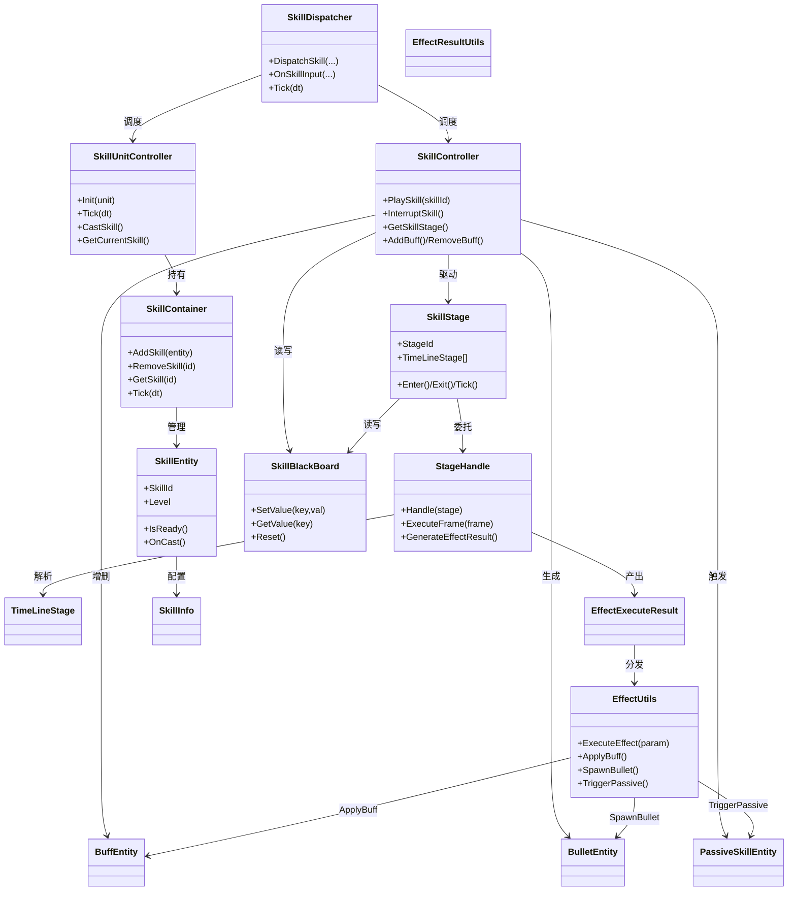
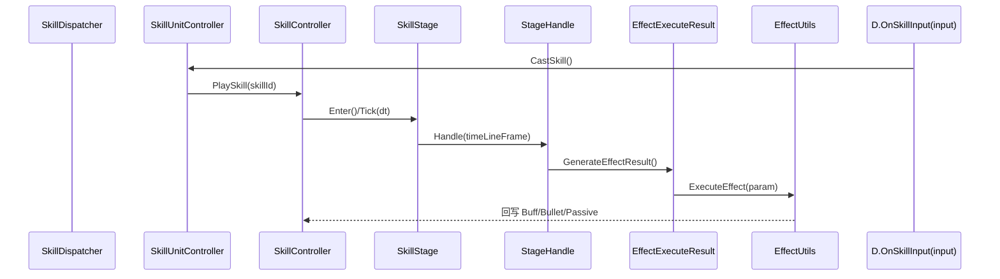
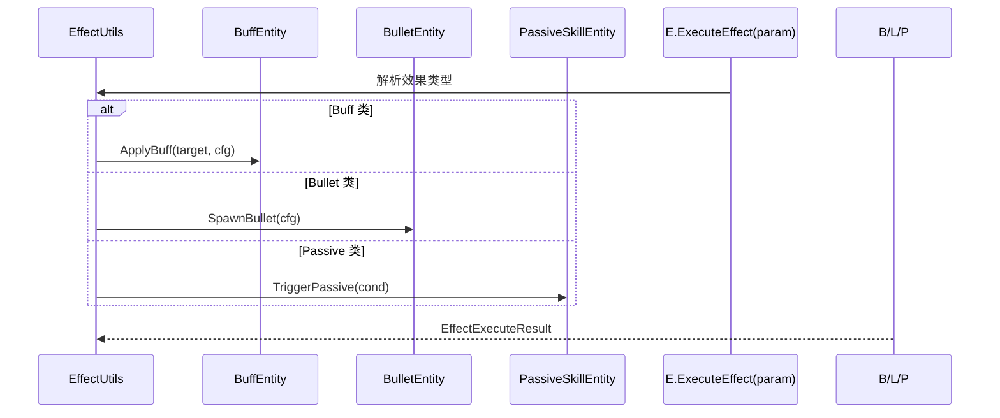

# Agent-4a [skill-core] L3 技能引擎核心层分析报告（精简版）

> **历史草稿（已复核）**：本文件保留 2026-07-09 初版阅读结果，包含已被当前代码推翻的 `DispatchSkill/OnSkillInput/ExecuteEffect/ApplyBuff/SpawnBullet/TriggerPassive/AddSkill/GetSkill/Tick` 等概念方法名。当前事实以 `agent-skill-review.md`、`../L3A_SKILL_ENGINE_CORE.md`、`../FLOW_SKILL_RELEASE.md` 为准。

## 类图（Mermaid classDiagram）

## 核心调用链

### 1. 技能释放 Timeline 管线

### 2. EffectUtils 分发到 Buff/Bullet/Passive

## 关键发现

1. **Timeline 驱动管线（核心）**：`SkillStage` 持有 `TimeLineStage[]` 时间线帧序列，每帧由 `StageHandle` 解析，产出 `EffectExecuteResult`，再交由 `EffectUtils` 真正执行。这是整条技能 pipeline 的主轴，Tick 由 `SkillController` 逐帧推进。

2. **三层实体关系**：`SkillContainer` 管理多个 `SkillEntity`（按 skillId 索引）；`SkillEntity` 引用 `SkillInfo` 静态配置并可生成 `SkillStage` 运行时实例；`SkillStage` 生命周期由 `SkillController` 驱动，支持中断/重入。`PassiveSkillEntity` 与普通 `SkillEntity` 共用同一容器但触发逻辑不同。

3. **EffectUtils 对接 Agent-5 effect 层**：`EffectUtils.ExecuteEffect(SkillEffectParam)` 是 L3→L5 的唯一主入口；内部按 `EffectType` 分支调用 `ApplyBuff/SpawnBullet/TriggerPassive`，最终效果数值与表现通过 `EffectExecuteResult`/`EffectResultUtils` 回流。`SkillEffectParam` 与 `EffectExecuteResult` 是两层间的数据契约载体。

4. **SkillBlackBoard 作用域**：为单技能运行期的共享黑板（key-value），`SkillController` 与 `SkillStage` 均可读写，用于跨 Stage 传递临时状态（如连击数、蓄力值）。作用域限于当前技能实例，技能结束 `Reset()`，不跨技能共享。

5. **SkillDispatcher 是总入口**：统一接收输入（`OnSkillInput`/`SkillInputCache`）与计时（`Tick`），向下分发到 `SkillUnitController`（单位级）与 `SkillController`（技能级），是战斗层对外的统一调度面。

6. **StageHandle 职责单一**：仅负责时间线帧到效果结果的"翻译+执行编排"，不直接持有 Buff/Bullet 状态；所有实体增删归 `SkillController`，保证状态归属清晰。

7. **ClientEffect 与 Server 分离**：`ClientMoveFx.cs` 等 Client 端特效仅消费 `FxParam`/`FxUtils` 产出表现，不介入技能逻辑判定，逻辑层（Server/Power）与表现层解耦。

## 对外接口

### SkillDispatcher（对 Agent-5 依赖：输入来源、Tick 驱动）
- `OnSkillInput(SkillInputCache input)` — 接收释放意图
- `DispatchSkill(unitId, skillId)` — 显式派发
- `Tick(float dt)` — 帧推进（依赖外部战斗主循环）

### SkillController（对 Agent-5 依赖：Buff/Bullet/Passive 实体由 EffectUtils 回调）
- `PlaySkill(int skillId)` / `InterruptSkill()`
- `GetSkillStage() : SkillStage`
- `AddBuff(BuffEntity)` / `RemoveBuff(id)` / `SpawnBullet(...)` / `TriggerPassive(...)`

### SkillUnitController（对 Agent-5 依赖：单位对象 Unit）
- `Init(Unit unit)` / `Tick(float dt)`
- `CastSkill(int skillId)` / `GetCurrentSkill() : SkillEntity`

### SkillStage（对 Agent-5 依赖：EffectExecuteResult 协议）
- `Enter()` / `Exit()` / `Tick(float dt)`
- `GetTimeLineStage() : TimeLineStage[]`

### SkillContainer（对 Agent-5 依赖：SkillEntity 配置）
- `AddSkill(SkillEntity)` / `RemoveSkill(int id)`
- `GetSkill(int id) : SkillEntity` / `Tick(float dt)`

### EffectUtils（**对 Agent-5 核心依赖接口**）
- `ExecuteEffect(SkillEffectParam param) : EffectExecuteResult` ← L3→L5 主入口
- `ApplyBuff(target, BuffConfig)` / `SpawnBullet(BulletConfig)` / `TriggerPassive(PassiveCond)`
- 回调产出统一封装于 `EffectExecuteResult` + `EffectResultUtils`

### SkillBlackBoard
- `SetValue(string key, object val)` / `GetValue(string key)` / `Reset()`

> 标注：[语义不清] `EffectUtils` 内部对 Agent-5 的具体方法名因文件集未含 L5 代码，仅能确认以 `SkillEffectParam`/`EffectExecuteResult` 为契约边界，具体 L5 函数签名需 Agent-5 侧核对。
