# Agent-4b [skill-partial] L3 技能分部类（Partial）扩展层分析报告

## 1. 文件清单

| 文件名 | 大小 | partial归属主类 | 职责一句话 |
|--------|------|----------------|-----------|
| SkillControllerSkillPartial.cs | 84.89 KB | SkillController | 技能核心调度：施法、打断、队列、技能状态机主体逻辑 |
| SkillEntityActionPartial.cs | 76.07 KB | SkillEntity | 动作执行：动画/位移/特效/打击点触发的底层动作逻辑 |
| SkillEntityUserInputPartial.cs | 57.2 KB | SkillEntity | 玩家输入解析：摇杆/技能键/连招输入映射与响应 |
| SkillControllerUserInputPartial.cs | 42.87 KB | SkillController | 控制器层输入处理：将用户意图翻译为技能调度指令 |
| SkillControllerEffectPartial.cs | 35.81 KB | SkillController | 技能特效管理：特效挂点、生命周期、矩阵同步 |
| SkillEntityCfgPartial.cs | 13.04 KB | SkillEntity | 配置加载：技能表/动作表数据绑定与初始化 |
| SkillControllerBuffPartial.cs | 8.35 KB | SkillController | Buff 与技能联动：施法附带 Buff、Buff 触发技能 |
| SkillControllerMsgPartial.cs | 6.42 KB | SkillController | 网络/系统消息：技能相关协议收发与转发 |
| SkillControllerBulletPartial.cs | 5.38 KB | SkillController | 子弹/弹道：弹体生成、飞行、命中回调 |
| SkillEntityDebugDataPartial.cs | 5.73 KB | SkillEntity | 调试数据：运行时技能状态可视化与采集 |
| SkillControllerPassivePartial.cs | 5.21 KB | SkillController | 被动技能：被动触发条件判定与效果施加 |
| SkillControllerBasePartial.cs | 2.47 KB | SkillController | 基础扩展：构造函数/字段声明/通用辅助方法 |

## 2. 分部类归属图

```mermaid
graph TD
    subgraph SkillController["SkillController (主类)"]
        CS[SkillControllerSkillPartial<br/>核心调度 85KB]
        CUI[SkillControllerUserInputPartial<br/>输入 43KB]
        CE[SkillControllerEffectPartial<br/>特效 36KB]
        CB[SkillControllerBuffPartial<br/>Buff 8KB]
        CM[SkillControllerMsgPartial<br/>消息 6KB]
        CBu[SkillControllerBulletPartial<br/>子弹 5KB]
        CP[SkillControllerPassivePartial<br/>被动 5KB]
        CBase[SkillControllerBasePartial<br/>基础 2KB]
    end

    subgraph SkillEntity["SkillEntity (主类)"]
        EA[SkillEntityActionPartial<br/>动作 76KB]
        EUI[SkillEntityUserInputPartial<br/>输入 57KB]
        EC[SkillEntityCfgPartial<br/>配置 13KB]
        ED[SkillEntityDebugDataPartial<br/>调试 6KB]
    end

    CS --> SkillController
    CUI --> SkillController
    CE --> SkillController
    CB --> SkillController
    CM --> SkillController
    CBu --> SkillController
    CP --> SkillController
    CBase --> SkillController

    EA --> SkillEntity
    EUI --> SkillEntity
    EC --> SkillEntity
    ED --> SkillEntity
```

## 3. 核心方法分布

| 主类名 | partial文件名 | 主要方法领域 |
|--------|---------------|-------------|
| SkillController | SkillControllerSkillPartial | 施法(Cast)、技能队列、打断(Interrupt)、状态查询、冷却、技能切换 |
| SkillController | SkillControllerUserInputPartial | 输入意图接收、输入缓冲、连招判定 |
| SkillController | SkillControllerEffectPartial | 特效创建/销毁、挂点矩阵、特效参数同步 |
| SkillController | SkillControllerBuffPartial | Buff 附加、Buff 触发技能、技能-Buff 联动 |
| SkillController | SkillControllerMsgPartial | 协议发送、协议回调、网络事件转发 |
| SkillController | SkillControllerBulletPartial | 弹体生成、弹道更新、命中处理 |
| SkillController | SkillControllerPassivePartial | 被动条件检测、被动效果结算 |
| SkillController | SkillControllerBasePartial | 字段声明、初始化辅助 |
| SkillEntity | SkillEntityActionPartial | 动作播放、位移(Bezier/直线)、特效触发点、打击判定 |
| SkillEntity | SkillEntityUserInputPartial | 摇杆解析、技能键映射、输入状态机 |
| SkillEntity | SkillEntityCfgPartial | 配置表读取、动作数据绑定 |
| SkillEntity | SkillEntityDebugDataPartial | 调试快照、状态输出 |

## 4. 关键发现

**功能域划分（按职责域拆分，非生命周期）**
- 12 个 partial 全部按**功能域**拆分：`UserInput`（输入）、`Effect`（特效）、`Action`（动作）、`Buff`、`Msg`、`Bullet`、`Passive`、`Cfg`、`DebugData`、`Skill`（核心）、`Base`（基础）。
- 不存在明显的"创建/更新/销毁"生命周期阶段拆分，说明设计者优先按"谁负责什么"而非"何时执行"组织代码。

**设计模式**
- partial class 是纯物理拆分手段，所有文件共享同一主类的私有字段——这意味着跨 partial 文件可直接访问彼此方法/字段，无接口隔离。
- `SkillController` 侧偏"调度与系统交互"（输入→协议→特效→子弹→Buff→被动）；`SkillEntity` 侧偏"表现与配置"（动作→输入→配置→调试）。二者呈**控制流(Controller) ↔ 表现流(Entity)** 双主类结构。

**疑问点标注 [待确认]**
- `SkillControllerUserInputPartial` 与 `SkillEntityUserInputPartial` 均处理输入，二者职责边界是否重叠？[待确认] —— 推测 Controller 层做"意图→指令"翻译，Entity 层做"指令→表现"映射，但需确认有无重复消费输入。
- `SkillControllerSkillPartial`(85KB) 体量超过部分主类，是否应进一步下沉为子模块（如 SkillStateMachine 独立类）？[待确认]

## 5. 对外接口

以下为各 partial 暴露的 **public 方法**（与其他层交互的契约，方法体未读部分仅列方法名）：

**SkillControllerSkillPartial [实现未读]** — public 方法名列表（节选领域）：
- `Cast` / `CastSkill` 类施法入口
- `Interrupt` / `InterruptSkill` 打断
- `CanCast` / `IsCasting` 状态查询
- `QueueSkill` 队列
- `SwitchSkill` / `ResetSkill` 切换与重置
- `GetSkillState` / `GetCooldown`

**SkillEntityActionPartial [实现未读]** — public 方法名列表（节选领域）：
- `PlayAction` / `StopAction` 动作播放
- `MoveTo` / `StartMove` / `StopMove` 位移
- `TriggerEffect` / `HitCheck` 特效与打击
- `OnActionEvent` 动作事件回调

**SkillEntityUserInputPartial（签名前10，🔴仅读签名）**
1. `public void HandleInput(...)` — 原始输入接收
2. `public void UpdateInputState(...)` — 输入状态帧更新
3. `public bool TryConsumeSkillKey(...)` — 技能键消费
4. `public void SetJoystickDir(...)` — 摇杆方向
5. `public void ClearInput(...)` — 输入清空
6. `public void EnableInput(...)` / `DisableInput(...)` — 输入开关
7. `public bool IsInputLocked(...)` — 输入锁查询
8. `public void BindSkillKeys(...)` — 技能键绑定
9. `public void OnComboInput(...)` — 连招输入
10. `public void ResetInputCache(...)` — 输入缓存重置

**SkillControllerUserInputPartial / EffectPartial（🟡关键方法前30行）**
- 输入层：将 Entity 上报的摇杆/按键翻译为 `Cast`/`QueueSkill` 调用 → 转交 `SkillControllerSkillPartial`
- 特效层：`CreateEffect(handle, mountPoint)` / `SyncEffectMatrix(...)` / `DestroyEffect(...)`，依赖挂载点配置

**<30KB 文件（全文已读，public 接口）**
- `SkillEntityCfgPartial`：`LoadSkillConfig(id)` / `BindActionData(...)` / `GetActionConfig(...)`
- `SkillControllerBuffPartial`：`AttachBuffOnCast(...)` / `OnBuffTriggerSkill(...)` / `RemoveBuffLinkedSkill(...)`
- `SkillControllerMsgPartial`：`SendSkillMsg(...)` / `OnRecvSkillMsg(...)` / `ForwardToEntity(...)`
- `SkillControllerBulletPartial`：`SpawnBullet(...)` / `UpdateBullet(...)` / `OnBulletHit(...)`
- `SkillEntityDebugDataPartial`：`CollectDebugData(...)` / `DumpSkillState(...)` / `GetDebugSnapshot(...)`
- `SkillControllerPassivePartial`：`CheckPassive(...)` / `ApplyPassive(...)` / `OnPassiveEvent(...)`
- `SkillControllerBasePartial`：`InitController(...)` / `GetField<T>(...)`（基础辅助，全文已读）

## 6. 大文件处理说明

| 文件 | 大小 | 处理手段 |
|------|------|---------|
| SkillControllerSkillPartial.cs | 84.89 KB | 🔴 极端截断：仅读类名、partial 归属、public 方法名列表，实现体未读，标注 [实现未读] |
| SkillEntityActionPartial.cs | 76.07 KB | 🔴 极端截断：仅读类名、partial 归属、public 方法名列表，实现体未读，标注 [实现未读] |
| SkillEntityUserInputPartial.cs | 57.2 KB | 🟠 重度：读类签名 + 前 10 个核心方法签名 |
| SkillControllerUserInputPartial.cs | 42.87 KB | 🟡 读类签名 + 关键方法实现（限前30行） |
| SkillControllerEffectPartial.cs | 35.81 KB | 🟡 读类签名 + 关键方法实现（限前30行） |
| 其余 7 文件 (<30KB) | — | 全文已读 |

**说明**：两个 >70KB 文件（SkillControllerSkillPartial、SkillEntityActionPartial）因极端截断策略未读取实现体，其方法领域分布基于方法名语义归类。如需精确方法清单与调用关系，建议后续对这两个文件单独做结构化扫描。
