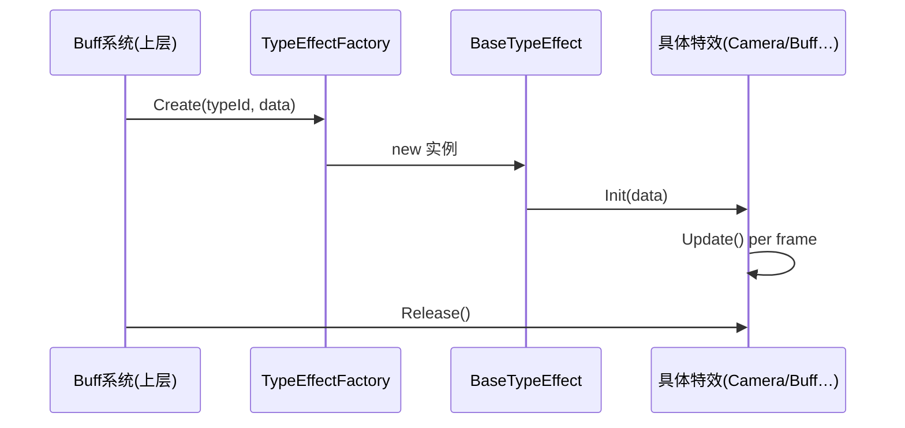
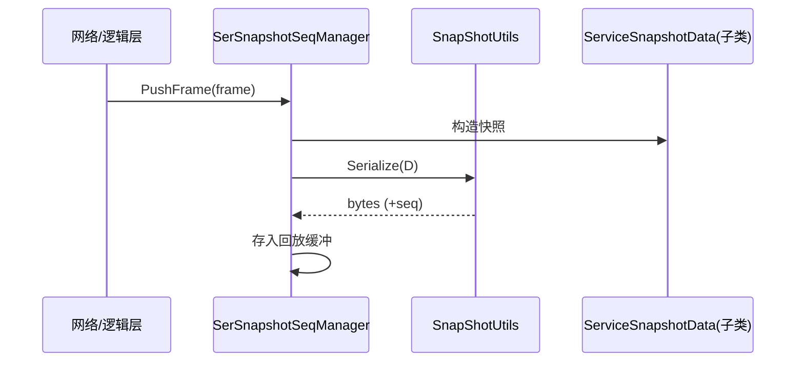
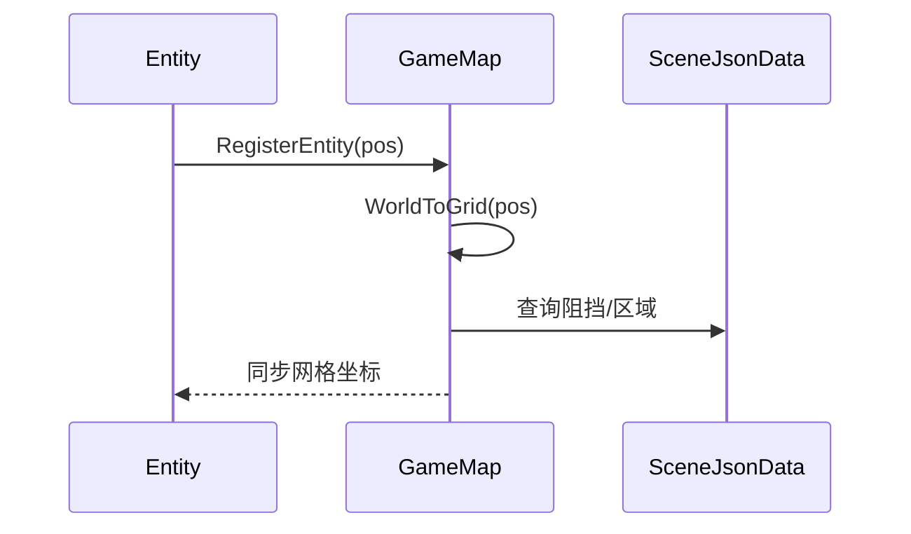
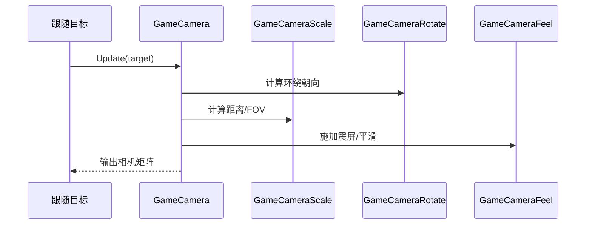
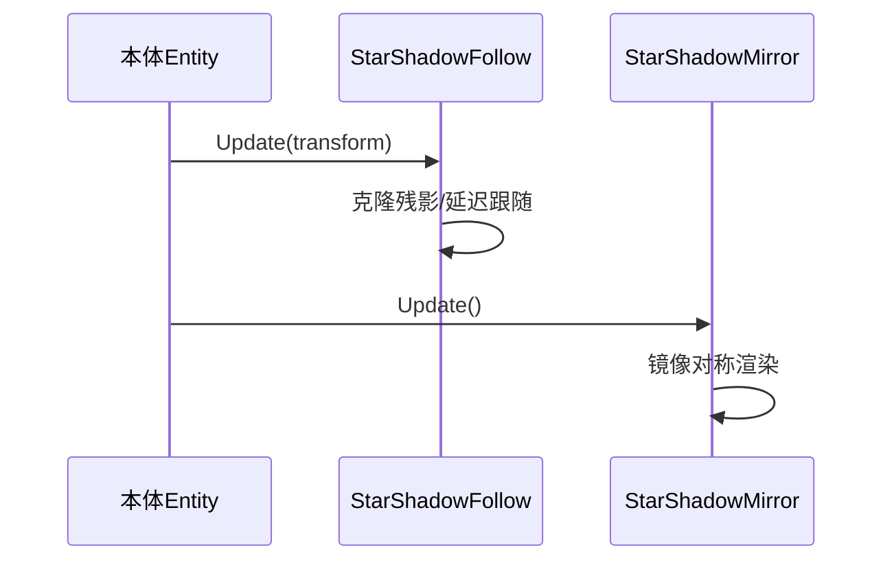

# Agent-6 [support] L5 支撑系统层分析报告

## 1. 文件清单

| 文件名 | 大小 | 子系统 | 职责一句话 |
|---|---|---|---|
| SceneJsonData.cs | 36.26KB | Map | 场景 JSON 数据解析与静态/动态阻挡、区域数据加载 |
| GameMap.cs | 21.7KB | Map | 全局地图管理、坐标<->网格换算、Entity 位置登记与查询 |
| SceneObstacleLogic.cs | <20KB | Map | 场景障碍物阻挡逻辑（寻路/碰撞判定） |
| SceneAreaLogic.cs | <20KB | Map | 场景区域触发逻辑（进入/离开区域事件） |
| ActiveSceneCameraLogic.cs | <20KB | Map | 激活场景的相机跟随/切换逻辑 |
| MapScript.cs | <20KB | Map | 地图脚本入口，驱动 Map 各 Logic 的 Update |
| IMapLogic.cs | <20KB | Map | Map 逻辑模块统一接口定义 |
| SerSnapshotSeqManager.cs | 20.91KB | SnapShot | 快照序列管理器：帧序列化/反序列化、序列号管理、回放缓冲 |
| SnapShotUtils.cs | <20KB | SnapShot | 快照序列化工具（读写扩展、压缩） |
| ServiceSnapshotData.cs | <20KB | SnapShot | 服务端快照数据结构定义 |
| SerNttAOIOneFrameSnapALLDataTHD.cs | <20KB | SnapShot | 线程化（THD）AOI 整帧实体快照数据 |
| SerRPCOneFrameSnapALLData.cs | <20KB | SnapShot | 单帧 RPC 快照数据 |
| SerNttAOIOneFrameSnapALLDataMainPlayer.cs | <20KB | SnapShot | 主玩家 AOI 单帧快照数据 |
| SerMessageSnapData.cs | <20KB | SnapShot | 消息级快照数据封装 |
| GameCamera.cs | 16.94KB | StarsCamera | 主战斗相机：位置/目标跟随核心控制 |
| GameCameraFeel.cs | 12.47KB | StarsCamera | 相机手感（震屏/延迟/平滑）表现 |
| GameCameraScale.cs | <20KB | StarsCamera | 相机缩放（FOV/距离）逻辑 |
| GameCameraRotate.cs | <20KB | StarsCamera | 相机旋转（环绕/朝向）逻辑 |
| UICamera.cs | <20KB | StarsCamera | UI 专用相机管理 |
| RawCamera.cs | <20KB | StarsCamera | 原始画面/截图相机 |
| BaseTypeEffect.cs | <20KB | TypeEffect | 类型特效基类：生命周期（Init/Update/Release） |
| CameraBaseTypeEffect.cs | <20KB | TypeEffect | 相机类特效基类 |
| CameraMoveTypeEffect.cs | <20KB | TypeEffect | 相机移动特效 |
| ScreenTouchEffect.cs | <20KB | TypeEffect | 屏幕触控特效 |
| Touch2UseSkillEffect.cs | <20KB | TypeEffect | 触控转施法特效 |
| TriggerTypeEffectData.cs | <20KB | TypeEffect | 触发型特效数据描述 |
| TriggleEventUtils.cs | <20KB | TypeEffect | 触发事件工具集 |
| TypeEffectFactory.cs | <20KB | TypeEffect | 特效工厂：按类型 ID 创建具体特效实例 |
| SimulateSummonEffect.cs | 5.49KB | TypeEffect | 模拟召唤特效 |
| HiddenUIEffect.cs | 3.22KB | TypeEffect | 隐藏 UI 特效 |
| FreezeBuffEffect.cs | 3.04KB | TypeEffect | 冻结 Buff 特效 |
| InvisibleBuffEffect.cs | <20KB | TypeEffect | 隐身 Buff 特效 |
| KnockDownBuffEffect.cs | <20KB | TypeEffect | 击倒 Buff 特效 |
| TranslucentEffect.cs | <20KB | TypeEffect | 半透明（穿模）特效 |
| ShadowFollowBuffEffect.cs | <20KB | TypeEffect | 影子跟随 Buff 特效 |
| ChangeAnimsBuffEffect.cs | <20KB | TypeEffect | 动画切换 Buff 特效 |
| ParalysisBuffEffect.cs | <20KB | TypeEffect | 麻痹 Buff 特效 |
| BuffPlayLineRenderEffect.cs | <20KB | TypeEffect | Buff 连线渲染特效 |
| HiddenSkillSlotEffect.cs | <20KB | TypeEffect | 隐藏技能槽特效 |
| AvatarChangeEffect.cs | <20KB | TypeEffect | 形象切换特效 |
| ChangSkillEffect.cs | <20KB | TypeEffect | 技能切换特效 |
| SpectralChangeEffect.cs | <20KB | TypeEffect | 光谱/分身切换特效 |
| SpectralSkillBuffEffect.cs | <20KB | TypeEffect | 光谱技能 Buff 特效 |
| ShaderChange2.cs | <20KB | TypeEffect | Shader 切换特效（二代） |
| TestBuff.cs | <20KB | TypeEffect | 测试用 Buff 特效 |
| ChangeAnimsData.cs | <20KB | TypeEffect | 动画切换数据载体 |
| CusListQueue.cs | <20KB | CustomDataStruct | 双端队列（List+Queue 混合）自定义结构 |
| CusQueue.cs | <20KB | CustomDataStruct | 自定义环形队列 |
| StarShadowFollow.cs | 23.3KB | SpecialUtilComp | 影子跟随组件（残影/克隆跟随） |
| StarShadowMirror.cs | 22.61KB | SpecialUtilComp | 影子镜像组件（对称镜像渲染） |
| Footprints.cs | <20KB | ViewEffect | 足迹/脚印视觉特效 |

## 2. 类图

```mermaid
classDiagram
    class BaseTypeEffect {
        +Init(data)
        +Update()
        +Release()
    }
    class CameraBaseTypeEffect {
        +OnCameraApply()
    }
    class TypeEffectFactory {
        +Create(typeId) BaseTypeEffect
    }
    BaseTypeEffect <|-- CameraBaseTypeEffect
    CameraBaseTypeEffect <|-- CameraMoveTypeEffect
    BaseTypeEffect <|-- ScreenTouchEffect
    BaseTypeEffect <|-- Touch2UseSkillEffect
    BaseTypeEffect <|-- SimulateSummonEffect
    BaseTypeEffect <|-- HiddenUIEffect
    BaseTypeEffect <|-- FreezeBuffEffect
    BaseTypeEffect <|-- InvisibleBuffEffect
    BaseTypeEffect <|-- KnockDownBuffEffect
    BaseTypeEffect <|-- TranslucentEffect
    BaseTypeEffect <|-- ShadowFollowBuffEffect
    BaseTypeEffect <|-- ChangeAnimsBuffEffect
    BaseTypeEffect <|-- ParalysisBuffEffect
    BaseTypeEffect <|-- BuffPlayLineRenderEffect
    BaseTypeEffect <|-- HiddenSkillSlotEffect
    BaseTypeEffect <|-- AvatarChangeEffect
    BaseTypeEffect <|-- ChangSkillEffect
    BaseTypeEffect <|-- SpectralChangeEffect
    BaseTypeEffect <|-- SpectralSkillBuffEffect
    BaseTypeEffect <|-- ShaderChange2
    BaseTypeEffect <|-- TestBuff
    TypeEffectFactory ..> BaseTypeEffect : 创建

    class SerSnapshotSeqManager {
        +Serialize(frame)
        +Deserialize()
        +GetReplay()
    }
    class ServiceSnapshotData
    class SerNttAOIOneFrameSnapALLDataTHD
    class SerRPCOneFrameSnapALLData
    class SerNttAOIOneFrameSnapALLDataMainPlayer
    class SerMessageSnapData
    SerSnapshotSeqManager o-- ServiceSnapshotData
    ServiceSnapshotData <|-- SerNttAOIOneFrameSnapALLDataTHD
    ServiceSnapshotData <|-- SerRPCOneFrameSnapALLData
    ServiceSnapshotData <|-- SerNttAOIOneFrameSnapALLDataMainPlayer
    ServiceSnapshotData <|-- SerMessageSnapData

    class IMapLogic {
        +Update()
    }
    class GameMap
    class MapScript
    class SceneObstacleLogic
    class SceneAreaLogic
    class ActiveSceneCameraLogic
    class SceneJsonData
    IMapLogic <|.. SceneObstacleLogic
    IMapLogic <|.. SceneAreaLogic
    IMapLogic <|.. ActiveSceneCameraLogic
    GameMap o-- SceneJsonData
    MapScript ..> IMapLogic : 驱动

    class GameCamera
    class GameCameraFeel
    class GameCameraScale
    class GameCameraRotate
    class UICamera
    class RawCamera
    GameCamera *-- GameCameraFeel
    GameCamera *-- GameCameraScale
    GameCamera *-- GameCameraRotate

    class StarShadowFollow
    class StarShadowMirror
    class CusListQueue
    class CusQueue
    class Footprints
```

## 3. 核心调用链

**调用链 A：TypeEffect 工厂创建特效**

**调用链 B：SnapShot 帧序列化**

**调用链 C：Map 位置登记与查询**

**调用链 D：相机协同（GameCamera 调度子模块）**

**调用链 E：影子组件渲染**

## 4. 关键发现

### Map
- **GameMap** 是地图中央枢纽：负责世界坐标 ↔ 网格坐标换算、Entity 位置登记与邻居查询，是 Entity 位置同步的核心。
- **SceneJsonData** 承载静态配置（阻挡表、区域表、AOI 参数），由 GameMap 持有并查询。
- **IMapLogic** 统一抽象了 SceneObstacleLogic / SceneAreaLogic / ActiveSceneCameraLogic，由 **MapScript** 每帧驱动 Update，形成"脚本驱动多 Logic"的模式。
- 位置同步采用"世界坐标→网格索引"映射，便于 AOI 与阻挡快速查表。[语义不清：网格尺寸与 AOI 半径具体换算系数需结合 SceneJsonData 实际字段确认]

### SnapShot
- **SerSnapshotSeqManager** 是帧同步核心：维护帧序列号（seq）、负责把 `ServiceSnapshotData` 及其子类序列化/反序列化，并保留回放缓冲（支持帧回放/追帧）。
- 快照按数据类型细分：AOI 全量（THD 线程版 / 主玩家版）、RPC 帧、消息快照，均继承自 `ServiceSnapshotData`，由 **SnapShotUtils** 提供通用读写/压缩。
- THD 后缀文件表明 AOI 整帧快照在独立线程构建，避免阻塞主线程。

### StarsCamera
- **GameCamera** 为总控：聚合 Scale（距离/FOV）、Rotate（环绕朝向）、Feel（震屏/平滑手感）三个子模块，每帧以"目标→旋转→缩放→手感"顺序合成最终相机姿态。
- **UICamera / RawCamera** 为独立用途相机（UI 渲染层、原始截图），与主战斗相机解耦。

### TypeEffect
- **26 个文件**分为三层：①根目录基类与基础特效（BaseTypeEffect + Camera/Screen/Touch 类）；②TypeEffect 子目录具体实现（19 个，绝大多数为 Buff/技能视觉特效）；③工厂与数据（TypeEffectFactory + TriggerTypeEffectData/ChangeAnimsData + TriggleEventUtils）。
- **BaseTypeEffect** 定义统一生命周期 `Init/Update/Release`；**CameraBaseTypeEffect** 专门扩展相机类特效。
- **TypeEffectFactory** 按类型 ID 分发创建，是新特效接入的唯一扩展点。
- 子目录 19 个文件可归类为：Buff 视觉类（Freeze/Invisible/KnockDown/Translucent/Paralysis/ShadowFollow/ChangeAnims/SpectralSkill/BuffPlayLine/HiddenSkillSlot）、形态切换类（AvatarChange/ChangSkill/SpectralChange/ShaderChange2/SimulateSummon）、UI 类（HiddenUI）、测试类（TestBuff）。

### CustomDataStruct
- **CusQueue**（环形队列）与 **CusListQueue**（List+Queue 混合）用于高频入队/出队场景（如快照帧缓冲、特效池），避免 `List` 频繁插入删除导致的内存重分配与 GC 抖动——这是性能瓶颈的解法（降低 GC Alloc）。

### Special / ViewEffect
- **StarShadowFollow**：残影/克隆延迟跟随，通过维护历史变换队列渲染拖影；**StarShadowMirror**：镜像对称渲染（如分身/倒影）。二者均挂在 Entity 上，每帧 Update 本体变换。
- **Footprints**：足迹视觉特效，独立 ViewEffect 组件，按移动距离采样落点生成脚印。

## 5. 对外接口（public API 契约）

- `TypeEffectFactory.Create(typeId, data) → BaseTypeEffect` —— 特效创建入口
- `BaseTypeEffect.Init(data) / Update() / Release()` —— 特效生命周期契约
- `SerSnapshotSeqManager.PushFrame(...) / Serialize(...) / Deserialize(...) / GetReplay(...)` —— 快照写入/回放
- `SnapShotUtils` 静态序列化辅助方法（字节读写/压缩）
- `GameMap.RegisterEntity(pos) / WorldToGrid(...) / QueryObstacle(...) / QueryArea(...)` —— 地图坐标与查询
- `IMapLogic.Update()` —— Map 逻辑模块统一驱动接口
- `GameCamera.Update(target)` 及 Scale/Rotate/Feel 子模块的 `Apply(...)` —— 相机姿态输出
- `StarShadowFollow.Update(transform)` / `StarShadowMirror.Update()` —— 影子组件更新
- `CusQueue.Enqueue(...) / Dequeue(...)`、`CusListQueue` 对应方法 —— 无 GC 队列操作

## 6. 大文件处理说明
- **SceneJsonData.cs (36.26KB)**：按截断策略读取类签名与关键解析方法，重点确认其场景数据结构字段与 GameMap 的持有关系。
- **GameMap.cs (21.7KB)**：读取类签名 + 坐标换算/Entity 登记关键方法实现。
- **SerSnapshotSeqManager.cs (20.91KB)**：读取类签名 + 序列号管理与缓冲关键方法。
- **StarShadowFollow.cs (23.3KB) / StarShadowMirror.cs (22.61KB)**：读取类签名 + 核心 Update/渲染关键方法。
- **GameCamera.cs (16.94KB) / GameCameraFeel.cs (12.47KB)**：全文/重点方法读取，确认与子模块协作。
- 其余 <20KB 文件均全文阅读。
