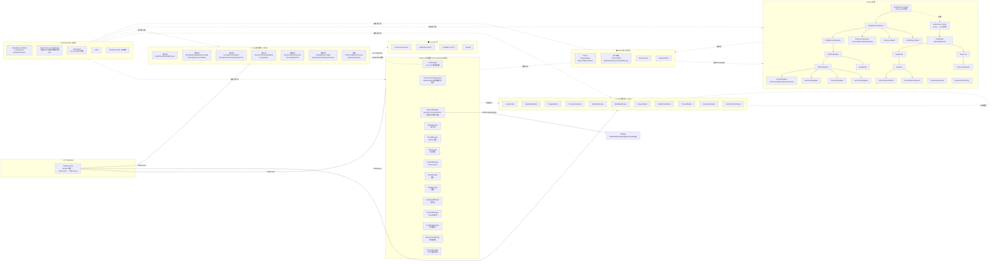

# 完整模块设计图

```mermaid
flowchart LR
    %% Styles
    classDef entry fill:#1a5276,color:#fff,stroke:#3498db
    classDef service fill:#1a6e3a,color:#fff,stroke:#4ad990
    classDef csmodule fill:#6c3483,color:#fff,stroke:#af7ac5
    classDef game fill:#7d3c1a,color:#fff,stroke:#d97a4a
    classDef entity fill:#1a5c5c,color:#fff,stroke:#4ad9d9
    classDef luamod fill:#3a3a6c,color:#fff,stroke:#7a7ad9
    classDef lualib fill:#3a5c3a,color:#fff,stroke:#7ad97a
    classDef view fill:#5c3a3a,color:#fff,stroke:#d97a7a
    classDef def fill:#5c5c1a,color:#fff,stroke:#d9d94a

    subgraph TOP["🚀 入口 AppMain"]
        APP["AppMain.Init()<br/>Prepare场景 → InitServices → InitBusiness"]
    end

    subgraph SVC["🔧 Service 常驻服务 (ServiceModule 单例)"]
        direction TB
        RES["ResourceFormalManager<br/>Addressables 加载/缓存/对象池"]
        LUA["LuaManager<br/>XLua VM / 模块加载"]
        NET["NetworkManager<br/>gameSocket+battleSocket<br/>消息订阅/分帧派发"]
        BAT["BattleManager<br/>战斗域"]
        SND["SoundManager<br/>Wwise 音频"]
        GM["GMManager<br/>GM调试"]
        CAM["CameraManager<br/>StarsCamera"]
        INP["InputManager<br/>输入"]
        ATL["AtlasManager<br/>图集"]
        LNG["LanguageManager<br/>多语言"]
        TLM["TimelineManager<br/>Timeline驱动"]
        LDM["LocalDataManager<br/>本地缓存"]
        SCM["StarScenesManager<br/>场景加载"]
        REN["RenderManager<br/>URP渲染/画质"]
    end

    subgraph CS_MOD["🔷 C# 业务模块 (< 5000)"]
        LOGIN["LoginModule"]
        SW["StarWorldModule"]
        TRIG["TriggerModule"]
        IA["InterActionModule"]
        RT["RingTaskModule"]
        WM["WorldMapModule"]
        EC["EctypeModule"]
        BZ["BattleZoneModule"]
        TUT["TutorialModule"]
        SP["ScenePlayModule"]
        ITEMCTRL["ItemControllerModule"]
    end

    subgraph LUA_MOD["🔶 Lua 业务模块 (> 5000)"]
        direction TB
        LUA_SOCIAL["社交组<br/>Chat/Friend/Guild/Mail/Team"]
        LUA_ECO["经济组<br/>Shop/Bag/Equip/Bank/Exchange<br/>Recharge/Donate/ItemBuy"]
        LUA_ACT["活动组<br/>Activity/Event/DailyAct<br/>OnlineReward/7DaySign/DrawCard"]
        LUA_BAT["战斗组<br/>Pvp/Arena/Tower/WildBoss<br/>EctypeSettle"]
        LUA_CHAR["养成组<br/>Partner/Talent/Inscription<br/>Amulet/SkillSwitch"]
        LUA_INFO["信息组<br/>Rank/BeginnerTarget<br/>SystemOpenTips/PlayerPreview"]
        LUA_OTHER["其他<br/>Task/LivingSkills/Treasure<br/>Wanted/Login/Avg"]
    end

    subgraph ENTITY["🧬 Entity 系统"]
        direction TB
        EF["EntityFactory (static)<br/>+ Recycler 对象池"]
        VF["ViewFactory (static)<br/>Entity ↔ View 映射"]
        SDF["SimpleDataFactory"]
        DDF["DynamicDataFactory"]

        EO["EntityObject (abstract)"]
        ERD["EntityRemoteDynamic"]
        AOI["AOIEntityObject"]
        NPC["NPCEntityBase"]
        HERO["HeroEntityBase<br/>SkillComp/BuffComp/PassiveComp"]
        MON["MonsterEntityBase"]
        PART["PartnerEntityBase"]
        SUM["SummonEntityBase"]
        BUL["BulletEntity"]
        ELD["EntityLocalDynamic<br/>TreasureBox/Gateway/Wanted"]
        ELS["EntityLocalStatic"]
        ERS["EntityRemoteStatic"]

        VO["ViewObject (MonoBehaviour)"]
        VM["ViewModel"]
        VAOI["ViewAOI"]
        V_HERO["ViewVitalHeroNormal"]
        V_MON["ViewVitalMonsterAnim"]
        VL["ViewLocal"]
        VL_D["ViewLocalDynamic"]
    end

    subgraph GAME["🎮 Game 核心运行时"]
        PLAYER["Player<br/>EntityCtrlBase<br/>PlayerCtrl/MonsterCtrl"]
        SKILL["Skill 系统<br/>Timeline 驱动<br/>BuffComp/PassiveComp/SkillComp"]
        CAM_G["StarsCamera"]
        MAP["Map/FindPath"]
    end

    subgraph LUA_VIEW["🖥️ Lua View 层"]
        V_CORE["Core/UIPanel.lua.txt"]
        V_WIN["UIWindow (443个)"]
        V_WGT["UIWidget (103个)"]
        V_PAGE["UIPage"]
    end

    subgraph DEF["📐 StarProjectDef 定义层"]
        ENUMS["GameEnums (91KB)<br/>E_EntityType / ModuleDef.Name"]
        CFG["GameConfig / GlobalConfig<br/>帧率30FPS/移动参数/网络URL"]
        MDEF["ModuleDef<br/>enum (5000分界线)"]
        UI_DEF["UIDef"]
        WRAP["WrapData (350+ 结构体)"]
    end

    %% 依赖关系
    APP -->|InitServices| SVC
    APP -->|InitBusiness| CS_MOD
    APP -->|InitBusiness| LUA_MOD

    SVC -.->|依赖注入| CS_MOD
    SVC -.->|依赖注入| GAME
    
    CS_MOD -.-|消息通信| CS_MOD
    LUA_MOD -.->|LuaModule 桥接| LUA_VIEW
    LUA_MOD -.->|C# LuaModule| LUA
    
    ENTITY -.->|实例化| GAME
    GAME -.->|使用 Entity 系统| ENTITY
    
    NET -->|FixMessageManager| FIX["MDMgr<br/>ItemMDMgr/HeroMDMgr/PartnerMDMgr"]
    
    DEF -.->|被共享引用| SVC
    DEF -.->|被共享引用| CS_MOD
    DEF -.->|被共享引用| LUA_MOD
    DEF -.->|被共享引用| ENTITY
    DEF -.->|被共享引用| GAME

    EF --> EO
    EO --> ERD
    ERD --> AOI
    AOI --> NPC
    NPC --> HERO
    NPC --> MON
    NPC --> PART
    NPC --> SUM
    AOI --> BUL
    EO --> ELD
    EO --> ELS
    EO --> ERS

    VF --> VO
    VO --> VM
    VM --> VAOI
    VAOI --> V_HERO
    VAOI --> V_MON
    VO --> VL
    VL --> VL_D

    EF -.->|创建| VF
```
