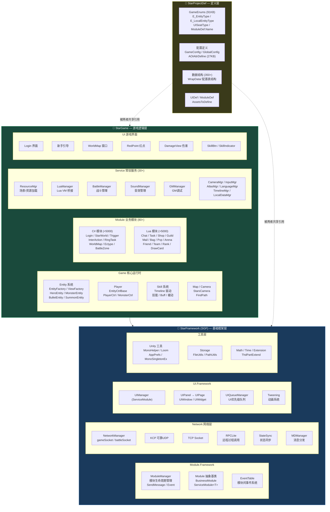

# Star 项目整体架构 C4 分层图



## 架构说明

### 三层依赖关系

```
StarProjectDef (定义层)
       ↑ 共享引用
  ┌────┴────┐
  │         │
StarGame   StarFramework
(游戏逻辑)  (基础框架)
  │         ↑
  └────单向依赖──┘
```

### 关键设计原则

| 层次 | 命名空间 | 依赖方向 | 主要内容 |
|------|----------|----------|----------|
| **StarFramework** | `SGF.*` | 只依赖 Unity，不依赖上层 | 模块管理、网络通信、UI框架、工具类 |
| **StarGame** | `StarProject.*` | 依赖 SGF + StarProjectDef | 游戏运行时、业务模块、服务、游戏界面 |
| **StarProjectDef** | `StarProjectDef` | 被两者引用 | 枚举、常量、配置数据结构 |

### 模块系统特点

- **C# / Lua 混合**: 模块由 `ModuleDef.Name` 枚举统一标识，值 < 5000 是 C# 模块，> 5000 是 Lua 模块
- **统一创建**: `ModuleManager.CreateModule()` 自动判断类型，C# 反射实例化或 LuaManager 加载
- **统一通信**: `SendMessage` (方法调用) + `Event` (事件订阅) + `GlobalEvent` (全局广播)

### 文件统计

- **总 C# 文件**: 7,608 个
- **StarFramework**: ~100 个核心框架文件
- **StarGame**: ~7,500 个游戏逻辑文件
- **StarProjectDef**: 散布在 StarGame 中，`WrapData/` 含 350+ 配置结构体
