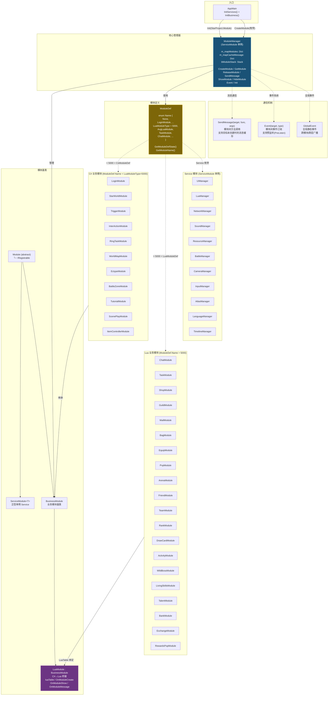

# Star 模块系统组件图



## 架构说明

### 模块创建流程

```
CreateModule("ChatModule")
    │
    ├─ Type.GetType("StarProject.Module.ChatModule")
    │   └─ null → C# 中没有此类
    │
    └─ LuaManager.Instance.GetLuaModule("ChatModule")
        └─ new LuaModule() → BindLuaCall(LuaTable)
            └─ Lua 侧: LuaScripts/LuaModule/ChatModule.lua
```

### C# 与 Lua 分割线

| 类型 | 枚举值 | 判别 | 示例 |
|------|--------|------|------|
| C# 业务模块 | < 5000 | `CsModuleDef` | LoginModule, StarWorldModule |
| Lua 业务模块 | > 5000 | `LuaModuleDef` | ChatModule, TaskModule, ShopModule |

### 通信方式对比

| 方式 | API | 特点 | 适用场景 |
|------|-----|------|----------|
| **SendMessage** | `ModuleManager.SendMessage(target, func, args)` | 反射调用，支持消息缓存 | 模块间方法调用 |
| **Event** | `ModuleManager.Event(target, type).AddListener()` | 支持预监听 | 模块间事件订阅 |
| **GlobalEvent** | `GlobalEvent.onLogin.Invoke()` | 全局广播 | 跨层通知 |
