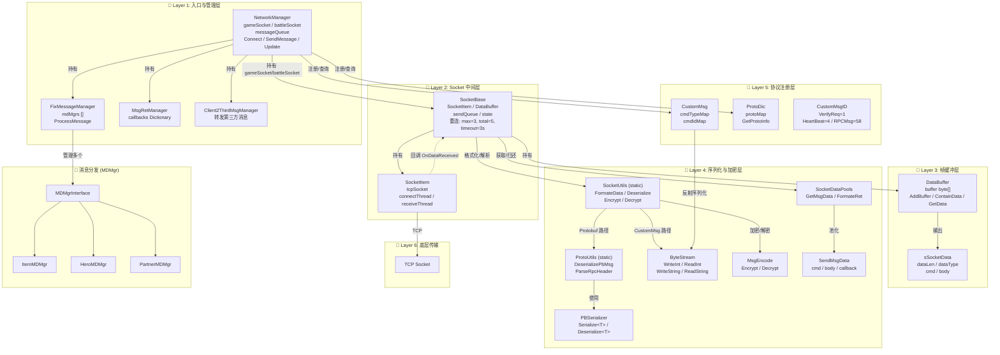

# Star 网络层架构图 (Mermaid)



## 架构说明

### 6层架构分层

| 层 | 名称 | 核心类 | 职责 |
|----|------|--------|------|
| 1 | 入口与管理层 | NetworkManager, FixMessageManager, MsgRetManager | 消息收发入口，管理消息分发器和回调 |
| 2 | Socket中间层 | SocketBase, SocketItem | 封装Socket连接，重连机制(3次/总计5次，超时3s) |
| 3 | 帧缓冲层 | DataBuffer, sSocketData | TCP流式数据→完整消息包的组装 |
| 4 | 序列化与加密层 | SocketUtils, ProtoUtils, PBSerializer, ByteStream, MsgEncode | 双路径序列化(Pb/CustomMsg)，加密解密，对象池 |
| 5 | 协议注册层 | CustomMsg, ProtoDic, CustomMsgID | 协议号→类型映射，支持运行时反射 |
| 6 | 底层传输 | TCP Socket | 原生Socket通信 |

### 双协议路径

```
  收到数据 → SocketUtils.DeserializeMessageData(data)
    ├── dataType == CustomMsg → ByteStream 反射反序列化
    └── dataType == Protobuf → ProtoUtils → PBSerializer 反序列化
```

### 重连机制

- 单次重连最多 3 次
- 总重连次数最多 5 次
- 连接超时 3 秒
- 心跳检测保活
