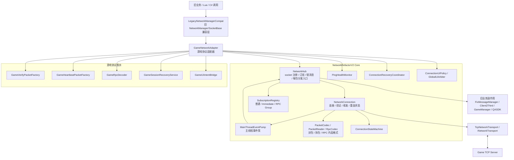
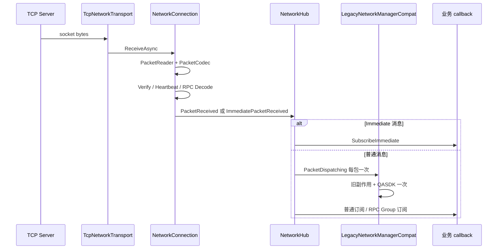
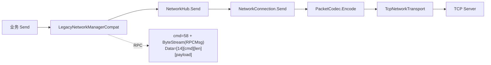

# NetworkRefactorV2 集成适配层 (NetworkRefactorV2Adapter)

> 位置：`Assets/Scripts/StarFramework/NetworkRefactorV2Adapter/`（无 asmdef，属 Assembly-CSharp）
> 作用：把 V2 核心网络层与游戏真实协议（旧 `SGF.Network` / `ProtoMsg` / `StarProjectDef.GameLoginInfo`）粘合。
> 约束：**不修改 AppMain、旧网络层、Lua、UI**（按计划约定）。仅"准备"集成。

## 协议对照（关键）

| 消息 | 方向 | 命令号 | 封装 | 说明 |
|------|------|--------|------|------|
| ClientVerifyReq | C→S | `CustomMsgID.ClientVerifyReq=1` | 自定义结构体 + `ByteStream` | 验证请求，连接后首包 |
| ClientVerifySucceedRet | S→C | `CustomMsgID.ClientVerifySucceedRet=2` | 自定义结构体 | 触发 `MarkVerified` |
| ClientVerifyFailedRet | S→C | `CustomMsgID.ClientVerifyFailedRet=3` | 自定义结构体 | 触发 `MarkVerifyFailed`（Kicked） |
| HeartBeat | C↔S | `CustomMsgID.HeartBeat=4` | 自定义结构体 | 心跳；服务器回包用于算延迟 |
| RPCMsg | C→S | `CustomMsgID.RPCMsg=58` | `ByteStream(RPCMsg struct)`，其中 `RPCMsg.Data=[14][cmd:2][len:2][payload]` | 客户端发 RPC，保持旧 `SocketBase.SendRPCMsg` 线格式 |
| RpcMsg（接收） | S→C | `MsgIDEnum.RpcMsgID=1001` | protobuf `ProtoMsg.RpcMsg` | 服务器推 RPC，由 `GameRpcDecoder` 解析 |
| ServerTimeRet | S→C | `MsgIDEnum.ServerTimeRetID=4843` | protobuf | 时间同步（即时处理） |

> 注意：发送与接收 RPC 命令号不同（58 vs 1001），解码器必须按 protobuf 解析而非 `[14]` 信封。
> `ProtoUtils.DeserializePbMsg` 中 `enityId` 默认 0、RPC 时取 `rpcMsg.SrcEntityID` —— **这是设计行为，不是 bug**。

## V2 主 TCP 架构图



## 收包流程



## 发包流程



## 类结构

```
GameNetworkAdapter (主编排器, IDisposable)
 ├─ build NetworkConnectionConfig
 │    ├─ VerifyPacketFactory  = GameVerifyPacketFactory.Create
 │    ├─ HeartbeatPacketFactory = GameHeartbeatPacketFactory.Create
 │    ├─ RpcCommand = 1001, RpcDecoder = GameRpcDecoder.Decode
 │    ├─ ImmediateCommands = { ServerTimeRetID(4843) }  // 仅时间同步即时；心跳走主线程
 │    └─ RecoveryPolicy = RefreshSessionBeforeReconnect
 ├─ NetworkHub.Register("game", ...)
 ├─ ConnectionRecoveryCoordinator(GameSessionRecoveryService)
 ├─ GlobalUiArbiter.Register("game", AlwaysVisible, Lobby)
 ├─ Subscribe: 验证成功(2)→MarkVerified / 验证失败(3)→MarkVerifyFailed
 ├─ Subscribe: 心跳(4)→RecordPong
 ├─ Subscribe(Immediate): 时间(4843)→TimeSync.Update
 └─ Tick(now): 心跳发送 → Ping 老化 → hub.Tick() → UI 仲裁 → SocketViewStateChanged

GameSessionRecoveryService : ISessionRecoveryService
 └─ RecoverAsync → HttpUtils.SendRetryLoginHeaderHttpReq(CHOOSE_HELP_HANDLER) 刷新 Token

GameUiIntentBridge (静态): ConnectionUiIntent → SocketViewState
```

## 心跳延迟计算

与旧 `Ping.OnNewPingRet` 一致：延迟 = 收到 `HeartBeat` 回包时刻 − 上次发送时刻（记录于 `_lastHeartbeatSentMs`）。
`Tick` 内 `SendHeartbeatIfDue` 异步发送，`MarkVerified` 时重置 `_lastHeartbeatSentMs=0` 与 `ping.Reset()`。

## 会话恢复（HTTP 重新登录）

`RecoveryPolicy = RefreshSessionBeforeReconnect` 时，`ConnectionRecoveryCoordinator` 回调
`GameSessionRecoveryService.RecoverAsync`，通过 `HttpUtils.SendRetryLoginHeaderHttpReq<ChooseHeroReq, ChossHeroAck>`
向 `CHOOSE_HERO_HANDLER` 重新选角，拿回新 `Token` 写回 `GameLoginInfo.M_ChossHeroAck`，
构造新的 `ReconnectSessionData`（地址=GameServerIpAddress, PID=M_ChooseHeroReq.PID, Token=新）。

## 多 Socket（预留）

V2 运行时已支持 `NetworkHub.Register(name, ...)` 多实例。当前仅 `game` socket；
未来 `battle` socket 复用同一 `NetworkHub`，独立 `Register("battle", ...)` + 独立 config
（验证/心跳/RPC 命令号可能不同）。适配层不在此实现 battle 协议（待 battle 服协议确认）。

## 自检

`GameAdapterSelfCheck.Run()`：命令号映射 / RPC 解码 round-trip / 验证包 / 心跳包 / UI 映射。
编辑器菜单 `Network/V2 Adapter SelfCheck` 手动运行。

## 已知缺口（与集成无关）

- V2 `PacketCodec` 帧格式已由 codex 对齐旧 `DataBuff`（6 字节头 + 旧加密），逻辑层兼容。
- 真正的端到端联调需在 `AppMain` 接入 `GameNetworkAdapter`（按计划，行为验证前不改 AppMain）。
